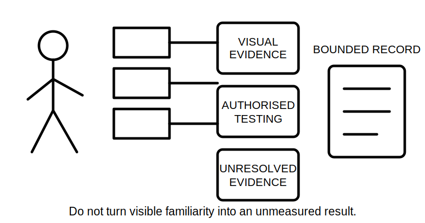
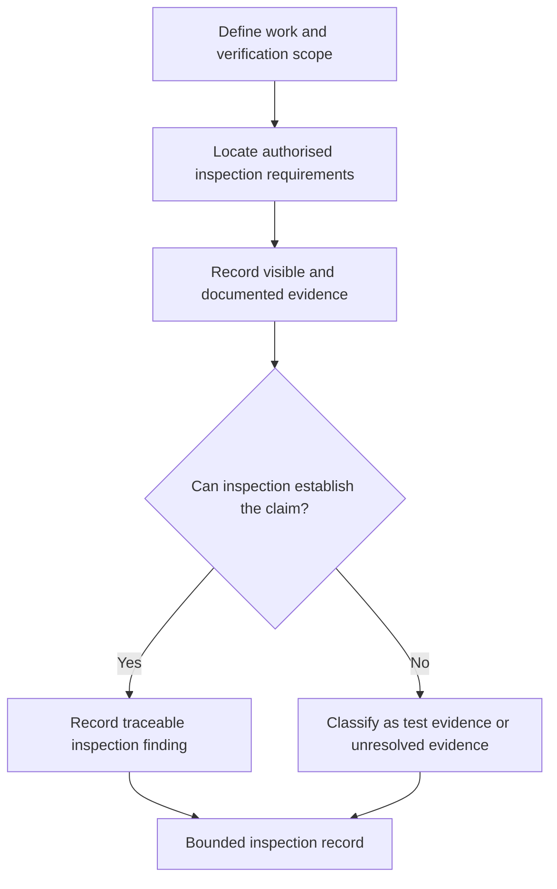

# Day 36 — Verification Purpose, Evidence and Visual Inspection

> **Currency, copyright and safety notice:** This original educational module explains verification reasoning at document level. It does not reproduce an official inspection checklist, prescribe field actions or establish acceptance criteria. Current authorised sources and qualified supervision remain mandatory.

## 1. Outcome and entry check

Given a fictional installation record, the learner can explain the purpose of verification, distinguish visual-inspection evidence from test evidence, classify evidence gaps and produce a bounded visual-inspection record without claiming certification.

**Entry check:** define observation, inference, evidence, scope and bounded conclusion; explain why “looks acceptable” is not a verification result.

## 2. Why it matters

Verification is not a single test or a final signature. It is a controlled body of evidence showing whether the defined work has been examined against applicable requirements. Visual inspection can identify many conditions before test evidence is considered, but it cannot prove characteristics that require measurement or functional demonstration.

*Caption: Record what inspection can establish, then identify what remains for authorised testing or review.*

## 3. Core concepts and terminology

- **Verification:** a structured process for obtaining and evaluating evidence about defined installation work.
- **Visual inspection:** examination using sight and supplied records, without treating unseen or unmeasured characteristics as proven.
- **Test evidence:** results produced by an authorised test method using suitable equipment under controlled preconditions.
- **Inspection item:** a defined feature or condition to be examined.
- **Evidence gap:** information required for a conclusion that has not been observed, supplied or validly tested.
- **Traceability:** the ability to connect a finding to its location, circuit, equipment, source and evidence record.
- **Certification:** a formal act performed only by an authorised person under applicable requirements; completing this module does not confer that authority.

## 4. Rule-finding workflow

Use **V-I-S-U-A-L**: **V**erify scope and documents; **I**dentify applicable inspection questions from authorised sources; **S**eparate visible facts from assumptions; **U**nresolved items become evidence requests; **A**ssign each finding a location and consequence; **L**imit the conclusion to inspection evidence.

The decision point prevents visual familiarity from being mistaken for measured, functional or certified evidence.

## 5. Visual model or worked example

A fictional distribution board schedule identifies six final subcircuits, but two conductors are not traceable to the schedule and an alternate-source label is shown without source documentation. Visual inspection supports recording the schedule mismatch and the stated label. It does not establish conductor continuity, source isolation effectiveness or protective-device performance. Those claims remain outside the visual evidence set.

Changed condition: complete source documents are later supplied. Update the evidence ledger and source mapping, but do not convert unperformed tests into completed evidence.

## 6. Practical application

Create a visual-inspection record for a fictional small workshop pack. Include: scope; document list; ten observations; four inferences clearly labelled; five evidence gaps; each item’s location and affected function; three items that require authorised test evidence; and one bounded conclusion.

Rubric, 12 points: scope and traceability 2; fact/inference separation 2; inspection-versus-test distinction 2; evidence gaps 2; consequence reasoning 2; safety and authority boundary 2. Critical errors override the score: inventing a result, treating absence of visible damage as proof, or claiming certification.

## 7. Common errors and safety checkpoint

Common errors include using a generic checklist without defining scope, recording assumptions as observations, treating labels as proof, skipping document discrepancies, or using visual inspection to infer continuity, polarity, insulation condition or device operation.

This is document-only learning. It authorises no access, opening, switching, isolation, contact, measurement, testing, energisation, certification or approval. Stop where the fictional evidence does not establish source state, scope, equipment identity or authority.

## 8. Retrieval and next links

Without notes: define verification, visual inspection, test evidence and traceability; state V-I-S-U-A-L; classify six claims as inspection-supported, test-dependent or unresolved; rewrite one certification claim as a bounded inspection statement.

- **Program:** [Six-Week Capstone Learning Plan](../MASTER_PLAN.md)
- **Previous:** [Day 35 — Week 5 Integrated Installation Inspection](day-35-week-5-integrated-installation-inspection.md)
- **Knowledge note:** [[Six-Week Day 36 - Verification Purpose Evidence and Visual Inspection]]
- **Next:** [Day 37 — Mandatory Test Purposes and Safe Test Preconditions](day-37-mandatory-test-purposes-and-safe-test-preconditions.md)
