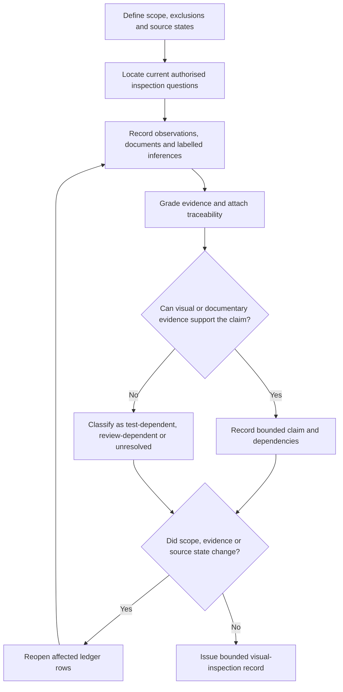
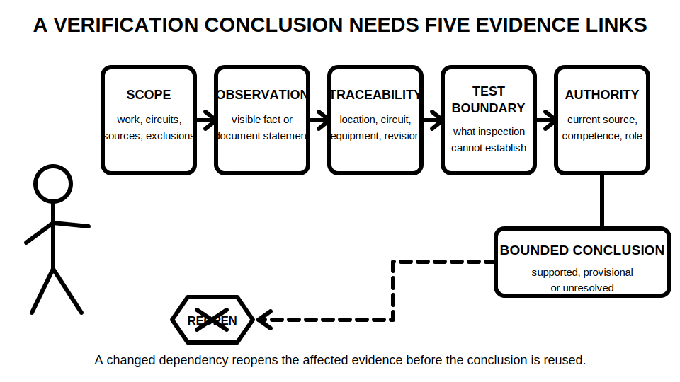

# Day 36 — Verification Purpose, Evidence and Visual Inspection

> **Currency, copyright and safety notice:** This original educational module explains verification reasoning at document level. It does not reproduce an official inspection checklist, prescribe field actions, define acceptance values or establish certification authority. Current authorised sources, competent supervision and jurisdiction-specific requirements remain mandatory.

## 1. Outcome and entry check

Given a fictional installation evidence pack, the learner can:

1. define the verification scope and identify exclusions;
2. separate observations, document statements, inferences, test-dependent claims and unresolved claims;
3. grade evidence and claims using the model in this module;
4. produce a traceable visual-inspection ledger with dependencies and reopening triggers; and
5. write a bounded conclusion that does not claim testing, compliance, certification or technical approval.

**Entry check:** without notes, define **observation**, **inference**, **evidence**, **scope**, **traceability** and **bounded conclusion**. Then explain why “looks acceptable” and “the label says isolated” are not verification results.

## 2. Why it matters

Verification is not one test, one checklist or one signature. It is a controlled body of evidence about defined work. Visual inspection can establish visible condition, correspondence and document discrepancies, but it cannot establish characteristics that require measurement, functional demonstration, controlled source states or authorised judgement.

A learner who overclaims visual evidence may hide an unresolved risk. A learner who records every uncertainty without prioritising it may also produce an unusable record. The required skill is to state what is supported, what depends on further evidence and what must remain unresolved.

*Caption: Record what inspection can establish, then identify what remains for authorised testing or review.*

## 3. Core concepts and terminology

- **Verification:** a structured process for obtaining, evaluating and recording evidence about defined installation work against applicable requirements.
- **Verification scope:** the exact work, circuits, equipment, documents, locations and source states included in the evidence review.
- **Visual inspection:** examination using sight and supplied records, without treating unseen, unmeasured or unoperated characteristics as proven.
- **Observation:** a directly visible or explicitly documented fact, recorded without interpretation.
- **Inference:** a reasoned interpretation that goes beyond the direct observation and must be labelled as such.
- **Test evidence:** results produced by an authorised test method using suitable equipment under controlled preconditions.
- **Evidence gap:** information required for a conclusion that has not been observed, supplied or validly tested.
- **Traceability:** the ability to connect a finding to its location, circuit, equipment, source, document revision and evidence record.
- **Dependency:** a fact or assumption on which a finding relies.
- **Reopening trigger:** a change or conflict that requires an earlier finding to be reconsidered.
- **Certification:** a formal act performed only by an authorised person under applicable requirements; this module confers no authority.

### Evidence grades

Use one grade for each evidence item:

1. **Stated** — appears in a supplied label, schedule, drawing or statement but has not been independently checked.
2. **Indicated** — supported by one visible or documentary feature, but important dependencies remain open.
3. **Corroborated** — supported by multiple consistent observations or current documents within the defined scope.
4. **Transferred** — remains supported after a relevant fictional condition changes and the dependencies are rechecked.
5. **Unresolved** — absent, conflicting, stale, outside scope or dependent on authorised testing or review.

### Claim grades

1. **Assumption** — a proposition used temporarily and clearly labelled.
2. **Provisional educational conclusion** — a reasoned classroom conclusion with unresolved dependencies.
3. **Supported educational conclusion** — well supported within the fictional evidence and stated scope.
4. **Authorised technical determination** — reserved for competent authorised review; this module does not produce it.

## 4. Rule-finding workflow

Use **V-E-R-I-F-Y**:

- **V — Verify scope and source states:** define the work, documents, locations, circuits, exclusions and known source arrangements.
- **E — Establish authorised questions:** locate current authorised requirements and convert them into inspection questions without copying protected tables or systematic wording.
- **R — Record evidence and grades:** separate observations, document statements, inferences and evidence gaps; assign traceability and an evidence grade.
- **I — Identify dependencies and test boundaries:** state what each finding relies on and which claims require authorised test evidence, functional demonstration or qualified judgement.
- **F — Form bounded claims:** assign a claim grade and write only what the evidence supports.
- **Y — Yield and reopen when conditions change:** stop at authority boundaries and reopen affected rows when scope, evidence or source conditions change.

The workflow prevents a checklist tick, label, drawing, normal operating response or remembered rule from substituting for traceable evidence. It also prevents unrelated findings from being reopened when only one dependency changes.

## 5. Visual model or worked example

### Verification evidence ledger

For every fictional finding, record:

| Field | Required entry |
|---|---|
| Scope item | circuit, equipment, location or document under review |
| Observation or statement | direct fact, quoted briefly in original words |
| Inference | interpretation, explicitly labelled |
| Evidence grade | stated, indicated, corroborated, transferred or unresolved |
| Claim grade | assumption, provisional, supported or authorised determination |
| Traceability | location, circuit, equipment ID, source and document revision |
| Dependency | fact that must remain true for the claim to stand |
| Evidence request | document, authorised test evidence or qualified review needed |
| Reopening trigger | change that invalidates or weakens the conclusion |
| Bounded conclusion | what the current evidence supports and does not support |

*Caption: A visual-inspection conclusion remains bounded until scope, traceability, dependencies, test boundaries and authority are all controlled.*

### Fully guided example

A fictional distribution-board schedule lists six final subcircuits. Two conductors cannot be matched to the schedule, and an alternate-source warning label appears without source documentation.

- **Observation:** two conductor identifiers do not correspond with the supplied schedule.
- **Observation:** an alternate-source warning label is present.
- **Inference:** the schedule may be incomplete or stale; grade this as an inference, not a defect determination.
- **Supported visual finding:** correspondence between the two identifiers and the supplied schedule is unresolved.
- **Not supported by visual evidence:** continuity, polarity, insulation condition, protective-device operation, source isolation effectiveness or compliance.
- **Dependencies:** document revision, circuit identity, source inventory and verification scope.
- **Evidence requests:** current schedule, source documentation and authorised test records where relevant.
- **Bounded conclusion:** the supplied pack does not yet support a complete visual-verification record for the affected circuits.

### Partially guided transfer

A revised schedule later identifies one of the two conductors, but the alternate-source documentation remains absent. Regrade only the affected correspondence row. Do not upgrade the separate source-boundary row or infer that unperformed tests are complete.

### Independent changed-scope transfer

The fictional brief then excludes one workshop extension from the verification scope. Update the scope statement, mark related observations as outside the current conclusion and reconsider every summary statement that depended on whole-installation coverage.

## 6. Practical application

Create a visual-inspection record for a fictional small workshop pack containing a layout, distribution schedule, equipment list, three photographs and a revision history.

Your submission must include:

- a one-paragraph scope with inclusions, exclusions and source-state assumptions;
- a document register with currency status;
- ten observations and four labelled inferences;
- at least five evidence gaps;
- one ledger row for each item, including evidence grade, claim grade, traceability, dependency and reopening trigger;
- three claims that require authorised test evidence;
- one changed-document transfer and one changed-scope transfer; and
- a bounded conclusion stating what has and has not been established.

### Educational rubric — 12 points

- scope and source-state control — 2;
- observation/inference separation — 2;
- evidence and claim grading — 2;
- inspection/test/authority boundaries — 2;
- traceability, dependencies and reopening triggers — 2;
- bounded reporting and safety language — 2.

**Critical errors override the score:** inventing a result; treating absence of visible damage as proof; treating a label, drawing or device position as proof of isolation or compliance; implying that a test occurred; or claiming certification or technical approval.

This rubric is an original educational tool, not an official RTO assessment instrument or pass mark.

## 7. Common errors and safety checkpoint

Common errors include:

- using a generic checklist without defining scope;
- recording assumptions as observations;
- treating labels, schedules or photographs as conclusive proof;
- ignoring document revision conflicts;
- treating visual inspection as proof of continuity, polarity, insulation condition or device operation;
- carrying a conclusion across a changed source state or changed scope without reopening dependencies;
- using “compliant”, “safe”, “verified” or “certified” where only a bounded observation is supported; and
- listing every uncertainty without identifying consequence, ownership or next evidence.

**Safety checkpoint:** this is document-only learning. It authorises no site access, opening, switching, isolation, proving, locking, tagging, contact, measurement, testing, energisation, certification, approval or return to service. Stop where the fictional evidence does not establish scope, source state, equipment identity, competence or authority.

Exact verification requirements, inspection items, required records, test preconditions, acceptance criteria and jurisdiction-specific duties remain `reference_check_required` and require qualified review.

## 8. Retrieval and next links

### Immediate retrieval

Without notes:

1. define verification, visual inspection, test evidence, dependency and reopening trigger;
2. state V-E-R-I-F-Y in order;
3. classify six claims as inspection-supported, test-dependent, review-dependent or unresolved;
4. assign an evidence grade and claim grade to two fictional findings; and
5. rewrite one certification claim as a bounded inspection statement.

### Delayed retrieval for Day 37

At the start of Day 37, redraw the V-E-R-I-F-Y workflow and explain why visual evidence cannot be converted into a test result. Then identify the scope, source-state and authority preconditions that must be resolved before any fictional test evidence can be interpreted.

- **Program:** [Six-Week Capstone Learning Plan](../MASTER_PLAN.md)
- **Previous:** [Day 35 — Week 5 Integrated Installation Inspection](day-35-week-5-integrated-installation-inspection.md)
- **Knowledge note:** [[Six-Week Day 36 - Verification Purpose Evidence and Visual Inspection]]
- **Next:** [Day 37 — Mandatory Test Purposes and Safe Test Preconditions](day-37-mandatory-test-purposes-and-safe-test-preconditions.md)
