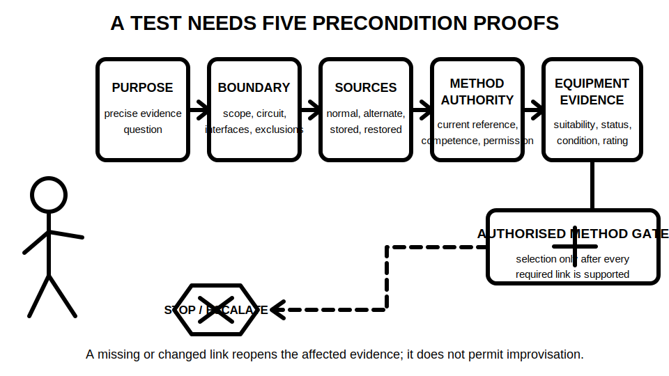
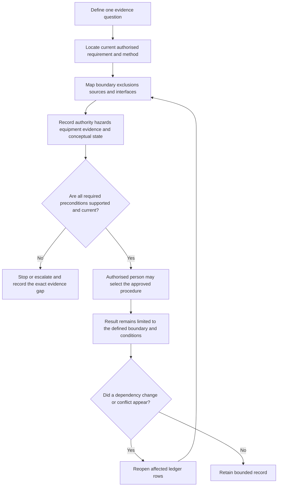

# Day 37 — Mandatory Test Purposes and Safe Test Preconditions

> **Currency, copyright and safety notice:** This module teaches paper-based reasoning about why tests exist and what must be established before an authorised procedure begins. It deliberately omits instrument connection, switching steps, test sequences, exact values and acceptance criteria. Exact mandatory tests and safe preconditions remain `reference_check_required`.

## 1. Outcome and entry check

Given a fictional verification brief, the learner can:

1. state the precise evidence question for each proposed test category;
2. classify the proposed context as conceptually de-energised, energised or unresolved without prescribing a field method;
3. map the test boundary, every known energy source and each dependency;
4. grade the available evidence and the resulting claim;
5. identify missing preconditions and issue a clear stop or escalation decision; and
6. reopen only the affected reasoning when a source, scope, document, instrument record or authority changes.

**Entry check:** Explain why a test name, instrument or remembered result has no meaning without a defined evidence question, test boundary, source state, authorised method and acceptance source.

A satisfactory entry response must distinguish:

- **purpose** from **procedure**;
- **evidence** from **conclusion**;
- **conceptual state category** from proof that the state has been established; and
- **educational planning** from permission to perform a test.

## 2. Why it matters

Testing is not automatically safe or meaningful merely because a recognised instrument or familiar test name is used. A test can expose people to energy, alter the installation state, damage equipment, defeat controls or generate misleading evidence when the question, boundary, source map or approved method is incomplete.

Safe reasoning therefore begins before any practical action. The learner must define what characteristic is being investigated, what the result could and could not support, which sources and interfaces are inside the boundary, and which authorised evidence must exist before the method may be selected.

*Caption: A recognised test name does not open the gate; the evidence purpose and every authorised precondition must first be established.*

*Caption: Purpose, boundary, sources, method authority and equipment evidence are separate links. A missing or changed link keeps the decision at stop or escalate.*

## 3. Core concepts and terminology

### Essential terms

- **Test purpose:** the installation characteristic or safety question the test is intended to provide evidence about.
- **Test category:** a conceptual grouping of tests by evidence purpose. A category name is not an approved method.
- **Precondition:** a state, document, authority, control or item of evidence that must be established before an approved method begins.
- **De-energised test context:** a conceptual category in which the authorised method requires a controlled non-energised state. This module does not prescribe how that state is achieved or proved.
- **Energised test context:** a conceptual category involving electrical energy under an approved procedure, qualified control and task-specific safeguards.
- **Unresolved state:** a condition in which the available evidence is insufficient to classify or control the relevant energy state.
- **Instrument suitability:** documented evidence that the instrument and accessories are appropriate, within required status, in suitable condition and rated for the authorised task.
- **Test boundary:** the exact circuit, equipment, conductors, sources, interfaces and exclusions to which the evidence claim applies.
- **Dependency:** a fact or condition on which a proposed test plan or conclusion relies, such as source configuration, circuit identity, equipment state, document revision or instrument status.
- **Reopening trigger:** a change or contradiction that requires affected ledger rows to be reconsidered before their conclusions are reused.
- **Stop condition:** missing or conflicting authority, source control, scope, method, instrument evidence, environment or competence that prevents progression.
- **Bounded claim:** a conclusion limited to the evidence question, test boundary, authorised method, conditions and currency actually supported.

### Five evidence grades

Use one grade for every important input:

1. **Stated** — present in one supplied source but not independently checked.
2. **Indicated** — suggested by a label, drawing, schedule, photograph or scenario detail.
3. **Corroborated** — supported by two or more consistent, relevant sources within the fictional pack.
4. **Transferred** — previously supported evidence reused only after its dependencies and currency are checked.
5. **Unresolved** — missing, conflicting, outside scope or dependent on authorised practical verification.

### Four claim grades

- **Assumption** — a proposition used only to identify what evidence is missing.
- **Provisional educational conclusion** — reasonable for the fictional exercise but dependent on unresolved evidence.
- **Supported educational conclusion** — adequately supported within the supplied fictional evidence and stated limits.
- **Authorised technical determination** — a decision requiring current authorised sources, appropriate competence and real evidence; this module does not grant it.

A recognised test name, a valid calibration label or a familiar circuit arrangement can contribute evidence. None independently proves that the method is authorised, the boundary is correct, every source is controlled, the instrument is suitable for the actual task or the result is acceptable.

## 4. Rule-finding workflow

Use **P-R-E-C-H-E-C-K**:

- **P — Purpose:** define the exact characteristic or safety question.
- **R — Reference:** locate the current authorised requirement, method and acceptance source.
- **E — Establish boundary:** identify scope, exclusions, circuit identity, equipment, interfaces and every source.
- **C — Confirm authority:** identify competent role, supervision, permission and responsibility.
- **H — Hazards:** identify energy states, environmental conditions, interactions and required controls at a planning level.
- **E — Equipment evidence:** verify the required evidence for instrument and accessory suitability.
- **C — Circuit state and dependencies:** state the conceptual context and record every dependency without claiming it has been practically proved.
- **K — Keep the stop decision:** stop or escalate whenever any required item is unresolved, contradictory or stale.

Build a **test-precondition ledger** with these columns:

| Evidence question | Proposed category | Boundary and exclusions | Sources and interfaces | Conceptual state | Authorised reference required | Authority required | Hazard/control evidence | Instrument evidence | Evidence grade | Claim grade | Dependency | Reopening trigger | Decision |
|---|---|---|---|---|---|---|---|---|---|---|---|---|---|

This model is a permission and evidence gate, not a field sequence. The diagram deliberately ends at authorised procedure selection and bounded recording; it does not tell the learner how to connect, switch, isolate, prove, measure or interpret an official acceptance value.

### Rule-finding sequence

For each fictional request:

1. Write the evidence question without naming an instrument.
2. Identify the characteristic the result is intended to support.
3. Locate the type of authorised source that must define the requirement, method and acceptance basis.
4. Define the boundary and exclusions.
5. List normal, alternate, stored and automatically restored energy possibilities supplied by the scenario.
6. Record the required authority, environmental controls and equipment evidence.
7. Grade each input and resulting claim.
8. Issue **proceed to authorised method selection**, **stop**, or **escalate**.
9. Add the exact reopening triggers.

Never infer a complete precondition set from a standard-looking board, an instrument sticker, a normal operating response, a drawing alone or a previous test record.

## 5. Visual model or worked example

### Worked example 1 — fully guided

A fictional brief requests evidence about protective-conductor continuity for a labelled final subcircuit. The pack contains a schedule, a photograph of the label and an older verification record.

1. **Purpose:** evidence about continuity of the relevant protective path.
2. **Boundary:** the exact fictional circuit, relevant conductors and interfaces; downstream equipment and alternate paths remain explicit rather than assumed.
3. **Sources:** the pack must be screened for normal, alternate, stored and automatic restoration possibilities.
4. **Reference:** the current authorised requirement and approved method are not supplied.
5. **Instrument evidence:** no current task-specific suitability record is supplied.
6. **Grades:** circuit identity is **indicated**; the old record is **stated** and may be stale; method and instrument evidence are **unresolved**.
7. **Claim:** only an **assumption** that continuity evidence is required; no technical determination is available.
8. **Decision:** **stop and escalate** for current boundary, source, method, authority and equipment evidence.

The correct answer does not supply a remembered test sequence.

### Worked example 2 — partially guided

A fictional task card asks for evidence about insulation condition. The scenario later adds a battery-backed control circuit.

Complete the ledger, then explain why the changed source reopens:

- source mapping;
- boundary and exclusions;
- conceptual state classification;
- approved-method selection;
- equipment suitability; and
- any earlier conclusion that treated the circuit as having one source.

Do not reopen unrelated evidence unless its dependency changed.

### Independent transfer

A revised drawing changes the circuit identifier but leaves the physical equipment description unchanged. Decide which rows can be transferred, which become provisional and which must be reopened. Justify each decision using dependencies rather than redoing the entire exercise automatically.

## 6. Practical application

Complete eight fictional verification requests. Include varied purposes such as continuity, insulation condition, conductor identification, polarity-related evidence, protective-device operation and supply-related evidence, while keeping all methods and values outside scope.

For each request, produce:

- one precise evidence question;
- the proposed conceptual test category;
- conceptual state category: de-energised, energised or unresolved;
- boundary and exclusions;
- all supplied source and interface evidence;
- five or more required preconditions;
- evidence and claim grades;
- exact missing evidence;
- stop, escalate or authorised-method-selection decision;
- dependencies and reopening triggers; and
- the authorised source types that must be consulted.

### Worked-example fading

- **Requests 1–2:** use a completed ledger model and explain every grade.
- **Requests 3–5:** use headings only.
- **Requests 6–8:** build the ledger independently.
- **Changed-condition transfer:** after completion, add one alternate source, one revised drawing and one expired or missing instrument-status record to three different requests. Reopen only the affected rows.
- **Delayed retrieval:** at the start of Day 38, reconstruct P-R-E-C-H-E-C-K and one complete ledger from memory before reopening this module.

### Original educational rubric — 12 points

| Category | 0 points | 1 point | 2 points |
|---|---|---|---|
| Purpose | instrument-led or vague | partly defined | precise evidence question |
| Boundary and sources | major omission | partial map | complete supplied map with exclusions |
| State and dependencies | confuses category with proof | some dependencies | conceptual state and dependencies controlled |
| Authority, hazards and equipment | absent | partly identified | all planning evidence identified |
| Evidence and claims | overclaims or ungraded | inconsistent grading | grades justified and bounded |
| Stop and reopening discipline | proceeds through gaps | notices some gaps | explicit stop/escalate and selective reopening |

**Critical-error gates override the numerical score:**

- giving improvised practical test steps;
- treating a conceptual state category as proof of a safe state;
- ignoring a supplied alternate, stored or automatically restored source;
- permitting progression with unresolved authority or method;
- inventing an exact value, limit or official acceptance claim; or
- treating this rubric as an official RTO pass mark.

This rubric is an original learning tool, not an authorised assessment standard.

## 7. Common errors and safety checkpoint

Common errors include:

- choosing a test because an instrument is available;
- naming a procedure before defining the evidence question;
- treating isolation or de-energisation as a paperwork phrase;
- assuming a label, schedule or old record proves circuit identity;
- overlooking alternate, stored, control or automatically restored energy;
- confusing instrument calibration evidence with complete task suitability;
- copying a remembered sequence;
- applying a result outside its test boundary;
- failing to reopen controls after a changed source, scope or document; and
- using a provisional educational conclusion as a technical approval.

### Safety checkpoint

This module authorises no practical test and contains no field sequence. Practical verification requires qualified supervision, current approved procedures, suitable equipment, task-specific authority and site-specific controls.

Stop whenever any of the following is unresolved or contradictory:

- competence, permission or supervision;
- work scope, circuit identity, boundary or exclusions;
- normal, alternate, stored or automatically restored energy;
- required circuit state and the authorised means of establishing it;
- current approved method and acceptance source;
- instrument or accessory suitability evidence;
- environmental or access conditions;
- interaction with connected equipment or other work; or
- the meaning, traceability or currency of prior evidence.

The learner must never infer permission to open, switch, isolate, prove, connect, contact, measure, test, energise, certify or return equipment to service from this module.

## 8. Retrieval and next links

Without notes:

1. state P-R-E-C-H-E-C-K;
2. define test purpose, category, precondition, boundary, dependency, reopening trigger and stop condition;
3. list the five evidence grades and four claim grades;
4. classify eight missing-precondition examples;
5. explain why a changed source invalidates selected parts of an earlier plan; and
6. explain why an approved test name, suitable instrument and familiar result still do not establish a complete technical conclusion.

- **Program:** [Six-Week Capstone Learning Plan](../MASTER_PLAN.md)
- **Previous:** [Day 36 — Verification Purpose, Evidence and Visual Inspection](day-36-verification-purpose-evidence-and-visual-inspection.md)
- **Knowledge note:** [[Six-Week Day 37 - Mandatory Test Purposes and Safe Test Preconditions]]
- **Next:** [Day 38 — Test Sequence, Expected Evidence and Result Interpretation](day-38-test-sequence-expected-evidence-and-result-interpretation.md)
