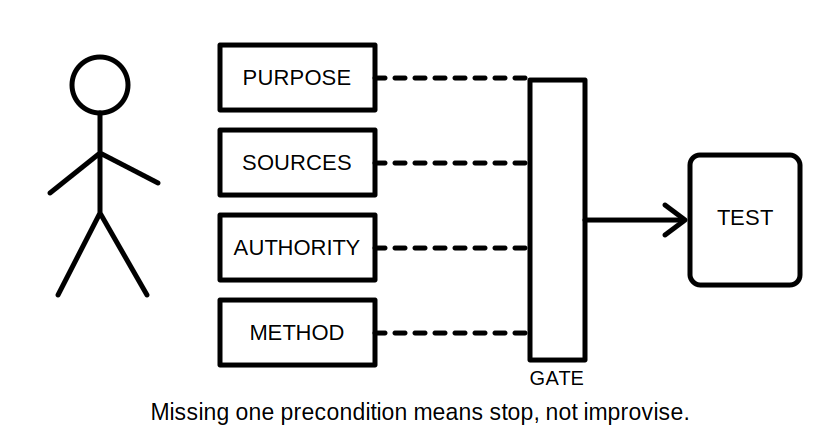
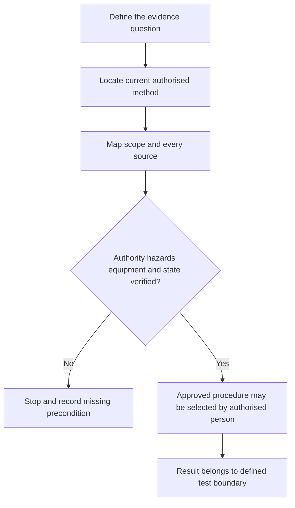

# Day 37 — Mandatory Test Purposes and Safe Test Preconditions

> **Currency, copyright and safety notice:** This module teaches paper-based reasoning about why tests exist and what must be established before an authorised procedure begins. It deliberately omits instrument connection, switching steps, exact test values and acceptance criteria.

## 1. Outcome and entry check

Given fictional verification tasks, the learner can match each test category to its evidence purpose, identify precondition gaps, distinguish de-energised and energised test contexts conceptually, and stop rather than inventing a procedure.

**Entry check:** explain why a test name, instrument or result has no meaning without a defined circuit, purpose, preconditions and authorised method.

## 2. Why it matters

Tests can introduce hazards, alter circuit conditions or create misleading results when performed under the wrong state or without complete source knowledge. Safe verification reasoning begins before an instrument is connected: define the question, identify every source, confirm authority and use the current approved method.

*Caption: A test does not begin until its evidence purpose and every authorised precondition are established.*

## 3. Core concepts and terminology

- **Test purpose:** the installation characteristic or safety question the test is intended to provide evidence about.
- **Precondition:** a state or requirement that must be established before the approved method begins.
- **De-energised test context:** a category where the approved method requires a controlled non-energised state; this module does not prescribe how that state is achieved.
- **Energised test context:** a category involving electrical energy under an approved procedure and qualified control.
- **Instrument suitability:** verified appropriateness, condition and rating of equipment for the authorised task.
- **Test boundary:** the exact circuit, equipment, conductors, sources and interfaces included in the evidence claim.
- **Stop condition:** missing authority, source control, scope, method, instrument evidence or environmental control that prevents the task from proceeding.

## 4. Rule-finding workflow

Use **P-R-E-C-H-E-C-K**: **P**urpose of evidence; **R**eference the authorised method; **E**stablish scope and all sources; **C**onfirm competent authority and supervision; **H**azards and controls identified; **E**quipment suitability evidenced; **C**ircuit state and dependencies verified; **K**eep a stop decision when any item is unresolved.

The model is intentionally a permission gate, not an operational procedure.

## 5. Visual model or worked example

Fictional task cards ask for evidence about protective-conductor continuity, insulation condition, conductor identification and protective-device operation. Match each card to the characteristic being investigated and list the documentation, source-state, boundary and approved-method evidence required before action. Do not specify leads, terminals, switching steps or numeric criteria.

Changed condition: a battery source is added to one circuit. Reopen source mapping, state control, boundary definition and method selection; the original precondition record is no longer sufficient.

## 6. Practical application

For eight fictional verification requests, produce a matrix with: evidence question; test category; conceptual state category; test boundary; five preconditions; missing evidence; stop/escalate decision; and the authorised source that must be checked.

Rubric, 12 points: purpose matching 2; state-category reasoning 2; source and boundary completeness 2; authority and hazard controls 2; instrument/method evidence 2; stop discipline 2. Critical errors override the score: giving improvised field steps, ignoring an alternate source, or allowing testing with an unresolved precondition.

## 7. Common errors and safety checkpoint

Errors include choosing a test because an instrument is available, treating isolation as a paperwork phrase, failing to reopen controls after a changed source, mixing evidence purposes, copying a remembered sequence or interpreting a result outside its boundary.

This module authorises no test. It contains no field sequence. Practical verification requires qualified supervision, current approved procedures, suitable equipment and site-specific controls. Stop whenever authority, scope, sources, state, environment, method or instrument suitability is unresolved.

## 8. Retrieval and next links

State P-R-E-C-H-E-C-K; define test purpose, precondition, boundary and stop condition; classify eight missing-precondition examples; explain why adding one source invalidates an earlier test plan.

- **Program:** [Six-Week Capstone Learning Plan](../MASTER_PLAN.md)
- **Previous:** [Day 36 — Verification Purpose, Evidence and Visual Inspection](day-36-verification-purpose-evidence-and-visual-inspection.md)
- **Knowledge note:** [[Six-Week Day 37 - Mandatory Test Purposes and Safe Test Preconditions]]
- **Next:** [Day 38 — Test Sequence, Expected Evidence and Result Interpretation](day-38-test-sequence-expected-evidence-and-result-interpretation.md)
