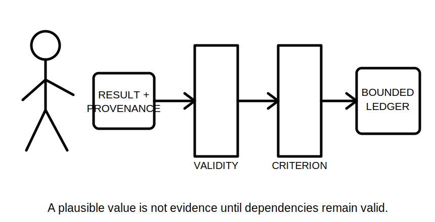
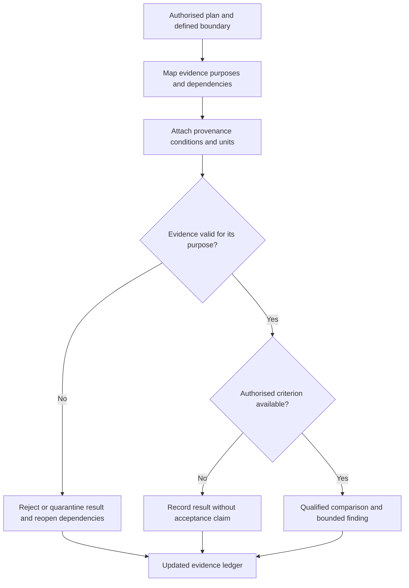

# Day 38 — Test Sequence, Expected Evidence and Result Interpretation

> **Currency, copyright and safety notice:** This original paper-based module teaches dependency and interpretation logic. It does not supply an official test order, operational steps, instrument connections, exact values or acceptance criteria.

## 1. Outcome and entry check

Given a fictional authorised test plan and result set, the learner can explain why sequence dependencies matter, connect each result to its evidence question, detect invalidated downstream evidence and state a bounded interpretation.

**Entry check:** define purpose, precondition, boundary, dependency and expected evidence; explain why a number without method, units, location and criterion is not interpretable.

## 2. Why it matters

Verification evidence is cumulative. An earlier result or changed condition can determine whether later evidence is meaningful, safe to obtain or still within scope. Interpretation therefore requires more than comparing a number with memory: confirm provenance, method, boundary, units, conditions and authorised criterion.

*Caption: Interpret only evidence that remains valid after every earlier dependency and changed condition is checked.*

## 3. Core concepts and terminology

- **Sequence dependency:** a relationship where the validity or permission of one evidence step depends on an earlier established condition.
- **Expected evidence:** the form of observation or result the authorised method is intended to produce, without assuming its acceptance outcome.
- **Result provenance:** the circuit, location, instrument, method, state, time and person associated with a result.
- **Validity:** whether the evidence was obtained under the defined method and conditions for its stated purpose.
- **Acceptance criterion:** the current authorised rule used by a qualified person to judge a valid result.
- **Anomaly:** a result or pattern requiring confirmation, investigation or escalation rather than immediate diagnosis.
- **Reopening:** returning to earlier evidence or controls because a result, change or inconsistency affects downstream conclusions.

## 4. Rule-finding workflow

Use **S-E-Q-U-E-N-C-E**: **S**cope the authorised plan; **E**xplain each evidence purpose; **Q**ualify prerequisites and dependencies; **U**nite result with provenance and units; **E**valuate validity before acceptance; **N**ote anomalies without guessing; **C**heck changed conditions and reopen dependencies; **E**nd with a bounded interpretation.

The workflow separates evidence validity from technical acceptance; a plausible value can still be invalid evidence.

## 5. Visual model or worked example

A fictional results sheet contains values for four circuits. One entry lacks circuit identity, another was recorded before a drawing revision added an alternate source, and a third has units but no method reference. Quarantine all three from acceptance reasoning. The remaining result may be described only within its verified boundary and authorised criterion.

Changed condition: the circuit schedule is corrected after results were recorded. Reconcile identities and determine which results remain traceable; do not assume every earlier result transfers to the revised record.

## 6. Practical application

Audit a fictional twelve-row result sheet. For each row record: evidence purpose; prerequisite dependencies; provenance completeness; units; validity; authorised criterion status; anomaly; affected downstream evidence; reopen action; and bounded interpretation.

Rubric, 12 points: dependency map 2; provenance 2; validity reasoning 2; criterion separation 2; anomaly/reopening logic 2; bounded reporting 2. Critical errors override the score: accepting untraceable evidence, inventing a criterion, continuing downstream reasoning after an invalidating change or diagnosing from one unexplained anomaly.

## 7. Common errors and safety checkpoint

Common errors include memorising a sequence without understanding dependencies, comparing before validating evidence, ignoring changed drawings or source states, mixing circuits, omitting units, treating one anomaly as a fault diagnosis or repeating a test without authority.

This module is not an operational testing guide. It authorises no access, switching, isolation, instrument use, testing, energisation, diagnosis, certification or approval. Practical decisions require current authorised methods, qualified supervision and site-specific controls.

## 8. Retrieval and next links

State S-E-Q-U-E-N-C-E; define dependency, provenance, validity, criterion and reopening; audit four flawed result statements; explain why valid evidence and acceptable evidence are separate decisions.

- **Program:** [Six-Week Capstone Learning Plan](../MASTER_PLAN.md)
- **Previous:** [Day 37 — Mandatory Test Purposes and Safe Test Preconditions](day-37-mandatory-test-purposes-and-safe-test-preconditions.md)
- **Knowledge note:** [[Six-Week Day 38 - Test Sequence Expected Evidence and Result Interpretation]]
- **Next:** [Day 39 — Systematic Fault-Finding Workflow and Evidence Control](day-39-systematic-fault-finding-workflow-and-evidence-control.md)
