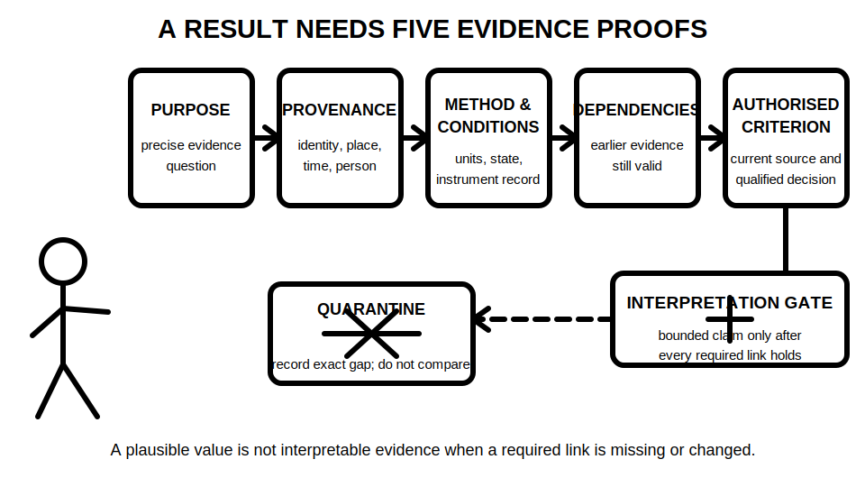
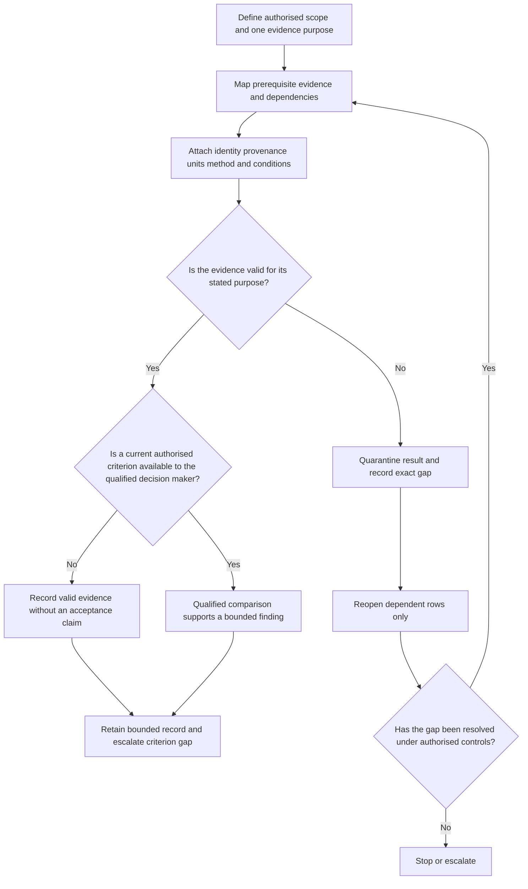

# Day 38 — Test Sequence, Expected Evidence and Result Interpretation

> **Currency, copyright and safety notice:** This original paper-based module teaches dependency, validity and interpretation reasoning. It does not provide an official test order, operational steps, instrument connections, exact values, acceptance criteria or authority to perform testing. Exact prescribed sequences, methods and decisions remain `reference_check_required`.

## 1. Outcome and entry check

Given a fictional authorised test plan and result pack, the learner can:

1. map the purpose and dependencies of each evidence item;
2. distinguish a result's provenance, validity and technical acceptance;
3. grade evidence and claims without treating a plausible value as proof;
4. identify when an earlier gap or changed condition invalidates downstream reasoning;
5. reopen only affected ledger rows; and
6. report a bounded interpretation or an explicit stop and escalation decision.

**Entry check:** Reconstruct P-R-E-C-H-E-C-K from Day 37, then define **purpose**, **precondition**, **boundary**, **dependency**, **provenance**, **validity** and **acceptance criterion**. Explain why a number without circuit identity, method, units, conditions and an authorised criterion is not interpretable.

A satisfactory entry response must distinguish:

- **test order** from **dependency logic**;
- **recorded result** from **valid evidence**;
- **valid evidence** from **acceptable evidence**; and
- **educational interpretation** from **authorised technical determination**.

## 2. Why it matters

Verification evidence is cumulative but not automatically transferable. A later result may depend on an earlier boundary, source state, circuit identity, method, instrument record or result remaining valid. When one dependency changes, the correct response is not to keep comparing numbers or restart everything blindly; it is to identify the affected claims, quarantine invalid evidence and reopen the smallest justified part of the reasoning.

A result may look familiar and still be unusable because it belongs to the wrong circuit, lacks units, was obtained under an unverified state, refers to a superseded drawing or has no authorised acceptance source. Conversely, an unusual result is not automatically a fault diagnosis. It is an anomaly that requires controlled confirmation and escalation.

*Caption: Interpret only evidence that remains valid after every earlier dependency and changed condition is checked.*

*Caption: Purpose, provenance, method conditions, dependency status and authorised criterion are separate links. A missing link keeps the result quarantined.*

## 3. Core concepts and terminology

### Essential terms

- **Sequence dependency:** a relationship in which the validity, meaning or permission of one evidence item depends on an earlier established condition. It does not prescribe an official test order.
- **Expected evidence:** the form of observation, record or result that an authorised method is intended to produce for a stated purpose, without assuming the outcome will be acceptable.
- **Result provenance:** the traceable identity of the circuit or equipment, location, instrument, authorised method, state, conditions, units, time and responsible person associated with a result.
- **Validity:** whether evidence was obtained and recorded within the defined boundary, method and conditions for its stated purpose.
- **Acceptance criterion:** the current authorised rule used by an appropriately qualified person to judge valid evidence. A remembered threshold is not an authorised criterion.
- **Anomaly:** a result, pattern or inconsistency that requires confirmation, investigation or escalation rather than immediate diagnosis.
- **Quarantine:** marking evidence so it is not used for acceptance reasoning until its gap or conflict is resolved.
- **Dependency propagation:** the effect of an invalid or changed input on later evidence and conclusions that relied on it.
- **Reopening:** returning to affected evidence, controls or conclusions because a dependency changed or a contradiction appeared.
- **Bounded interpretation:** a statement limited to the verified purpose, boundary, provenance, conditions, criterion and currency actually supported.

### Five evidence grades

Grade every material input:

1. **Stated** — present in one supplied source but not independently checked.
2. **Indicated** — suggested by a label, schedule, drawing, photograph or scenario detail.
3. **Corroborated** — supported by two or more consistent relevant sources in the fictional pack.
4. **Transferred** — previously supported evidence reused only after its dependencies, identity and currency are checked.
5. **Unresolved** — missing, conflicting, outside scope or dependent on authorised practical verification.

### Four claim grades

- **Assumption** — a proposition used only to expose missing evidence.
- **Provisional educational conclusion** — reasonable for the fictional exercise but dependent on unresolved evidence.
- **Supported educational conclusion** — adequately supported within the fictional pack and stated limits.
- **Authorised technical determination** — a decision requiring current authorised sources, appropriate competence and real evidence; this module does not grant it.

A result can be **stated** and numerically plausible while its validity remains **unresolved**. Evidence validity must be established before any qualified acceptance comparison.

## 4. Rule-finding workflow

Use **S-E-Q-U-E-N-C-E**:

- **S — Scope:** define the authorised plan, evidence boundary, exclusions and circuit identities.
- **E — Explain purpose:** state the exact evidence question for each result without leading with a number or instrument.
- **Q — Qualify dependencies:** map prerequisite evidence, source states, document versions and conditions on which later results rely.
- **U — Unite provenance:** connect each result to identity, location, method, instrument record, state, units, conditions, time and responsible role.
- **E — Evaluate validity:** determine whether the evidence is valid for its stated purpose before considering acceptance.
- **N — Note anomalies:** record inconsistencies without guessing a cause or repeating a test without authority.
- **C — Check changes:** propagate changed conditions only to dependent rows and reopen the affected reasoning.
- **E — End bounded:** state the supported interpretation, unresolved gap, quarantine decision and escalation path.

Build a **result-interpretation ledger**:

| Evidence purpose | Result identity | Boundary and exclusions | Provenance | Units and conditions | Method authority | Dependency | Evidence grade | Validity status | Criterion status | Claim grade | Anomaly | Reopening trigger | Bounded interpretation |
|---|---|---|---|---|---|---|---|---|---|---|---|---|---|

The diagram separates three decisions: whether evidence is valid, whether an authorised criterion is available and whether a bounded technical finding may be made. It deliberately contains no operational sequence or test method.

### Dependency and reopening rules

1. Write each dependency explicitly; do not rely on implied order.
2. When evidence is invalid, quarantine every later claim that actually depends on it.
3. Do not discard independent evidence merely because another row failed.
4. Reopen when circuit identity, source arrangement, equipment, boundary, state, document revision, method, instrument status, units, environmental condition, authority or criterion changes.
5. Record why a transferred result remains valid or why it cannot transfer.
6. Never infer a fault cause from one unexplained anomaly.

## 5. Visual model or worked example

### Worked example 1 — fully guided

A fictional results sheet contains four entries:

- Row A has a circuit identity, authorised method reference, units, conditions and a current criterion source.
- Row B has a plausible number but no circuit identity.
- Row C was recorded before a revised drawing introduced an alternate source.
- Row D has units and circuit identity but no method reference or instrument record.

Apply S-E-Q-U-E-N-C-E:

1. **Row A:** provenance is corroborated within the fictional pack; validity may be supported within the exercise, but only a qualified person using the supplied authorised criterion may make the bounded comparison.
2. **Row B:** identity is unresolved, so the result is quarantined and cannot support any circuit claim.
3. **Row C:** the new source arrangement reopens boundary, state, method-condition and downstream dependency reasoning. The old result does not automatically transfer.
4. **Row D:** the number is stated, but method and instrument evidence are unresolved; quarantine it from acceptance reasoning.

The correct response is not to invent missing details or diagnose a fault.

### Worked example 2 — partially guided

A corrected circuit schedule changes two identifiers but leaves one equipment description unchanged. For each affected row decide whether identity evidence is:

- corroborated and transferable;
- provisional pending reconciliation; or
- unresolved and quarantined.

Explain the decision using dependencies. Do not assume the unchanged equipment description proves the result belongs to the revised circuit.

### Independent changed-condition transfer

After completing a six-row ledger, introduce three changes:

1. an alternate source is added to one circuit;
2. an instrument-status record is found to have expired before one result was recorded; and
3. an authorised criterion document is superseded.

Reopen only dependent rows, identify which conclusions remain supported and state what must be escalated. No test is repeated within this exercise.

## 6. Practical application

Audit a fictional twelve-row result sheet. For every row record:

- evidence purpose;
- circuit or equipment identity;
- boundary and exclusions;
- prerequisite dependencies;
- complete provenance;
- units and recorded conditions;
- method-authority status;
- evidence grade;
- validity status;
- authorised-criterion status;
- claim grade;
- anomaly, if any;
- affected downstream evidence;
- reopening trigger and action; and
- bounded interpretation or quarantine statement.

### Worked-example fading

- **Rows 1–3:** use a completed model and explain each grade.
- **Rows 4–7:** use ledger headings and dependency prompts only.
- **Rows 8–12:** complete independently.
- **Changed-condition transfer:** apply the three changes from the independent exercise and revise only affected rows.
- **Delayed retrieval:** at the start of Day 39, reconstruct S-E-Q-U-E-N-C-E, the five evidence grades, the four claim grades and one ledger row from memory before reopening this module.

### Original educational rubric — 12 points

| Category | 0 points | 1 point | 2 points |
|---|---|---|---|
| Purpose and scope | vague or number-led | partly defined | precise question, boundary and exclusions |
| Dependencies | omitted or assumed | partial map | explicit prerequisite and propagation map |
| Provenance | result detached from context | some traceability | identity, method, instrument, state, units and conditions linked |
| Validity and criterion | compares before validating | partial separation | validity established before criterion status and acceptance |
| Anomaly and reopening | guesses cause or restarts blindly | notices issue | quarantines, propagates and selectively reopens |
| Reporting | overclaims | partly bounded | grades justified with a clear bounded interpretation or escalation |

**Critical-error gates override the numerical score:** accepting untraceable evidence; inventing a method, value or criterion; treating an anomaly as a diagnosis; continuing dependent reasoning after an invalidating change; repeating or proposing practical testing without authority; or labelling the work `technically-reviewed`.

This rubric is an original learning aid, not an official RTO pass mark or assessment rule.

## 7. Common errors and safety checkpoint

Common errors include:

- memorising an order without understanding dependencies;
- treating a familiar value as valid evidence;
- comparing before confirming identity, method, units and conditions;
- assuming a revised schedule preserves all earlier traceability;
- overlooking alternate, stored or automatically restored energy in the dependency map;
- transferring a result because equipment appears unchanged;
- treating one anomaly as proof of a fault cause;
- reopening every row instead of only affected dependencies;
- repeating a test to resolve uncertainty without authority; and
- describing educational reasoning as technical approval.

**Safety checkpoint:** This module is not an operational testing guide. It authorises no site access, opening, switching, isolation, proving, locking, tagging, connection, contact, instrument use, measurement, testing, fault diagnosis, energisation, certification, approval or return to service. Practical decisions require current authorised methods, competent people, task-specific controls and site evidence.

Stop and escalate whenever identity, source state, boundary, method, instrument evidence, conditions, authority, criterion or downstream dependency remains unresolved or conflicting.

## 8. Retrieval and next links

Without notes:

1. State S-E-Q-U-E-N-C-E.
2. Define provenance, validity, criterion, anomaly, quarantine and reopening.
3. List the five evidence grades and four claim grades.
4. Explain why valid evidence and acceptable evidence are separate decisions.
5. Audit four flawed result statements and identify the exact quarantine reason.
6. Describe how one changed source or document revision propagates through dependent rows.
7. State the safety and technical-review boundaries.

- **Program:** [Six-Week Capstone Learning Plan](../MASTER_PLAN.md)
- **Previous:** [Day 37 — Mandatory Test Purposes and Safe Test Preconditions](day-37-mandatory-test-purposes-and-safe-test-preconditions.md)
- **Knowledge note:** [[Six-Week Day 38 - Test Sequence Expected Evidence and Result Interpretation]]
- **Next:** [Day 39 — Systematic Fault-Finding Workflow and Evidence Control](day-39-systematic-fault-finding-workflow-and-evidence-control.md)
