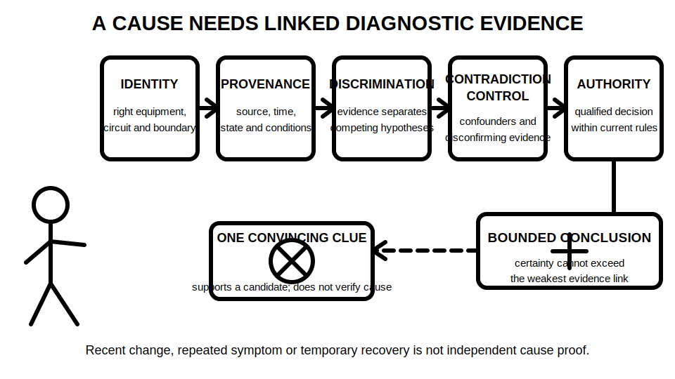
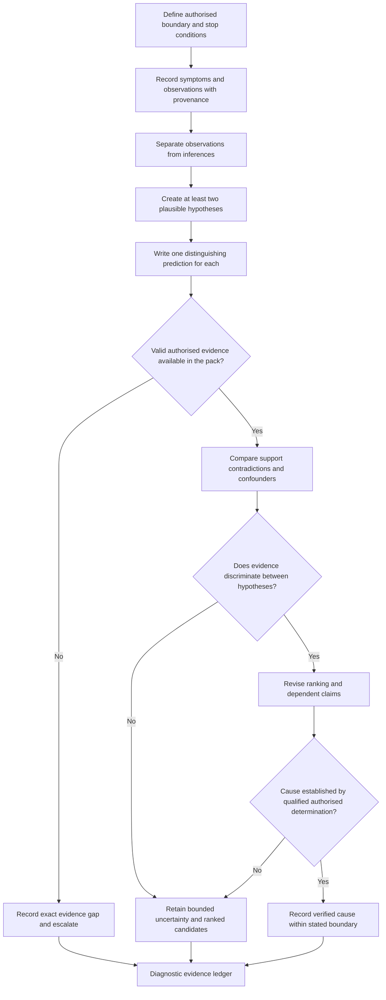

# Day 39 — Systematic Fault-Finding Workflow and Evidence Control

> **Currency, copyright and safety notice:** This original paper-based module teaches diagnostic reasoning, evidence control and escalation boundaries. It does not provide live fault-finding instructions, switching or isolation steps, instrument connections, test values, acceptance criteria, repair methods or authority to work on electrical installations. Exact procedures and technical determinations remain `reference_check_required`.

## 1. Outcome and entry check

Given a fictional installation history, symptom report, drawing set and authorised evidence record, the learner can:

1. separate symptoms, observations, inferences, hypotheses and verified causes;
2. grade evidence and claims without treating repetition or plausibility as proof;
3. create at least two competing hypotheses and a distinguishing prediction for each;
4. identify confounders, contradictions and invalid evidence;
5. map which hypotheses and conclusions depend on each evidence item;
6. reopen only affected reasoning when a condition changes; and
7. state a bounded conclusion, evidence gap or escalation decision without claiming a verified cause prematurely.

**Entry check:** Reconstruct S-E-Q-U-E-N-C-E from Day 38, then define **symptom**, **observation**, **inference**, **hypothesis**, **prediction**, **provenance**, **confounder**, **disconfirming evidence** and **verified cause**. Explain why a repeated symptom, replaced component or familiar result does not independently prove one cause.

A satisfactory entry response distinguishes:

- what happened from why it happened;
- evidence from interpretation;
- a hypothesis from a verified cause;
- supporting evidence from distinguishing evidence; and
- educational analysis from authorised practical diagnosis.

## 2. Why it matters

Poor fault finding often begins with an early guess that is treated as fact. This creates **anchoring**, where later evidence is interpreted mainly to protect the first explanation. It can lead to unsafe actions, unnecessary replacement, repeated tests, lost evidence and false certainty.

Systematic fault finding does not mean collecting the largest number of clues. It means preserving provenance, comparing competing explanations and seeking evidence that would produce different expectations under different hypotheses. A conclusion is only as strong as its weakest identity, boundary, state, method, dependency or authority link.

*Caption: Keep reported symptoms, direct observations, proposed explanations and verified causes in separate evidence categories.*

*Caption: A symptom, one supporting clue or a recent change cannot independently establish a cause; identity, provenance, discrimination, contradiction control and authority must remain linked.*

## 3. Core concepts and terminology

### Essential terms

- **Symptom:** a reported or observed effect, such as intermittent operation, unexpected tripping or loss of function. It describes what appears wrong, not why.
- **Observation:** information directly seen, recorded or supplied with identifiable provenance.
- **Inference:** a meaning drawn from observations. It must not be rewritten as though directly observed.
- **Hypothesis:** a provisional explanation capable of being challenged by evidence.
- **Alternative hypothesis:** a competing explanation retained until evidence distinguishes between candidates.
- **Testable prediction:** a specific expected evidence pattern that would be more likely if one hypothesis were correct.
- **Distinguishing evidence:** evidence expected to differ between competing hypotheses; it is more useful than evidence that fits all candidates.
- **Evidence provenance:** the source, identity, time, location, state, conditions, method and responsible role associated with evidence.
- **Confounding factor:** another condition that could produce the same apparent effect or distort the evidence.
- **Disconfirming evidence:** evidence that weakens or contradicts a hypothesis.
- **Dependency:** an evidence item, condition or assumption on which a hypothesis ranking or conclusion relies.
- **Verified cause:** a cause established through authorised, valid and sufficient evidence by an appropriately competent person; it is not the most plausible guess.
- **Bounded conclusion:** a statement limited to what the evidence establishes, including uncertainty, exclusions and escalation.

### Five evidence grades

Grade every material input:

1. **Stated** — present in one supplied source but not independently checked.
2. **Indicated** — suggested by a label, drawing, report, photograph, symptom history or scenario detail.
3. **Corroborated** — supported by two or more consistent relevant sources in the fictional pack.
4. **Transferred** — previously supported evidence reused only after identity, state, boundary, dependencies and currency are checked.
5. **Unresolved** — missing, conflicting, outside scope or dependent on authorised practical verification.

### Four claim grades

- **Assumption** — used only to expose an evidence need; never presented as fact.
- **Provisional educational conclusion** — plausible within the fictional exercise but dependent on unresolved evidence.
- **Supported educational conclusion** — adequately supported within the fictional pack and stated limits.
- **Authorised technical determination** — requires current authorised sources, appropriate competence and real evidence; this module does not grant it.

A hypothesis can be well ranked while the cause remains unresolved. Ranking is a decision about where the supplied evidence points; verification is a stronger technical determination.

## 4. Rule-finding workflow

Use **T-R-A-C-E-S**:

- **T — Triage:** identify hazards, authority, scope, energy-source awareness, stop conditions and the precise diagnostic boundary.
- **R — Record:** preserve each symptom and observation with identity, source, time, state and conditions.
- **A — Analyse:** separate observation from inference and identify what each evidence item can and cannot establish.
- **C — Create:** form at least two plausible hypotheses and a distinguishing prediction for each.
- **E — Evaluate:** grade evidence, test provenance, check contradictions and confounders, and map dependencies without proposing unauthorised work.
- **S — State:** record the bounded conclusion, unresolved evidence, selective reopening and escalation point.

Build a **diagnostic-evidence ledger**:

| Symptom or question | Evidence item | Identity and boundary | Provenance and state | Evidence grade | Observation or inference | Hypothesis supported | Hypothesis weakened | Distinguishing prediction | Confounder or contradiction | Dependency | Claim grade | Reopening trigger | Bounded statement |
|---|---|---|---|---|---|---|---|---|---|---|---|---|---|

The diagram prevents a jump from symptom to cause. It also distinguishes evidence that merely supports a candidate from evidence that discriminates between candidates.

### Dependency and reopening rules

1. Link every ranking and conclusion to the evidence on which it depends.
2. Reopen affected rows when circuit or equipment identity, source state, boundary, symptom timing, document revision, maintenance history, method, instrument status, environmental condition, responsible role or authority changes.
3. Withdraw an inference when a changed fact removes its basis.
4. Preserve independent evidence that remains valid; do not restart the whole analysis blindly.
5. Quarantine evidence that mixes circuits, states, times or undocumented methods.
6. Do not treat component replacement, temporary recovery or symptom disappearance as proof of cause.
7. A qualified technical determination remains outside this educational exercise.

## 5. Visual model or worked example

### Worked example 1 — fully guided

A fictional workshop reports that one machine stops intermittently. The pack contains:

- a user report that stopping is more common late in the day;
- a recent control-document revision;
- one unexplained protective-device operation;
- a maintenance note describing vibration near an enclosure; and
- a later note that the symptom occurred before the control revision.

Create three hypotheses: a control-state issue, a supply-path interruption and a mechanical condition affecting a connection.

- The recent control revision initially **indicates** a control-state hypothesis, but the later timing evidence weakens the claim that the revision initiated the symptom.
- The protective-device record is **stated** evidence of an operation, not proof of why it operated.
- The vibration note may support a mechanical candidate, but it is not distinguishing unless its identity, timing and relation to the symptom are established.
- The correct bounded conclusion is that several candidates remain open and the original revision-based inference must be withdrawn.

### Worked example 2 — partially guided

A second fictional pack contains two symptom reports that use different equipment labels, a drawing revision, a maintenance record and one result statement without a timestamp. Complete the ledger by deciding:

- whether the reports refer to the same boundary;
- which evidence is stated, indicated, corroborated or unresolved;
- which candidate each item supports or weakens;
- what confounder could produce the same apparent pattern; and
- which conclusion must remain provisional.

### Independent changed-condition transfer

After completing a six-row ledger, introduce four changes:

1. the symptom also occurred before the most recent alteration;
2. a result was recorded for a similarly named but different circuit;
3. an alternate source was active during one event; and
4. a maintenance timestamp is corrected.

Reopen only dependent rows, withdraw unsupported inferences, re-rank the candidates and state what remains unresolved. Do not propose a practical test or repair.

## 6. Practical application

Audit a fictional twelve-item evidence pack containing user reports, drawing revisions, maintenance notes, inspection observations and authorised result statements. For each item record:

- evidence category and identity;
- boundary, state and provenance;
- evidence grade;
- observation-versus-inference status;
- hypotheses supported and weakened;
- distinguishing prediction;
- contradiction or confounder;
- dependency and reopening trigger;
- claim grade; and
- bounded statement or escalation.

### Worked-example fading

- **Items 1–3:** use a completed model and explain every grade.
- **Items 4–7:** use ledger headings and hypothesis prompts only.
- **Items 8–12:** complete independently.
- **Changed-condition transfer:** apply the four changes above and revise only affected rows.
- **Delayed retrieval:** at the start of Day 40, reconstruct T-R-A-C-E-S, the five evidence grades, four claim grades and one ledger row from memory before reopening this module.

### Original educational rubric — 12 points

| Category | 0 points | 1 point | 2 points |
|---|---|---|---|
| Scope and provenance | boundary or source ignored | partly recorded | identity, boundary, state, source and time linked |
| Evidence classification | symptom or inference treated as fact | some separation | symptoms, observations, inferences and results separated |
| Competing hypotheses | one favoured guess | alternatives named | plausible alternatives with explicit dependencies |
| Predictions and discrimination | generic confirmation | partly distinguishing | predictions capable of separating candidates |
| Contradiction and reopening | conflicting evidence ignored | issue noticed | confounders controlled and dependent claims selectively reopened |
| Reporting and escalation | overclaims cause or safety | partly bounded | grades justified with uncertainty, exclusions and escalation |

**Critical-error gates override the numerical score:** treating a symptom, replaced component or temporary recovery as a verified cause; inventing evidence; ignoring contradictory provenance; combining different circuits or states; proposing unauthorised practical diagnosis, testing or repair; declaring an installation safe, compliant or ready for service; or labelling the work `technically-reviewed`.

This rubric is an original learning aid, not an official RTO pass mark or assessment rule.

## 7. Common errors and safety checkpoint

Common errors include:

- anchoring on the first plausible cause;
- seeking only confirming evidence;
- confusing a recent change with causation;
- treating repeated symptoms as independent corroboration when they derive from one report;
- replacing parts as a diagnostic shortcut;
- mixing evidence from different circuits, equipment, times or source states;
- ignoring timestamps and document revisions;
- treating absence of evidence as evidence of absence;
- interpreting temporary recovery as verification;
- repeating or proposing a test without authority; and
- reporting certainty greater than the evidence supports.

**Safety checkpoint:** This module is not an operational fault-finding guide. It authorises no site access, opening, switching, isolation, proving, locking, tagging, connection, contact, instrument use, measurement, testing, fault diagnosis, repair, energisation, certification, approval or return to service.

Stop and escalate whenever the scenario indicates uncertain isolation, multiple or stored energy sources, automatic restoration, altered protective arrangements, damaged equipment, conflicting identity or records, evidence outside the authorised boundary, or any need for practical access, switching, testing, energisation or diagnosis.

## 8. Retrieval and next links

Without notes:

1. State T-R-A-C-E-S.
2. Define symptom, observation, inference, hypothesis, prediction, confounder, disconfirming evidence and verified cause.
3. List the five evidence grades and four claim grades.
4. Explain why supporting evidence is not always distinguishing evidence.
5. Convert four premature cause statements into bounded evidence statements.
6. Given one changed condition, identify every dependent hypothesis and conclusion that must be reopened.
7. State the safety, authority and technical-review boundaries.

- **Program:** [Six-Week Capstone Learning Plan](../MASTER_PLAN.md)
- **Previous:** [Day 38 — Test Sequence, Expected Evidence and Result Interpretation](day-38-test-sequence-expected-evidence-and-result-interpretation.md)
- **Knowledge note:** [[Six-Week Day 39 - Systematic Fault-Finding Workflow and Evidence Control]]
- **Next:** [Day 40 — Rest, Final Catch-Up and Readiness Triage](day-40-rest-final-catch-up-and-readiness-triage.md)
