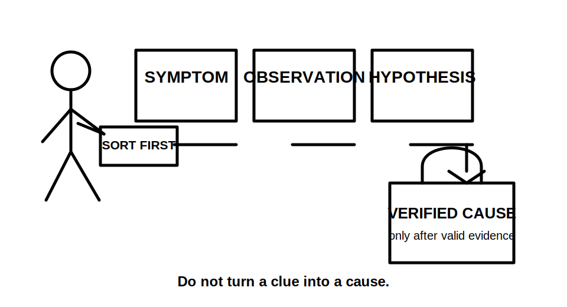
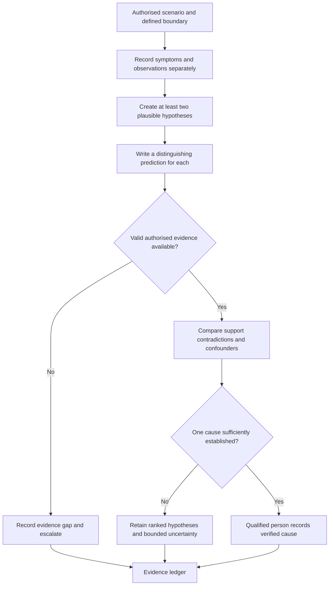
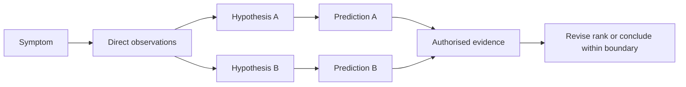

# Day 39 — Systematic Fault-Finding Workflow and Evidence Control

> **Currency, copyright and safety notice:** This original paper-based module teaches diagnostic reasoning, evidence control and escalation boundaries. It does not provide live fault-finding instructions, switching or isolation steps, instrument connections, test values, acceptance criteria or authority to work on electrical installations.

## 1. Outcome and entry check

Given a fictional installation history, symptom report, drawing set and authorised evidence record, the learner can separate observations from hypotheses, form a testable prediction, rank competing explanations, identify invalid or missing evidence and state a bounded conclusion without claiming a verified cause prematurely.

**Entry check:** define symptom, observation, hypothesis, prediction, evidence provenance, confounding factor and verified cause. Explain why a repeated symptom does not by itself prove one specific fault.

## 2. Why it matters

Poor fault finding often begins with an early guess that is treated as fact. This can cause unsafe actions, wasted time, replaced components that were not defective and loss of evidence. A systematic process protects people and preserves reasoning quality by requiring each claim to be supported, traceable and open to revision.

*Caption: Keep reported symptoms, direct observations, proposed explanations and verified causes in separate evidence categories.*

## 3. Core concepts and terminology

- **Symptom:** a reported or observed effect, such as intermittent operation, unexpected tripping or loss of function. A symptom describes what appears wrong, not why it occurred.
- **Observation:** information directly seen, recorded or supplied with identifiable provenance.
- **Hypothesis:** a provisional explanation that could account for the observations and can be challenged by evidence.
- **Testable prediction:** a specific expected evidence pattern that would be more likely if a hypothesis were correct.
- **Alternative hypothesis:** a competing explanation that must remain open until evidence distinguishes between candidates.
- **Evidence provenance:** the source, time, location, conditions, method and responsible person associated with evidence.
- **Confounding factor:** another condition that could produce the same apparent result or distort the evidence.
- **Disconfirming evidence:** evidence that weakens or contradicts a hypothesis.
- **Verified cause:** a cause established through authorised, valid and sufficient evidence by a competent person; it is not merely the most plausible guess.
- **Bounded conclusion:** a statement limited to what the evidence actually establishes, including uncertainties and required escalation.

## 4. Rule-finding workflow

Use **T-R-A-C-E-S**: **T**riage hazards, authority and boundaries; **R**ecord symptoms and provenance; **A**nalyse observations without converting them into causes; **C**reate competing hypotheses and predictions; **E**valuate authorised evidence, confounders and contradictions; **S**tate the bounded conclusion, reopen dependencies or escalate.

The diagram prevents a jump from symptom directly to cause. The learner must first create competing explanations and identify evidence capable of distinguishing between them.

This model shows that the same observation may support more than one hypothesis. Diagnostic quality depends on choosing distinguishing evidence, not accumulating only confirming clues.

## 5. Visual model or worked example

A fictional workshop reports that one machine stops intermittently. Available records show a recent control modification, one unexplained protective-device operation and a maintenance note describing vibration near a connection enclosure. None of these items proves the cause.

Create three hypotheses: a control-state issue, a supply-path interruption and a mechanical condition affecting a connection. For each, write one prediction, one plausible confounder and the authorised evidence that would be needed to distinguish it from the others. Then apply a changed condition: the original symptom also occurred before the control modification. Re-rank the hypotheses and identify which earlier inference must be withdrawn.

Worked-example fading:

1. First attempt: hypotheses and evidence categories are supplied; complete the predictions and confounders.
2. Second attempt: only the observations are supplied; create hypotheses, predictions and evidence gaps.
3. Transfer attempt: use a different fictional symptom and justify why your preferred hypothesis remains provisional.

## 6. Practical application

Complete a paper-based fault-analysis record for a fictional installation containing eight mixed items: user reports, drawing revisions, maintenance notes, inspection observations and authorised result statements.

For each item record:

1. category: symptom, observation, inference or result;
2. provenance and validity;
3. hypotheses supported or weakened;
4. confounding factors;
5. distinguishing prediction;
6. evidence gap or reopening action;
7. bounded conclusion and escalation point.

**Assessment rubric, 12 points:** evidence classification 2; provenance 2; competing hypotheses 2; distinguishing predictions 2; contradiction/confounder control 2; bounded conclusion and escalation 2.

Critical errors override the score: treating a symptom as a verified cause, inventing evidence, ignoring a contradictory record, proposing unauthorised live work or declaring an installation safe, compliant or ready for service.

## 7. Common errors and safety checkpoint

Common errors include anchoring on the first plausible cause, seeking only confirming evidence, replacing parts as a diagnostic shortcut, mixing evidence from different circuits or states, ignoring timestamps, treating absence of evidence as proof, repeating a test without authority and reporting certainty greater than the evidence supports.

Stop the educational exercise and escalate whenever the scenario indicates uncertain isolation, multiple or stored energy sources, altered protective arrangements, evidence outside the authorised boundary, damaged equipment, conflicting records or any need for live access, switching, testing, energisation or practical diagnosis.

This module authorises no field activity. Actual fault finding requires competent supervision, current authorised procedures, site-specific risk controls, suitable instruments, verified isolation arrangements and jurisdiction-specific obligations.

## 8. Retrieval and next links

Without notes, state T-R-A-C-E-S and define symptom, observation, hypothesis, prediction, confounder, disconfirming evidence and verified cause. Convert four premature cause statements into bounded evidence statements. Given one changed condition, identify every hypothesis and conclusion that must be reopened.

- **Program:** [Six-Week Capstone Learning Plan](../MASTER_PLAN.md)
- **Previous:** [Day 38 — Test Sequence, Expected Evidence and Result Interpretation](day-38-test-sequence-expected-evidence-and-result-interpretation.md)
- **Knowledge note:** [[Six-Week Day 39 - Systematic Fault-Finding Workflow and Evidence Control]]
- **Next:** [Day 40 — Rest, Final Catch-Up and Readiness Triage](day-40-rest-final-catch-up-and-readiness-triage.md)
