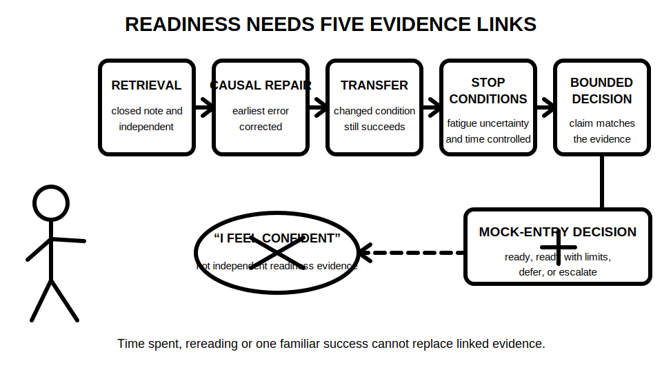
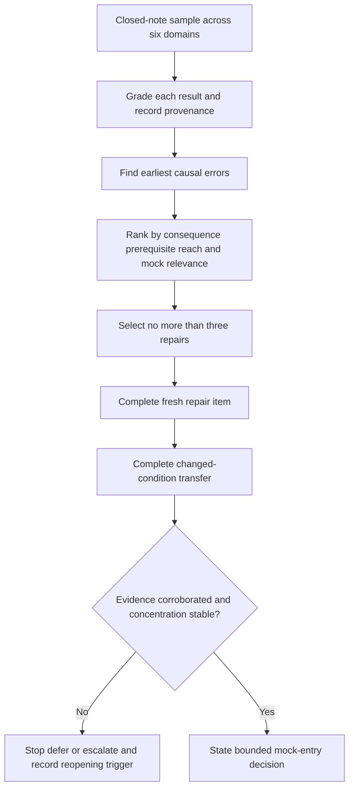

# Day 40 — Rest, Final Catch-Up and Readiness Triage

> **Currency, copyright and safety notice:** This original recovery module introduces no new electrical theory. It supports retrieval, error correction and readiness decisions only. It does not authorise electrical work, testing, switching, isolation, diagnosis, certification or technical approval. Any technical claim recalled from earlier modules retains its existing `review-required` and `reference_check_required` status.

## 1. Outcome and entry check

Given the learner’s error log and completed work from Days 1–39, the learner can:

1. classify readiness evidence by strength and provenance;
2. select no more than three repairs using consequence, prerequisite reach and recency;
3. complete closed-note retrieval and one changed-condition transfer item for each repair;
4. apply time, fatigue, uncertainty and safety stop conditions; and
5. state one of four bounded outcomes: **ready to attempt**, **ready with named limits**, **defer and repair**, or **escalate for qualified review**.

**Entry check:** without notes, name the six major program domains, identify one unresolved error from three different domains, and state what evidence would show that each error has actually been repaired.

## 2. Why it matters

Uncontrolled catch-up often creates the appearance of effort without reliable evidence of learning. Rereading, copying a model answer or completing a familiar item can improve confidence while leaving retrieval and transfer weak. Readiness is therefore a claim that must be supported by recent, traceable and varied performance.

*Caption: A readiness decision is only as strong as its weakest evidence link; confidence or time spent cannot replace retrieval, repair, transfer, stop-condition control and a bounded claim.*

## 3. Core concepts and terminology

- **Closed-note retrieval:** recalling or applying knowledge before consulting notes or worked answers.
- **Error log:** a record of the task, error, earliest cause, correction, supporting source, transfer check and reopening trigger.
- **Causal error:** the earliest incorrect assumption, classification or step that produced later mistakes.
- **Catch-up triage:** ranking unfinished or weak work by consequence and prerequisite reach rather than by age or ease.
- **Readiness evidence:** recent performance showing that the learner can complete a bounded task independently, explain uncertainty and respect authority limits.
- **Provenance:** where evidence came from, when it was produced, under what conditions and whether it can be traced to the same task or concept.
- **Transfer:** applying the repaired reasoning when a relevant condition, representation or context changes.
- **Stop condition:** a predefined signal to stop, defer or seek support before quality or safety judgement deteriorates.
- **Reopening trigger:** a later change that makes an earlier readiness decision uncertain and requires affected evidence to be checked again.
- **Bounded readiness claim:** a statement limited to the exact paper-based task supported by the available evidence; it is not a claim of practical competence or technical approval.

### Evidence grades

1. **Stated:** the learner says an item was completed or understood, but provides no observable performance.
2. **Indicated:** one familiar or supported attempt suggests partial understanding.
3. **Corroborated:** at least two consistent pieces of recent evidence support the same repair.
4. **Transferred:** the learner succeeds when a relevant condition, representation or context changes.
5. **Unresolved:** evidence is missing, contradictory, untraceable or invalidated by fatigue, prompting or changed conditions.

### Claim grades

1. **Assumption** — unsupported confidence or expectation.
2. **Provisional educational conclusion** — limited evidence supports a temporary study decision.
3. **Supported educational conclusion** — corroborated and transferred evidence supports the bounded paper-based task.
4. **Authorised technical determination** — a qualified decision using current authorised requirements; this module cannot produce this grade.

### Readiness-evidence ledger

Use one row per candidate repair:

`domain/task → error → earliest cause → consequence → prerequisite reach → evidence source/date → evidence grade → closed-note result → changed-condition result → fatigue/uncertainty signal → claim grade → decision → reopening trigger`

## 4. Rule-finding workflow

Use **R-E-A-D-Y**:

- **R — Retrieve before rereading:** attempt a short closed-note sample across the six domains.
- **E — Examine evidence and earliest causes:** distinguish a recalled answer from a repaired reasoning process.
- **A — Allocate no more than three repairs:** rank by safety consequence, prerequisite reach and likelihood of affecting the mock.
- **D — Demonstrate repair and transfer:** complete one fresh item and one changed-condition item, then grade the evidence.
- **Y — Yield to stop conditions and state a bounded decision:** stop when quality declines and record exactly what is and is not supported.

The diagram shows that a repaired answer is not enough. Readiness requires traceable retrieval, causal repair, transfer and stable concentration before a bounded decision is made.

### Reopening triggers

Reopen affected ledger rows when the task scope, source revision, terminology, diagram, calculation conditions, equipment identity, supply state, assessment format, available time, prompting level, fatigue state or responsible reviewer changes.

## 5. Visual model or worked example

A learner has five unresolved items:

- a source-navigation error that caused two later rule-selection mistakes;
- a calculation transcription slip with correct method;
- an unsafe claim that paper performance proves practical competence;
- a weak definition that did not affect later reasoning; and
- a fault-finding conclusion based on one plausible clue.

**Guided round:** rank the unsafe competence claim first, then the source-navigation error, then the single-clue diagnostic conclusion. Explain why the calculation slip and weak definition are lower priority today.

**Partially guided round:** complete a fresh source-navigation item, then repeat it after the document layout and question wording change. Grade both pieces of evidence and state the narrowest defensible readiness claim.

**Independent transfer round:** revise the repair order when one of these conditions changes:

1. the mock is shortened and source navigation carries more weight;
2. fatigue appears after 18 minutes;
3. the learner needs prompts on the fresh item;
4. a later module uses a different diagram convention; or
5. a qualified reviewer identifies a technical uncertainty in the repaired explanation.

The transfer round tests whether the learner can change the decision rather than defend the original ranking.

## 6. Practical application

Complete one recovery block with a strict **30-minute maximum**:

1. **8 minutes — retrieval:** one short closed-note item from each of protection, earthing, design, switching/installation, verification and fault finding;
2. **4 minutes — triage:** grade evidence, identify earliest causes and select no more than three repairs;
3. **10 minutes — repair:** correct the highest-value causal errors using authorised learning sources already identified in the program;
4. **5 minutes — transfer:** complete one changed-condition item for each repair selected; and
5. **3 minutes — decision:** record the bounded readiness outcome, deferrals and reopening triggers.

Do not extend the block to “finish everything.” Deferred work remains visible and scheduled; it is not silently treated as complete.

### Readiness rubric — 12 points

Score 0, 1 or 2 in each category:

1. retrieval accuracy and independence;
2. causal-error identification;
3. repair quality and source traceability;
4. changed-condition transfer;
5. fatigue, uncertainty and stop-condition judgement; and
6. bounded readiness reporting and deferral control.

A score of **10–12 with no critical error** supports a provisional **ready to attempt** decision for the paper-based mock. A lower score supports **ready with named limits** or **defer and repair**, depending on which categories are weak. This is an original educational rubric, not an official RTO pass mark or qualification decision.

**Critical errors override the score:** inventing technical values; treating memory as an authorised source; claiming practical competence from paper performance; concealing unresolved safety uncertainty; continuing after a stop condition; or converting a provisional educational conclusion into a technical approval.

## 7. Common errors and safety checkpoint

Common errors include:

- rereading everything instead of retrieving first;
- selecting easy or recent errors rather than causal, high-consequence errors;
- counting a copied correction as independent evidence;
- treating one successful familiar item as transfer;
- repairing more than three items and losing concentration;
- using time spent or confidence as the readiness measure;
- ignoring prompting, fatigue or contradictory evidence; and
- calling a deferred item a failure or silently marking it complete.

Stop the block when any of the following occurs: repeated careless errors, loss of concentration, distress, inability to explain the current task boundary, uncertainty about a safety-critical claim, pressure to attempt unauthorised practical work, or the 30-minute limit. Record the stop reason and the exact next safe study action.

This module authorises no site access, opening, switching, isolation, proving, locking, tagging, connection, contact, instrument use, measurement, testing, diagnosis, repair, energisation, certification, approval or return to service.

## 8. Retrieval and next links

Without notes:

1. state R-E-A-D-Y;
2. name the five evidence grades and four claim grades;
3. explain why a copied correction is not transferred evidence;
4. identify three stop conditions;
5. distinguish **ready with named limits** from **defer and repair**; and
6. name two reopening triggers that would invalidate an earlier readiness decision.

**Delayed retrieval for Day 41:** before opening the mock, reconstruct the readiness-evidence ledger and state the exact paper-based scope your evidence supports.

- **Program:** [Six-Week Capstone Learning Plan](../MASTER_PLAN.md)
- **Previous:** [Day 39 — Systematic Fault-Finding Workflow and Evidence Control](day-39-systematic-fault-finding-workflow-and-evidence-control.md)
- **Knowledge note:** [[Six-Week Day 40 - Rest Final Catch-Up and Readiness Triage]]
- **Next:** [Day 41 — Full Mock Assessment with Design, Inspection and Verification Components](day-41-full-mock-assessment-with-design-inspection-and-verification-components.md)
