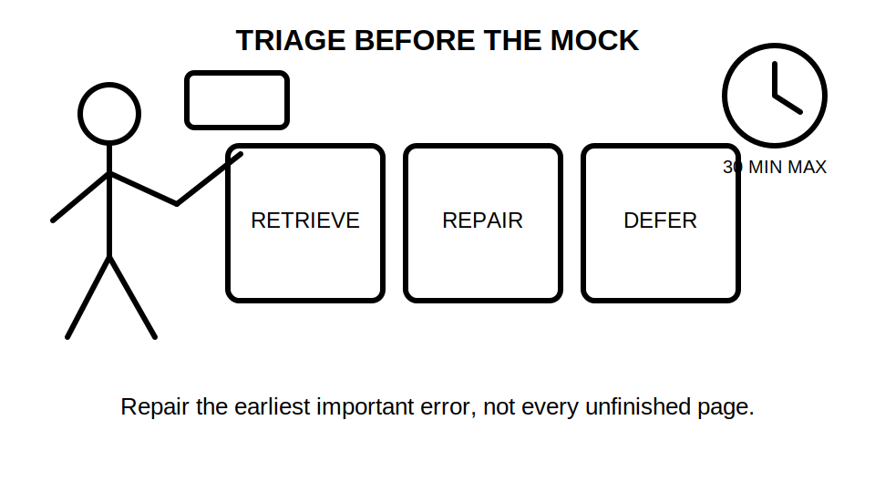
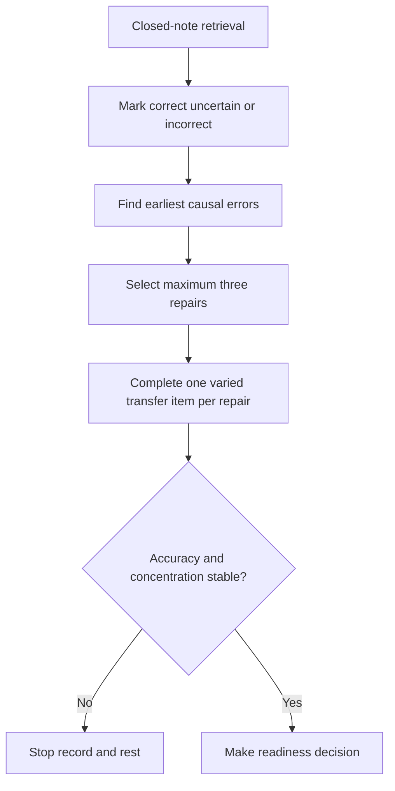

# Day 40 — Rest, Final Catch-Up and Readiness Triage

> **Currency, copyright and safety notice:** This original recovery module introduces no new electrical theory. It supports retrieval, error correction and readiness decisions only. It does not authorise electrical work, testing, switching, isolation, diagnosis or technical approval.

## 1. Outcome and entry check

Given the learner’s error log and completed work from Days 1–39, the learner can select no more than three high-value repairs, complete closed-note retrieval, apply fatigue stop conditions and make an evidence-based readiness decision for the mock assessment.

**Entry check:** without notes, list the six major program domains and identify one unresolved error in each of three different domains.

## 2. Why it matters

Uncontrolled catch-up creates fatigue and superficial rereading. Readiness improves when the learner retrieves from memory, repairs the earliest causal error and stops before accuracy declines.

*Caption: Retrieve first, repair only the highest-value gaps, and defer work that cannot be completed safely or accurately today.*

## 3. Core concepts and terminology

- **Closed-note retrieval:** recalling or applying knowledge before consulting notes.
- **Error log:** a record of the mistake, its cause, the correction and the evidence needed to prevent recurrence.
- **Causal error:** the earliest incorrect assumption or step that caused later errors.
- **Catch-up triage:** ranking missed work by consequence and prerequisite importance rather than age.
- **Readiness evidence:** recent performance showing that the learner can complete a task independently and explain boundaries.
- **Stop condition:** a predefined signal to end the session, such as repeated careless errors, loss of concentration or exceeding the time limit.
- **Defer:** deliberately postpone low-value or unsafe work and record when it will be revisited.

## 4. Rule-finding workflow

Use **R-E-A-D-Y**: **R**etrieve before rereading; **E**xamine the error log; **A**dd no more than three repairs; **D**ecide using evidence and stop conditions; **Y**ield to rest when performance declines.

The workflow prevents the learner from treating time spent as evidence of readiness.

## 5. Visual model or worked example

A learner has five unfinished items: one source-navigation error, two calculation slips, one unsafe claim and one weak terminology definition. Rank the unsafe claim and source-navigation error first because they can invalidate multiple later decisions. Select only one calculation repair if time remains. Defer the terminology polish if retrieval is otherwise accurate.

Worked-example fading:

1. First round: the priority order is supplied; explain why.
2. Second round: rank a fresh five-item error log.
3. Transfer round: revise the ranking after fatigue appears at minute 22.

## 6. Practical application

Complete a 30-minute recovery block:

1. 8 minutes closed-note retrieval across protection, earthing, design, switching, verification and fault finding;
2. 12 minutes repairing the two highest-consequence causal errors;
3. 6 minutes varied transfer;
4. 4 minutes recording readiness and deferrals.

**Readiness rubric, 10 points:** retrieval accuracy 2; causal-error selection 2; correction quality 2; transfer 2; safety and stop-condition judgement 2.

A critical error overrides the score: inventing technical values, treating memory as an authorised source, continuing while fatigued, or claiming practical competence from paper performance.

## 7. Common errors and safety checkpoint

Common errors include rereading everything, repairing too many items, choosing easy work over consequential gaps, ignoring fatigue, and calling partial recall “ready.” Stop immediately if concentration degrades, repeated transcription errors appear, distress increases, or the learner feels pressure to attempt unauthorised practical work.

## 8. Retrieval and next links

Without notes, state R-E-A-D-Y, name the six program domains, identify three stop conditions and explain why a deferred item is not a failed item.

- **Program:** [Six-Week Capstone Learning Plan](../MASTER_PLAN.md)
- **Previous:** [Day 39 — Systematic Fault-Finding Workflow and Evidence Control](day-39-systematic-fault-finding-workflow-and-evidence-control.md)
- **Knowledge note:** [[Six-Week Day 40 - Rest Final Catch-Up and Readiness Triage]]
- **Next:** [Day 41 — Full Mock Assessment with Design, Inspection and Verification Components](day-41-full-mock-assessment-with-design-inspection-and-verification-components.md)
