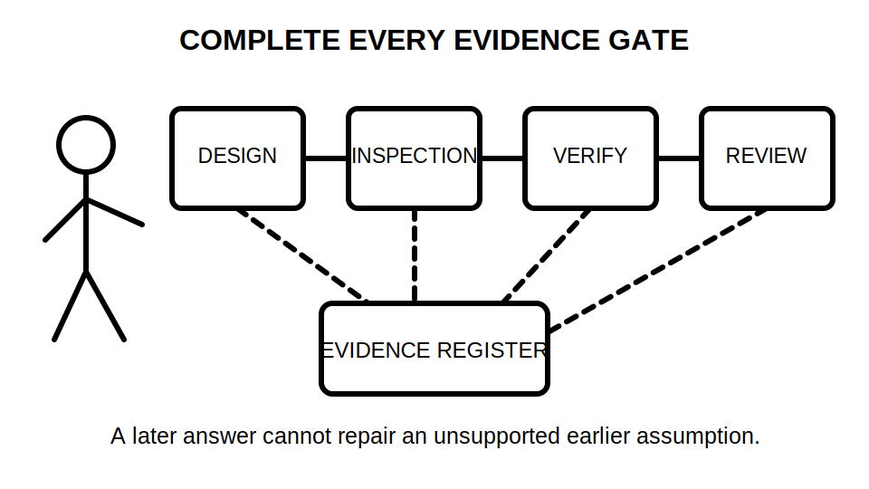
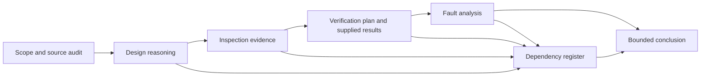

# Day 41 — Full Mock Assessment with Design, Inspection and Verification Components

> **Currency, copyright and safety notice:** This is an original paper-based mock, not an official assessment. It contains no authoritative clause wording, prescribed field procedure, exact acceptance value or permission to perform electrical work.

## 1. Outcome and entry check

Given one fictional installation dossier, the learner can complete a timed paper-based response that integrates source selection, circuit design reasoning, inspection evidence, verification planning, result interpretation and bounded fault analysis while stating every unresolved technical dependency.

**Entry check:** explain the difference between an observation, calculation, authorised result, inference and technical acceptance decision.

## 2. Why it matters

Capstone performance requires integration. A learner may know individual topics yet fail when boundaries, evidence and changed conditions interact. A cumulative mock reveals whether the learner can preserve sequence and safety under time pressure.

*Caption: The mock rewards a traceable process; no later section repairs an unsupported earlier assumption.*

## 3. Core concepts and terminology

- **Installation dossier:** the fictional drawings, schedules, notes and evidence supplied for assessment.
- **Assessment boundary:** the work the learner is permitted to complete in the paper scenario.
- **Dependency:** an earlier fact or decision required by a later conclusion.
- **Evidence register:** a table recording source, status, uncertainty and affected decisions.
- **Changed condition:** new information requiring affected conclusions to be reopened.
- **Critical error:** a safety, evidence or authority failure that overrides the numerical score.
- **Bounded response:** an answer that clearly distinguishes established facts from assumptions and unresolved checks.

## 4. Rule-finding workflow

Use **C-A-P-S-T-O-N-E**: **C**onfirm scope; **A**udit sources; **P**lan dependencies; **S**olve design tasks; **T**race inspection evidence; **O**rganise verification purposes; **N**ote changes and uncertainties; **E**nd with bounded conclusions.

The dependency register prevents an unsupported design assumption from being hidden by later work.

## 5. Visual model or worked example

The fictional dossier describes a small mixed-use installation with a switchboard change, one altered circuit route, a fixed appliance, an alternative supply note and four supplied verification statements. The learner receives no standards extracts and must identify where authorised current sources would be required.

Mock structure:

1. source and scope audit — 10 minutes;
2. design and conductor reasoning — 25 minutes;
3. visual-inspection analysis — 20 minutes;
4. verification-purpose and result interpretation — 20 minutes;
5. fault-analysis and final evidence register — 20 minutes;
6. review — 10 minutes.

A changed condition is introduced after section 2: the route passes through a different environment than first described. The learner must reopen every affected conclusion.

## 6. Practical application

Produce:

- a source hierarchy and assumption register;
- a design decision chain without invented values;
- an inspection evidence table separating observation from inference;
- a verification-purpose map using only supplied authorised evidence;
- two competing fault hypotheses with distinguishing evidence needs;
- a final bounded conclusion and escalation list.

**Assessment rubric, 30 points:** scope/source control 4; design sequence 6; inspection reasoning 5; verification reasoning 5; fault analysis 4; dependency reopening 3; communication and boundaries 3.

Critical errors override the score: invented technical data, unsafe practical instruction, treating unverified assumptions as facts, missing an alternative supply, declaring compliance or readiness for service, or bypassing a stated stop condition.

## 7. Common errors and safety checkpoint

Common errors include solving before defining scope, importing remembered limits, skipping upstream contributions, mixing evidence states, failing to reopen conclusions and writing operational test steps. The mock stops at paper analysis. Any practical action, exact acceptance decision or safety-critical procedure requires qualified supervision and current authorised sources.

## 8. Retrieval and next links

After submission, list three decisions with the highest dependency count, two unresolved reference checks and one critical error you deliberately avoided.

- **Program:** [Six-Week Capstone Learning Plan](../MASTER_PLAN.md)
- **Previous:** [Day 40 — Rest, Final Catch-Up and Readiness Triage](day-40-rest-final-catch-up-and-readiness-triage.md)
- **Knowledge note:** [[Six-Week Day 41 - Full Mock Assessment with Design Inspection and Verification Components]]
- **Next:** [Day 42 — Mock Review, Remediation Plan and Final Readiness Decision](day-42-mock-review-remediation-plan-and-final-readiness-decision.md)
