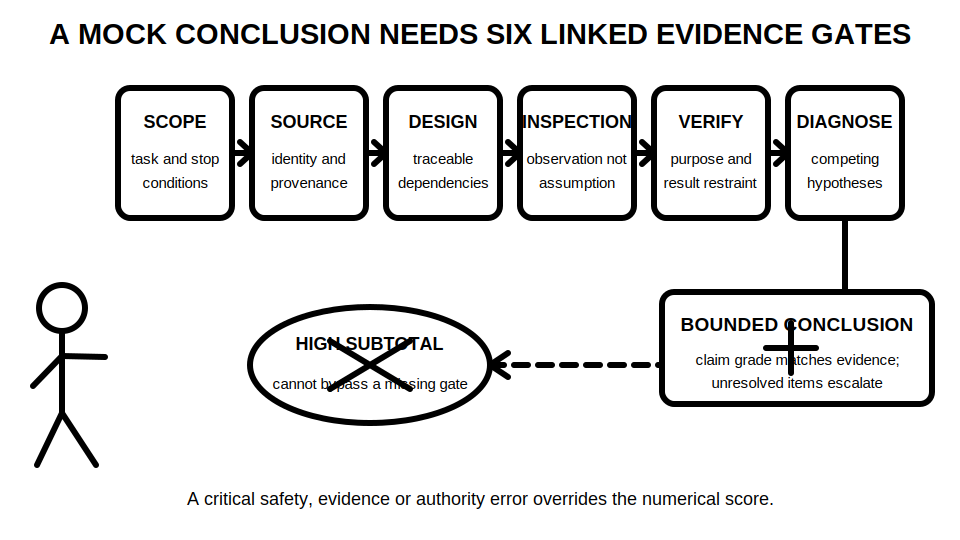
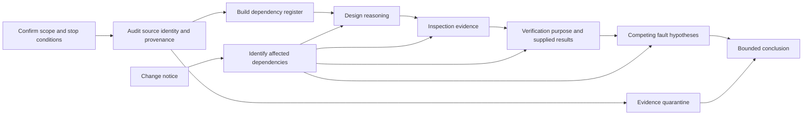

# Day 41 — Full Mock Assessment with Design, Inspection and Verification Components

> **Currency, copyright and safety notice:** This is an original paper-based mock, not an official assessment. It contains no authoritative clause wording, prescribed field procedure, exact acceptance value or permission to perform electrical work. Exact technical requirements remain `reference_check_required` and require current authorised sources and qualified review.

## 1. Outcome and entry check

Given one fictional installation dossier and a controlled change notice, the learner can complete a timed paper-based response that:

- identifies scope, evidence provenance and unresolved source checks before solving;
- builds a traceable design decision chain without inventing technical data;
- separates inspection observations, inferences, candidate concerns and authorised determinations;
- maps verification purposes, preconditions and supplied results without writing operational test instructions;
- develops competing fault hypotheses and states what evidence would distinguish them;
- propagates changed conditions through every dependent conclusion; and
- finishes with a bounded conclusion whose claim grade matches the available evidence.

**Entry check:** without notes, define and distinguish an observation, calculation, supplied result, inference, provisional educational conclusion and authorised technical determination. Entry is incomplete if any assumption is presented as verified fact.

## 2. Why it matters

Capstone performance is not the sum of isolated topic scores. A design assumption can distort inspection priorities; an unidentified alternative supply can invalidate a verification boundary; and an unsupported result interpretation can corrupt fault analysis. The mock therefore assesses whether the learner preserves evidence identity, dependency order and safety boundaries under time pressure.

*Caption: Every final claim must remain linked to scope, source, design, inspection, verification and diagnostic evidence; confidence or a high subtotal cannot bypass a missing gate.*

## 3. Core concepts and terminology

- **Installation dossier:** the fictional drawings, schedules, notes, photographs and supplied evidence used for the mock.
- **Assessment boundary:** the paper-based work permitted by the scenario; it does not grant practical authority.
- **Evidence provenance:** where evidence came from, who produced it, when it was produced and what conditions applied.
- **Dependency:** an earlier fact, assumption or decision required by a later conclusion.
- **Evidence register:** a table recording evidence identity, status, uncertainty, claim grade and affected decisions.
- **Evidence quarantine:** holding information out of decision-making when identity, provenance, conditions or authority are insufficient.
- **Changed condition:** new information that may invalidate or narrow earlier work.
- **Reopening trigger:** a defined change that requires affected rows or conclusions to be reconsidered.
- **Critical error:** a safety, evidence, authority or dependency failure that overrides the numerical score.
- **Bounded response:** an answer that states what is established, what is provisional, what remains unresolved and who must decide next.

Use five evidence grades:

1. **stated** — present in the dossier but not independently checked;
2. **indicated** — supported by one relevant item;
3. **corroborated** — supported by independent consistent items;
4. **transferred** — still supported after a changed condition;
5. **unresolved** — insufficient, conflicting or quarantined.

Use four claim grades:

1. **assumption**;
2. **provisional educational conclusion**;
3. **supported educational conclusion**;
4. **authorised technical determination** — reserved for appropriately qualified review using current authorised sources.

## 4. Rule-finding workflow

Use **C-A-P-S-T-O-N-E**:

- **C — Confirm scope:** identify the permitted paper task, excluded practical actions and stop conditions.
- **A — Audit sources:** record document identity, revision, provenance, authority and missing references.
- **P — Plan dependencies:** map which later decisions rely on each fact or assumption.
- **S — Solve design tasks:** show the decision sequence and mark every unresolved technical input.
- **T — Trace inspection evidence:** separate observations from inferences and candidate concerns.
- **O — Organise verification evidence:** state purpose, required precondition categories and what supplied results can support.
- **N — Note changes and uncertainties:** quarantine weak evidence and reopen affected work when conditions change.
- **E — End with bounded conclusions:** align claim grade, escalation and next action with the evidence.

The main path preserves sequence. The change-notice path forces selective reopening rather than restarting everything, while evidence quarantine prevents uncertain material from silently supporting a conclusion.

## 5. Visual model or worked example

The fictional dossier describes a small mixed-use installation with:

- a proposed switchboard alteration;
- one final subcircuit whose route and environmental conditions are incompletely described;
- a fixed appliance with local-control information;
- a motor load with a stated operating concern;
- an alternative-supply note whose operating state is initially unclear; and
- four supplied verification statements with differing provenance.

### Mock timing

1. scope, source and authority audit — 10 minutes;
2. dependency map and design reasoning — 25 minutes;
3. visual-inspection analysis — 20 minutes;
4. verification-purpose and supplied-result interpretation — 20 minutes;
5. fault hypotheses and distinguishing-evidence plan — 20 minutes;
6. final register, bounded conclusion and review — 10 minutes.

### Worked-example fading

**Guided stage:** one evidence-register row is completed for a route description. It shows the source, evidence grade, dependent design decisions, unresolved environmental classification and reopening trigger.

**Partially guided stage:** the learner completes a row for the alternative-supply note using headings only.

**Independent stage:** after design work, a change notice states that the route passes through a different environment and that automatic source restoration is possible. The learner must identify every affected row, quarantine unsupported conclusions and revise only the dependent work.

A correct response does not merely change one answer. It records why the change matters, which conclusions remain valid and which require authorised reference checking.

## 6. Practical application

Produce one integrated submission containing:

- a source hierarchy, authority statement and assumption register;
- a dependency map linking dossier facts to later decisions;
- a design decision chain with no invented values, limits or classifications;
- an inspection table separating observation, inference, candidate concern and authorised determination;
- a verification-purpose map that records evidence provenance and quarantine decisions;
- at least two competing fault hypotheses with distinguishing predictions and disconfirming evidence;
- a change-propagation record showing reopened and unaffected conclusions;
- a final bounded conclusion and escalation list; and
- a delayed-retrieval card for Day 42 containing three high-dependency decisions, two unresolved source checks and one critical error avoided.

### Original educational rubric — 12 points

Score each category 0, 1 or 2:

1. scope, authority and source control;
2. design sequence and dependency traceability;
3. inspection evidence separation;
4. verification purpose, provenance and result restraint;
5. fault-hypothesis discrimination;
6. change propagation and bounded reporting.

A score of 2 requires independent, traceable and transferred evidence; 1 indicates partial or prompted control; 0 indicates missing, unsafe or unsupported work. This rubric is not an official RTO pass mark, qualification result or technical approval.

**Critical-error gates override the score:** invented technical data; unsafe practical instruction; treating an assumption as verified fact; missing a stated alternative or automatically restored supply; using quarantined evidence as proof; declaring compliance, practical competence or readiness for service; failing to reopen a changed dependency; or bypassing a stop condition.

### Reopening triggers

Reopen affected work when scope, source revision, document identity, equipment identity, route, environmental condition, supply state, automatic restoration, stored energy, evidence provenance, instrument status, supplied result, acceptance criterion, responsible role or authority changes.

## 7. Common errors and safety checkpoint

Common errors include:

- solving before defining scope and evidence authority;
- importing remembered clauses, dimensions, ratings, test values or assessment claims;
- allowing a numerical subtotal to conceal a critical error;
- treating photographs, labels or unverified statements as complete proof;
- confusing verification purpose with a practical test procedure;
- selecting one plausible fault cause without competing hypotheses;
- changing a final answer without reopening its dependencies; and
- presenting paper performance as practical competence.

**Safety checkpoint:** the mock stops at documentary analysis. It authorises no site access, opening, switching, isolation, proving, locking, tagging, connection, contact, instrument use, measurement, testing, diagnosis, repair, energisation, certification, approval or return to service. Exact acceptance decisions and safety-critical procedures require current authorised sources, appropriate equipment, qualified supervision and authorised responsibility.

## 8. Retrieval and next links

Immediately after submission, close the dossier and record:

1. the three decisions with the highest dependency count;
2. two items placed in evidence quarantine and why;
3. one changed condition that caused the widest propagation;
4. one competing hypothesis that was weakened by disconfirming evidence; and
5. one critical error deliberately avoided.

On Day 42, reconstruct the dependency path for one selected decision before reading feedback. Compare the reconstruction with the submitted register and classify the error as knowledge, sequence, evidence, authority, transfer or time-control related.

- **Program:** [Six-Week Capstone Learning Plan](../MASTER_PLAN.md)
- **Previous:** [Day 40 — Rest, Final Catch-Up and Readiness Triage](day-40-rest-final-catch-up-and-readiness-triage.md)
- **Knowledge note:** [[Six-Week Day 41 - Full Mock Assessment with Design Inspection and Verification Components]]
- **Next:** [Day 42 — Mock Review, Remediation Plan and Final Readiness Decision](day-42-mock-review-remediation-plan-and-final-readiness-decision.md)
