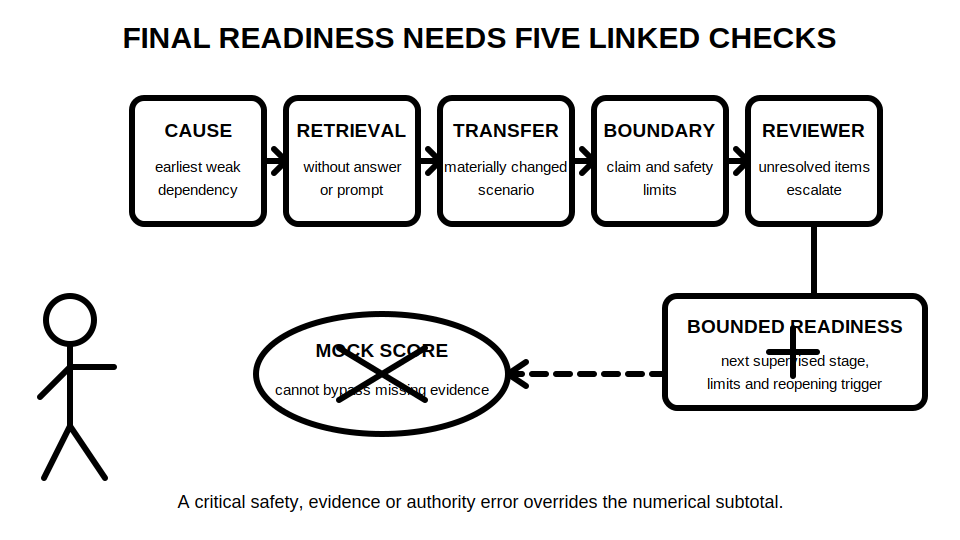
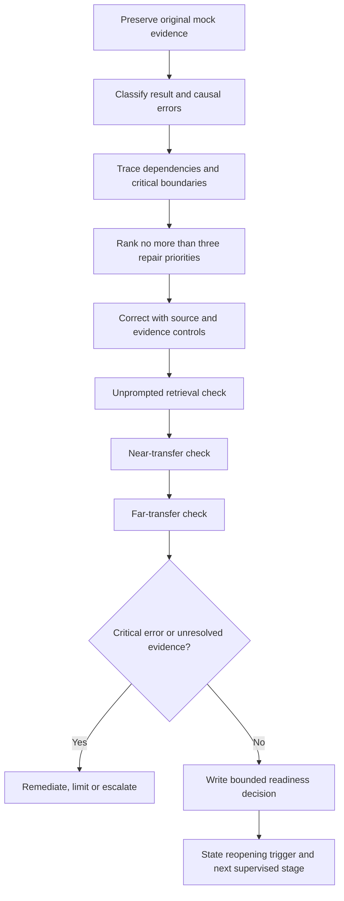

# Day 42 — Mock Review, Remediation Plan and Final Readiness Decision

> **Currency, copyright and safety notice:** This original educational review module does not reproduce official assessment criteria and cannot certify technical competence, compliance or readiness for unsupervised electrical work. Exact technical claims, official limits, procedures and assessment requirements remain `reference_check_required` and require current authorised sources and qualified review.

## 1. Outcome and entry check

Given a completed Day 41 mock, its evidence register and the assessor-style feedback supplied in this module, the learner can:

- separate a **result error** from its earliest causal process, knowledge, evidence or boundary error;
- rank no more than three remediation priorities by consequence, dependency reach and recurrence risk;
- design immediate correction, near-transfer and far-transfer checks for each priority;
- quarantine unresolved or poorly sourced technical claims rather than treating them as corrected;
- make one bounded readiness decision supported by traceable evidence; and
- identify the exact condition that would reopen that decision.

**Entry check:** without notes, give one example of each error class—process, knowledge, evidence and boundary—and explain why a high numerical score cannot override a critical safety, evidence or authority error.

## 2. Why it matters

A mock score is an outcome, not a diagnosis. Several wrong answers may arise from one early weak dependency, while one apparently correct answer may conceal unsafe reasoning, guessed evidence or excessive authority. Effective review therefore repairs the earliest causal weakness and then checks whether the repair transfers to a materially changed task.

*Caption: A readiness label is justified only when causal repair, retrieval, transfer, boundary control and reviewer evidence remain linked.*

This module closes the content sequence, but it does not close technical review. Completion means the learner has produced an educational remediation decision; it does not mean the program or learner has received qualified technical approval.

## 3. Core concepts and terminology

### Error and dependency terms

- **Result error:** an incorrect or incomplete answer, calculation, classification or conclusion.
- **Process error:** relevant knowledge was available but applied in the wrong order, without a required decision check or without reopening dependent work after a change.
- **Knowledge error:** a concept or distinction was missing, confused or incorrectly recalled.
- **Evidence error:** a claim relied on information with missing identity, provenance, conditions, corroboration or authority.
- **Boundary error:** the response exceeded the task, evidence, role, safety limit or permitted claim.
- **Earliest causal error:** the first weak decision that explains one or more later errors.
- **Dependency reach:** the number and importance of later decisions that rely on an earlier claim.
- **Recurrence risk:** the likelihood that the same causal error will appear again in a changed task.
- **Evidence quarantine:** keeping uncertain information visible but preventing it from supporting a conclusion until the uncertainty is resolved.
- **Reopening trigger:** a change that requires one or more earlier conclusions to be reconsidered.

### Evidence grades

1. **Stated:** present in the task or learner response but not independently checked.
2. **Indicated:** supported by one relevant clue or source.
3. **Corroborated:** supported by consistent independent evidence with known identity and conditions.
4. **Transferred:** the corrected reasoning succeeds in a materially changed scenario without the original support.
5. **Unresolved:** conflicting, missing, ambiguous or unauthorised evidence prevents reliance.

### Claim grades

1. **Assumption:** a working proposition that is not yet evidence-backed.
2. **Provisional educational conclusion:** reasonable for the exercise but dependent on stated uncertainties.
3. **Supported educational conclusion:** traceable to corroborated or transferred evidence within the fictional task.
4. **Authorised technical determination:** a real-world conclusion made by a suitably authorised person using current authorised requirements and appropriate evidence. This module cannot produce this grade.

### Readiness categories

- **Ready for the next supervised learning stage:** no unresolved critical error; priority repairs have passed retrieval and transfer checks; the learner stays within evidence and authority boundaries.
- **Ready with explicit limits:** the learner may proceed only to a defined supervised task while named uncertainties remain quarantined.
- **Targeted remediation required:** one or more important causal errors have not yet transferred reliably.
- **Not yet ready; escalate:** a critical safety, evidence or authority error remains, or the available evidence is too weak for a responsible educational decision.

## 4. Rule-finding workflow

Use **R-E-V-I-E-W**:

- **R — Record:** preserve the original response, score, confidence, timing, prompts and feedback before correcting anything.
- **E — Explain:** classify each error and identify the earliest causal weakness rather than merely rewriting the final answer.
- **V — Value:** rank errors by consequence, dependency reach, recurrence risk and safety significance.
- **I — Improve:** repair no more than three priorities using the smallest useful explanation and an authorised-reference action where needed.
- **E — Evaluate:** test unprompted retrieval, near transfer and far transfer; reopen dependent decisions when conditions change.
- **W — Write:** issue a bounded readiness decision with evidence, limits, unresolved items, escalation and a reopening trigger.

The diagram prevents an attractive score or corrected original answer from bypassing causal analysis and transfer. A changed condition, unresolved source or critical boundary error routes the learner back to remediation, limitation or escalation.

### Readiness evidence ledger

For every priority, record:

| Field | Required entry |
|---|---|
| Original result | What the learner wrote or selected before feedback |
| Error class | Process, knowledge, evidence, boundary, or a justified combination |
| Earliest causal error | The first weak decision that produced later effects |
| Consequence | What the error could distort or make unsafe |
| Dependency reach | Which later answers or conclusions must reopen |
| Evidence grade before repair | Stated, indicated, corroborated, transferred or unresolved |
| Repair action | Smallest explanation, retrieval task or source-verification action |
| Near-transfer evidence | Similar task with one material variable changed |
| Far-transfer evidence | Different domain using the same corrected reasoning |
| Claim grade after repair | Assumption, provisional or supported educational conclusion |
| Remaining uncertainty | What is still quarantined or requires qualified review |
| Stop/escalation condition | What prevents progression |
| Reopening trigger | What future change invalidates the decision |

## 5. Visual model or worked example

### Worked example: one early evidence error, four later effects

A fictional learner accepts a route description from an unverified sketch. Four later responses then rely on that route when discussing environmental influence, conductor reasoning, inspection evidence and changed-condition verification.

**Poor review:** correct four answers separately and record “understands after feedback.”

**Causal review:**

1. Preserve the original sketch reference and the learner's confidence.
2. Classify the earliest weakness as an **evidence error**: document identity and provenance were not checked.
3. Reopen the four dependent answers.
4. Repair the source-validation and change-reopening process.
5. Complete a near-transfer task using a revised route drawing.
6. Complete a far-transfer task in which the changed evidence concerns an alternate supply state rather than a route.
7. Keep any exact technical requirement as `reference_check_required`.
8. Record only a supported educational conclusion if both transfers succeed without a critical error.

### Worked-example fading

- **Fully guided:** the causal error and affected dependencies are supplied; the learner completes the ledger.
- **Partially guided:** the error list is supplied; the learner finds the earliest causal error and designs transfer checks.
- **Independent:** the learner receives only the original mock, timing, confidence and feedback, then produces the full remediation decision.
- **Changed-condition transfer:** one source revision, equipment identity, supply state, environmental condition, acceptance criterion or authority boundary changes after the initial decision; the learner reopens only affected dependencies.

A correction is not evidence of learning until it can be retrieved without the answer present and applied under changed conditions.

## 6. Practical application

Create a seven-day remediation plan with **no more than three priorities**. It is a learning plan, not a practical electrical work plan.

### Day-by-day structure

- **Day 1 — Diagnose:** preserve the evidence, classify errors and select priorities.
- **Day 2 — Repair priority 1:** smallest useful explanation, source action and unprompted retrieval.
- **Day 3 — Repair priority 2:** repeat the same bounded sequence.
- **Day 4 — Rest or light retrieval:** maximum 20 minutes; stop for fatigue, guessing or escalating uncertainty.
- **Day 5 — Repair priority 3 or consolidate:** do not add a third priority merely to fill the plan.
- **Day 6 — Interleaved transfer:** complete near- and far-transfer items in a different order and context.
- **Day 7 — Readiness decision:** review evidence grades, critical gates, remaining uncertainty and reopening triggers.

### Independent submission

Submit:

1. the completed readiness evidence ledger;
2. a dependency map showing which mock responses reopened;
3. three retrieval prompts answered without notes;
4. one near-transfer and one far-transfer task per retained priority;
5. a one-paragraph readiness decision using one of the four bounded categories;
6. an explicit list of `reference_check_required` or reviewer-required items; and
7. the exact next supervised learning action.

### Educational review rubric — 12 points

Score each category 0, 1 or 2:

- causal error analysis;
- consequence and dependency control;
- evidence grading and quarantine;
- remediation specificity and time bounds;
- retrieval and transfer quality;
- readiness justification, limits and escalation.

**Critical-error gates override the subtotal.** A submission cannot be classed ready when it:

- claims technical approval, qualification, licensing or unsupervised competence;
- treats a remembered clause, limit, value, test method or acceptance criterion as verified;
- omits a safety or authority boundary error;
- uses the corrected original item as the only transfer evidence;
- hides unresolved evidence or fails to reopen dependent decisions; or
- recommends practical switching, isolation, testing, repair, energisation, certification or return to service.

This rubric is an original educational tool. It is not an official RTO pass mark, competency decision or technical approval process.

## 7. Common errors and safety checkpoint

### Common errors

- reviewing only the subtotal;
- correcting the final answer without tracing the earliest cause;
- treating feedback recognition as unprompted retrieval;
- selecting too many remediation tasks;
- designing “transfer” that changes only names or numbers;
- using confidence, time spent or one correct attempt as readiness evidence;
- promoting indicated evidence directly to a supported conclusion;
- failing to reopen downstream work after a source or condition change;
- converting unresolved evidence into an assumption without labelling it; and
- treating completion of this program as evidence of practical authority.

### Safety checkpoint

Stop, limit or escalate when:

- the task would require real equipment access, opening, switching, isolation, proving, instrument use, testing, diagnosis, repair, energisation, certification or return to service;
- the learner cannot distinguish educational reasoning from an authorised technical determination;
- a safety-critical claim depends on memory, an unidentified source or conflicting evidence;
- fatigue or time pressure causes guessing, skipped evidence checks or concealed uncertainty;
- a critical error repeats after targeted remediation; or
- the appropriate authorised source, supervisor, assessor or technical reviewer is unavailable.

The strongest permitted outcome is readiness for a named **supervised educational stage**. No module result removes legal, licensing, workplace, RTO or qualified-supervision requirements.

## 8. Retrieval and next links

### Delayed retrieval

After at least one sleep interval and without notes:

1. write R-E-V-I-E-W in order;
2. distinguish a result error from an earliest causal error;
3. list the five evidence grades and four claim grades;
4. explain why near transfer and far transfer are both required;
5. state two critical-error gates;
6. write one reopening trigger; and
7. draft a bounded readiness decision containing evidence, limits, unresolved items and the next supervised action.

Recheck any technically specific statement against current authorised information or retain `reference_check_required`.

- **Program:** [Six-Week Capstone Learning Plan](../MASTER_PLAN.md)
- **Previous:** [Day 41 — Full Mock Assessment with Design, Inspection and Verification Components](day-41-full-mock-assessment-with-design-inspection-and-verification-components.md)
- **Knowledge note:** [[Six-Week Day 42 - Mock Review Remediation Plan and Final Readiness Decision]]
- **Next:** Program-wide completion audit after all module quality passes are confirmed.
