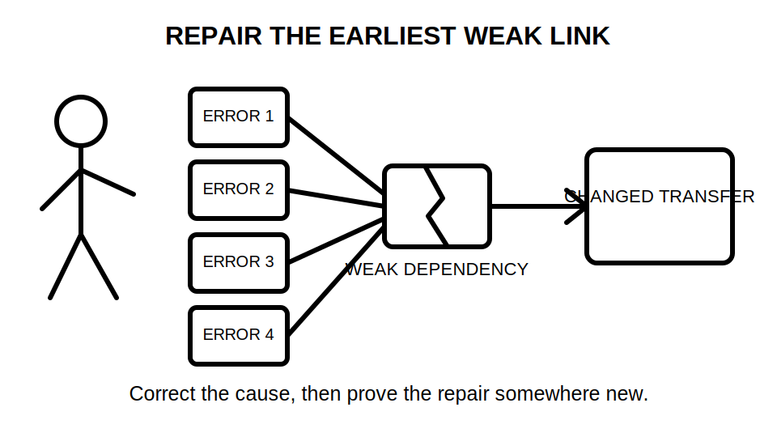
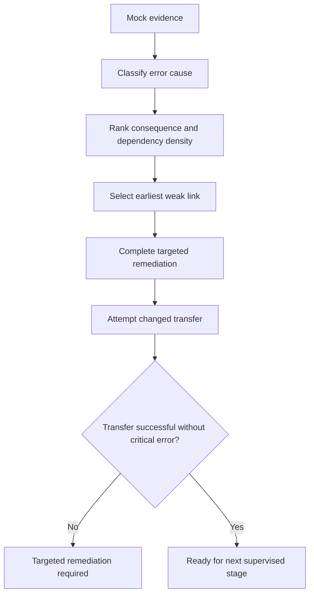

# Day 42 — Mock Review, Remediation Plan and Final Readiness Decision

> **Currency, copyright and safety notice:** This original review module supports educational remediation. It does not reproduce official assessment criteria and cannot certify technical competence, compliance or readiness for unsupervised electrical work.

## 1. Outcome and entry check

Given the completed Day 41 mock and evidence register, the learner can classify errors by cause and consequence, identify the earliest weak dependency, create a time-bounded remediation plan and make a justified readiness decision of ready-for-supervised-practice, targeted-remediation-required or not-yet-ready.

**Entry check:** identify one process error, one knowledge error, one evidence error and one safety-boundary error from the mock.

## 2. Why it matters

A score alone conceals whether failure arose from missing knowledge, poor sequence, weak evidence control or unsafe judgement. Effective remediation targets the earliest cause and then tests transfer in a changed scenario.

*Caption: Correct the earliest weak dependency, then prove the repair in a different scenario.*

## 3. Core concepts and terminology

- **Process error:** correct knowledge applied in an incorrect sequence or without required checks.
- **Knowledge error:** missing or incorrect conceptual understanding.
- **Evidence error:** unsupported, misclassified or untraceable information.
- **Boundary error:** exceeding the task, authority or safety limits.
- **Dependency density:** the number of later decisions relying on one earlier claim.
- **Remediation task:** a targeted activity designed to correct one identified cause.
- **Transfer check:** applying the correction to a materially different scenario.
- **Readiness decision:** a bounded educational judgement based on recent evidence, not confidence alone.

## 4. Rule-finding workflow

Use **R-E-V-I-E-W**: **R**ecord outcomes; **E**xplain each error cause; **V**alue errors by consequence and dependency density; **I**mprove the earliest weak link; **E**valuate transfer; **W**rite a bounded readiness decision.

The decision is intentionally limited to the next supervised learning stage.

## 5. Visual model or worked example

Suppose four later answers are wrong because the learner accepted an unverified route description. The remediation target is not four separate answers; it is the source-validation and changed-condition reopening step. The learner corrects that step, then completes a fresh scenario with a different route change.

Use three levels of remediation:

1. **Immediate correction:** explain the error and correct the original response.
2. **Near transfer:** solve a similar item with one changed variable.
3. **Far transfer:** apply the corrected process in another domain, such as a changed source rather than changed route.

## 6. Practical application

Create a seven-day remediation plan containing no more than three priorities. Each priority must state:

- the causal error;
- consequence and affected dependencies;
- learning task;
- authorised references required;
- near- and far-transfer checks;
- completion evidence;
- stop or escalation condition.

**Review rubric, 14 points:** error classification 2; causal analysis 2; consequence ranking 2; remediation specificity 2; transfer design 2; reference and safety boundaries 2; readiness justification 2.

Critical errors override the score: claiming technical approval, treating an official limit recalled from memory as verified, omitting a safety-boundary failure, or recommending unsupervised practical work.

## 7. Common errors and safety checkpoint

Common errors include focusing only on the score, correcting symptoms instead of causes, assigning too many tasks, repeating the original item as “transfer,” and using confidence as readiness evidence. Any unresolved critical error results in targeted remediation or not-yet-ready status.

“Ready” means ready for the next supervised educational stage only. It does not mean qualified, licensed, competent for unsupervised work, technically reviewed or authorised to certify an installation.

## 8. Retrieval and next links

Without notes, state R-E-V-I-E-W, define dependency density and explain the difference between correction and transfer. Record the final readiness category and the evidence supporting it.

- **Program:** [Six-Week Capstone Learning Plan](../MASTER_PLAN.md)
- **Previous:** [Day 41 — Full Mock Assessment with Design, Inspection and Verification Components](day-41-full-mock-assessment-with-design-inspection-and-verification-components.md)
- **Knowledge note:** [[Six-Week Day 42 - Mock Review Remediation Plan and Final Readiness Decision]]
- **Next:** Return to the program tracker for quality-improvement passes.
