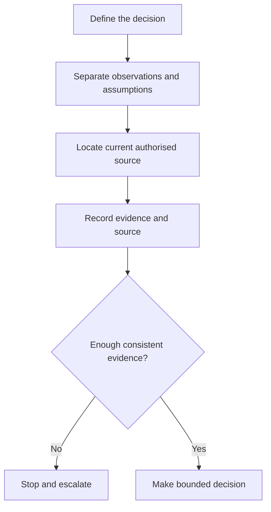
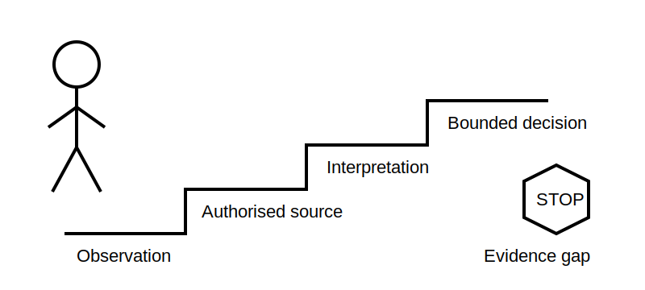

# Program Orientation and Evidence Habits

> This learning draft does not replace current authorised standards, legislation, regulator guidance or RTO procedures. Stop and seek qualified guidance whenever a task would require live work, isolation, testing or a safety-critical decision.

## 1. Outcome and entry check

By the end of this block, the learner can:

- classify a statement as observation, interpretation, rule claim or action decision;
- attach a source and confidence level to a technical claim;
- identify when evidence is insufficient to continue safely.

**Entry check:** For the statement “the circuit is safe because the switch is off,” identify what is observed, what is assumed and what evidence is missing.

## 2. Why it matters

Capstone performance depends on more than remembering facts. A defensible answer shows what was observed, which authorised source governs the decision, how the evidence supports the conclusion and where uncertainty remains. High-confidence assumptions are especially dangerous in electrical work.

## 3. Core concepts and terminology

- **Observation:** a directly seen, read or documented fact.
- **Interpretation:** the meaning assigned to one or more observations.
- **Rule claim:** a statement about what an authorised requirement says.
- **Action decision:** what should happen next, including stopping.
- **Evidence gap:** missing information that prevents a justified conclusion.
- **Confidence:** a self-rating of certainty; it is not proof.

## 4. Rule-finding workflow

1. Define the decision in plain language.
2. Separate known observations from assumptions.
3. Identify the governing source type: legislation, regulator guidance, authorised standard or approved RTO procedure.
4. Locate the relevant topic using an index or search terms.
5. Record the source edition and access date.
6. Paraphrase only the decision-relevant meaning.
7. Check whether contradictory evidence or an unresolved gap requires a stop.

## 5. Visual model or worked example

**Scenario:** A label identifies a switch as controlling a circuit. The label is an observation, not proof that every possible source is removed. A defensible response records the label, checks the installation context and approved isolation process, and stops if alternate-supply status is unresolved.

## 6. Practical application

Create a four-column evidence record for this claim: “The protective device is suitable for the circuit.” Use headings **observation**, **source to consult**, **interpretation**, and **remaining gap**. Do not invent ratings, clause numbers or compliance conclusions.

Assessment evidence:

- all four claim types are distinguished;
- at least one evidence gap is stated;
- the next action is bounded by authorised-source review.

## 7. Common errors and safety checkpoint

Common errors include treating labels as proof, quoting an outdated secondary summary, letting confidence replace evidence and continuing after contradictory information appears.

**Safety checkpoint:** Never use a learning module as authority for live work, isolation, testing or energisation. Use current authorised documents and approved procedures under qualified supervision.

## 8. Retrieval and next links

Without looking back, define observation, interpretation and evidence gap. Then explain why “switch off” and “isolated” are not interchangeable claims.

- Previous: [Nine-week master plan](../MASTER_PLAN.md)
- Next: [Block 02 — Electrical Quantities and Relationship Language](block-02-electrical-quantities-and-relationship-language.md)
- Knowledge note: [Program Orientation and Evidence Habits](../../../knowledge-base/9-week/Block 01 - Program Orientation and Evidence Habits.md)
