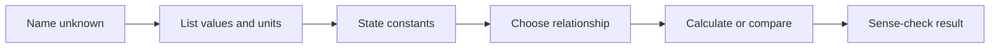
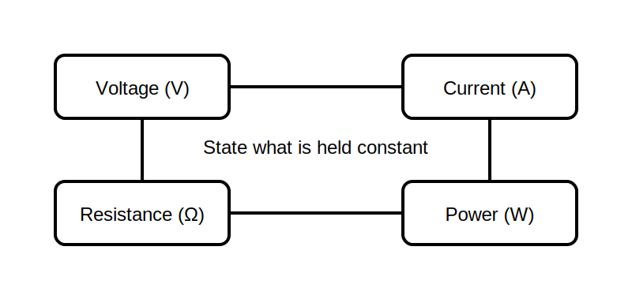

# Electrical Quantities and Relationship Language

## 1. Outcome and entry check

By the end, the learner can identify voltage, current, resistance and power from their units and describe qualitative relationships without confusing a quantity, a unit and a measured value.

**Entry check:** In “current is 2 A,” label the quantity, value and unit.

## 2. Why it matters

Most later decisions depend on reading quantities correctly, predicting direction of change and checking whether an answer is plausible. Unit confusion can make otherwise sound reasoning unusable.

## 3. Core concepts and terminology

- **Quantity:** the property being described or measured.
- **Value:** the numerical magnitude.
- **Unit:** the agreed measurement scale.
- **Voltage:** potential difference between two points.
- **Current:** rate of charge flow through a path.
- **Resistance:** opposition represented in a circuit model.
- **Power:** rate of energy transfer.
- **Direct relationship:** one quantity increases as another increases, with other relevant conditions held constant.
- **Inverse relationship:** one quantity decreases as another increases, with other relevant conditions held constant.

## 4. Rule-finding workflow

1. Identify the unknown quantity.
2. List known values with symbols and units.
3. State which conditions are assumed constant.
4. Choose a relationship that connects the quantities.
5. Check unit compatibility before calculating.
6. Estimate the expected direction and scale.
7. Compare the result with the estimate and reject implausible answers.

## 5. Visual model or worked example

**Worked comparison:** With resistance treated as unchanged, increasing voltage implies increased current in the simple model. The important habit is naming what is held constant rather than memorising an unqualified slogan.

## 6. Practical application

For each prompt, predict **increase**, **decrease**, **unchanged** or **insufficient information**, and justify the answer:

1. Voltage increases while resistance is stated to remain constant. What happens to current?
2. Resistance increases while current is stated to remain constant. What happens to the required voltage?
3. Voltage changes, but no other condition is given. What can be concluded about power?

Assessment evidence: correct quantity language, explicit constants and no invented values.

## 7. Common errors and safety checkpoint

Common errors include calling amperes “current,” omitting units, assuming every real load behaves like a fixed resistor and applying a formula without checking its model assumptions.

**Safety checkpoint:** These relationships are learning models, not permission to measure or work on energised equipment. Practical measurement requires approved procedures, suitable instruments and qualified supervision.

## 8. Retrieval and next links

From memory, define quantity, unit and value. Give one direct relationship and state the condition held constant.

- Previous: [Block 01 — Program Orientation and Evidence Habits](block-01-program-orientation-and-evidence-habits.md)
- Next: [Block 03 — Reading Simple Circuit Representations](block-03-reading-simple-circuit-representations.md)
- Knowledge note: [Electrical Quantities and Relationship Language](../../../knowledge-base/9-week/Block 02 - Electrical Quantities and Relationship Language.md)
