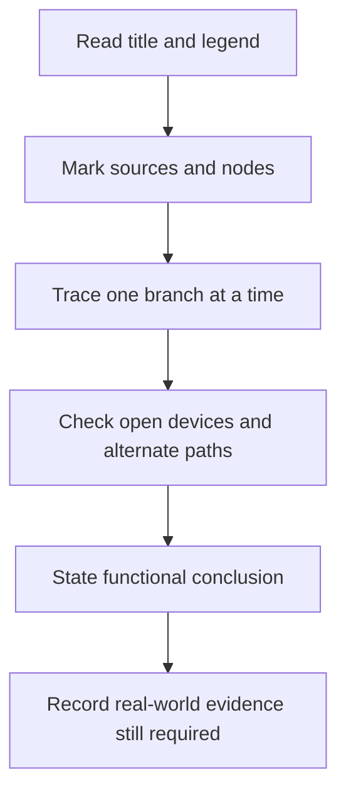
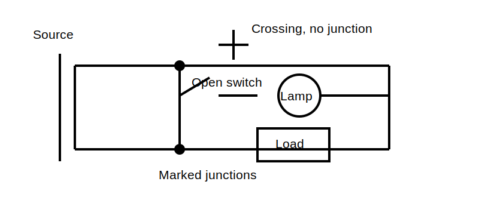

# Reading Simple Circuit Representations

## 1. Outcome and entry check

By the end, the learner can trace a represented current path, distinguish connection from physical proximity, identify open and closed paths, and state what a diagram does not prove about a real installation.

**Entry check:** Does a line crossing another line always mean the conductors are connected? Explain what additional notation is needed.

## 2. Why it matters

Circuit diagrams compress an installation into a reasoning model. Correct reading supports switching, protection, fault-path and testing concepts. Incorrect reading can turn a visual shortcut into a false safety conclusion.

## 3. Core concepts and terminology

- **Node:** a represented electrically common connection point.
- **Branch:** a path between nodes.
- **Source:** the represented origin of electrical energy in the model.
- **Load:** a component represented as transferring electrical energy.
- **Open path:** a represented discontinuity preventing current in that branch under the stated model.
- **Closed path:** a complete represented route.
- **Schematic:** a functional representation, not a physical layout.
- **Single-line representation:** a simplified view in which one line may stand for multiple conductors or phases; its exact conventions require context.

## 4. Rule-finding workflow

1. Read the title, legend and stated operating condition.
2. Mark sources and reference points.
3. Identify nodes using explicit connection marks.
4. Trace each branch from source through control and load elements.
5. Note open devices, alternate routes and return paths.
6. State the conclusion narrowly.
7. List what the drawing cannot establish, such as actual isolation, condition or compliance.

## 5. Visual model or worked example

**Worked example:** A switch symbol is open in one branch while a second branch remains connected to the source. The diagram supports the claim that the first represented branch is open in the shown state. It does not prove the real equipment is isolated or free of another source.

## 6. Practical application

Draw a simple source with two parallel branches. Put a switch and lamp in one branch and a second load in the other. Then:

- mark every node;
- trace each possible closed path;
- change one switch state and describe only the resulting model change;
- list two facts requiring field evidence before a safety decision.

Assessment evidence: correct junction notation, complete path tracing, narrow conclusions and explicit evidence limits.

## 7. Common errors and safety checkpoint

Common errors include treating crossings as junctions, following page layout instead of connectivity, ignoring alternate branches and assuming a schematic state proves physical isolation.

**Safety checkpoint:** A drawing, label or displayed switch state is never sufficient evidence of safe isolation. Follow current authorised procedures using suitable equipment under qualified supervision.

## 8. Retrieval and next links

Without looking back, define node, branch and schematic. Explain why an open switch symbol is a model statement rather than proof of a safe work condition.

- Previous: [Block 02 — Electrical Quantities and Relationship Language](block-02-electrical-quantities-and-relationship-language.md)
- Next: [Block 04 — Safe Information Boundaries and Authorised Sources](block-04-safe-information-boundaries-and-authorised-sources.md)
- Knowledge note: [Reading Simple Circuit Representations](../../../knowledge-base/9-week/Block 03 - Reading Simple Circuit Representations.md)
