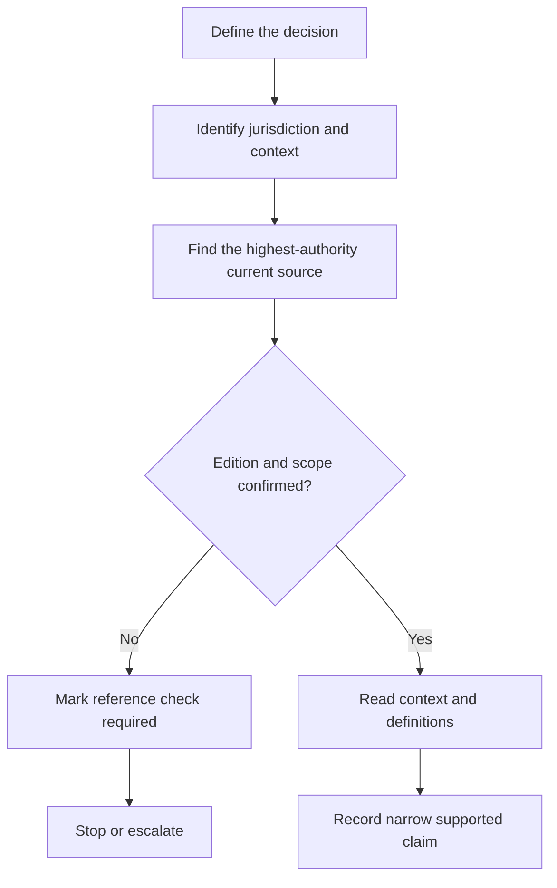
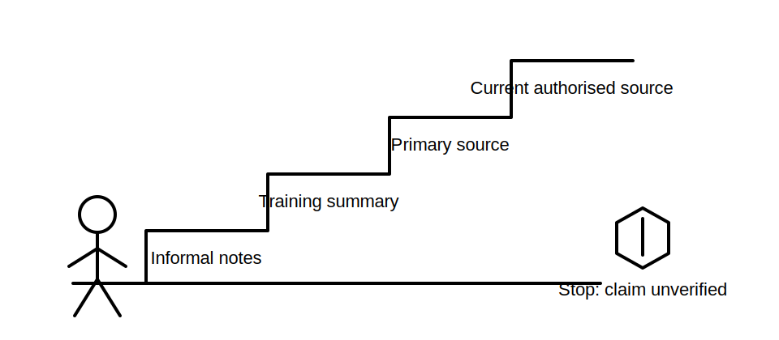

# Safe Information Boundaries and Authorised Sources

## 1. Outcome and entry check

By the end, the learner can classify a source by authority and currency, separate learning support from compliance evidence, identify when a claim requires verification, and stop rather than improvise where safety-critical information is missing.

**Entry check:** A study note gives a test value but provides no source date or edition. What can the note safely be used for, and what can it not establish?

## 2. Why it matters

Capstone preparation involves technical rules, procedures and assessment expectations that can change or depend on jurisdiction, edition and context. A plausible answer from memory is not equivalent to current authorised evidence. Strong learners know both how to find information and when not to act on incomplete information.

## 3. Core concepts and terminology

- **Authorised source:** a current source recognised for the decision being made, such as applicable legislation, regulator guidance, adopted standards or approved RTO material.
- **Primary source:** the originating legal, regulatory or standards document rather than a summary of it.
- **Secondary source:** explanatory material that interprets or teaches primary-source content.
- **Currency:** whether the source version and amendments are current for the task.
- **Scope:** the installations, people, conditions and decisions to which a source applies.
- **Evidence boundary:** the point beyond which the available information cannot justify a conclusion.
- **Reference check required:** a flag showing that an exact claim must be verified before reliance.

## 4. Rule-finding workflow

1. Define the exact decision or question.
2. Identify the applicable jurisdiction, work context and source hierarchy.
3. Locate the most authoritative current source available.
4. confirm edition, amendment status, scope and definitions.
5. Read surrounding context rather than extracting an isolated sentence.
6. Record the source and the narrow claim it supports.
7. Mark unresolved points `reference_check_required` and stop escalation-sensitive action.

## 5. Visual model or worked example

**Worked example:** A training handout states a rule without an edition date. It may help identify search terms and concepts, but it does not establish the current mandatory requirement. The learner records the claim as provisional, locates the applicable authorised source and checks context before using it.

## 6. Practical application

For each of four items—an online forum post, a manufacturer instruction, an RTO handout and current regulator guidance—record:

- what question the item may help answer;
- its authority, scope and currency checks;
- one decision it cannot support by itself;
- the next source or person needed where evidence is incomplete.

Assessment evidence: explicit hierarchy reasoning, version checks, narrow claims and correct stop/escalate decisions.

## 7. Common errors and safety checkpoint

Common errors include treating search ranking as authority, using an old edition because wording looks familiar, relying on summaries for exact requirements, ignoring manufacturer instructions, and converting uncertainty into a confident guess.

**Safety checkpoint:** Do not use unverified values, sequences or limits for live work, isolation, testing or defect decisions. Follow current authorised procedures and qualified supervision requirements.

## 8. Retrieval and next links

Without looking back, define authority, currency, scope and evidence boundary. Explain why a useful learning note may still be insufficient compliance evidence.

- Previous: [Block 03 — Reading Simple Circuit Representations](block-03-reading-simple-circuit-representations.md)
- Next: [Block 05 — Rule-Finding Workflow Foundations](block-05-rule-finding-workflow-foundations.md)
- Knowledge note: [Safe Information Boundaries and Authorised Sources](../../../knowledge-base/9-week/Block 04 - Safe Information Boundaries and Authorised Sources.md)
