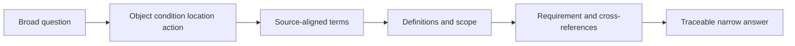
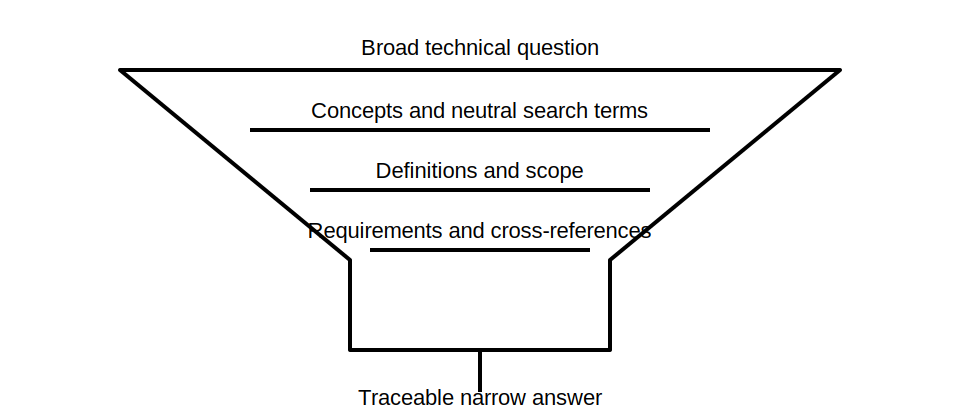

# Rule-Finding Workflow Foundations

## 1. Outcome and entry check

By the end, the learner can convert a broad technical question into searchable concepts, navigate definitions and scope before requirements, capture supporting context, and produce a traceable answer that distinguishes sourced facts from interpretation.

**Entry check:** Why is searching only for the expected answer more likely to produce confirmation bias than searching for the governing concept and scope?

## 2. Why it matters

Assessment and workplace questions are often phrased differently from source documents. A repeatable workflow reduces random searching, isolated-clause errors and unsupported memory-based answers. It also leaves an evidence trail that another person can review.

## 3. Core concepts and terminology

- **Question decomposition:** splitting a problem into subject, context, condition and required decision.
- **Search term:** a source-aligned word or phrase used to locate relevant material.
- **Defined term:** wording whose source-specific meaning may differ from everyday use.
- **Scope check:** confirming that a section applies to the installation or decision.
- **Cross-reference:** a direction to related requirements, exceptions or definitions.
- **Traceability:** recording enough source detail to reproduce the reasoning.
- **Interpretation:** a reasoned conclusion drawn from sourced material, not the source wording itself.

## 4. Rule-finding workflow

1. Restate the question as a decision to be supported.
2. Extract the object, condition, location and action.
3. Generate source-aligned synonyms without assuming the answer.
4. Search the index, contents, definitions and relevant section headings.
5. Confirm scope and defined terms before reading the apparent requirement.
6. Follow cross-references, exceptions and notes that affect meaning.
7. Record source, edition, location, context and the exact narrow conclusion.
8. Separate quoted facts, paraphrase and interpretation in the final response.

## 5. Visual model or worked example

**Worked example:** Instead of searching for “the allowed answer,” a learner identifies the equipment type, supply arrangement, location and decision being tested. They check defined terms and scope, follow related references and record why the located material applies. Any exact value remains provisional until verified in the current authorised source.

## 6. Practical application

Take three broad prompts from existing study material. For each:

- decompose it into object, condition, location and decision;
- propose at least three neutral search terms;
- identify which definitions and scope questions must be checked;
- write a two-sentence answer separating source-supported fact from interpretation;
- record one unresolved issue as `reference_check_required`.

Assessment evidence: efficient navigation, neutral search terms, scope awareness, cross-reference use and reproducible source notes.

## 7. Common errors and safety checkpoint

Common errors include searching the anticipated answer, skipping definitions, stopping at the first keyword hit, ignoring exceptions, copying wording without context and citing a source that does not apply to the scenario.

**Safety checkpoint:** A successful text search does not prove applicability. Safety-critical decisions require current authorised context and qualified review where required.

## 8. Retrieval and next links

From memory, list the eight workflow stages. Then explain how neutral search terms reduce confirmation bias.

- Previous: [Block 04 — Safe Information Boundaries and Authorised Sources](block-04-safe-information-boundaries-and-authorised-sources.md)
- Next: [Block 06 — Retrieval Lab: Terminology and Diagrams](block-06-retrieval-lab-terminology-and-diagrams.md)
- Knowledge note: [Rule-Finding Workflow Foundations](../../../knowledge-base/9-week/Block 05 - Rule-Finding Workflow Foundations.md)
