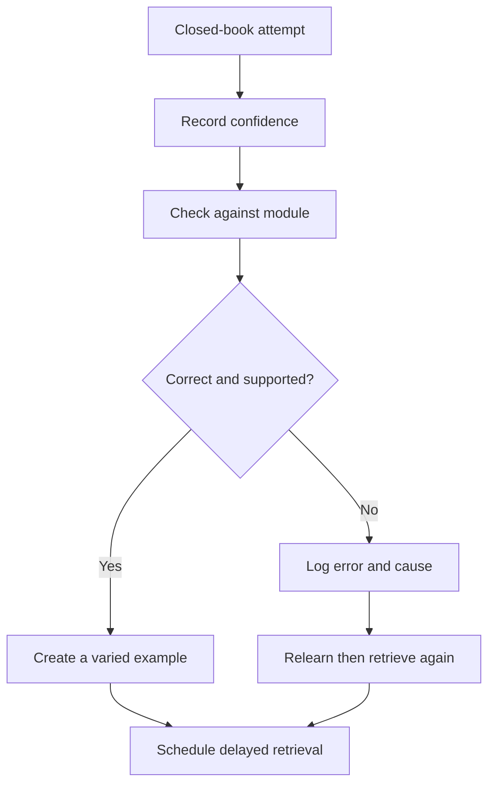
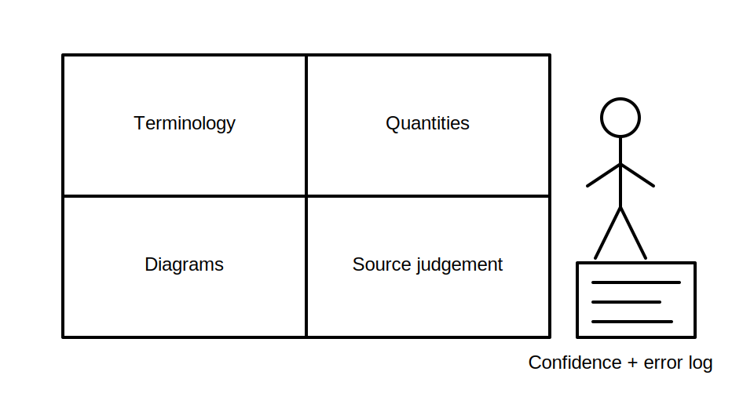

# Retrieval Lab - Terminology and Diagrams

## 1. Outcome and entry check

By the end, the learner can retrieve key Week 1 terminology without prompts, interpret a simple circuit representation, classify evidence quality and apply the rule-finding workflow to a fresh scenario while identifying uncertainty accurately.

**Entry check:** Without notes, define node, branch, scope and traceability, then sketch one crossing and one junction using clearly different notation.

## 2. Why it matters

Recognition can create false confidence. Retrieval exposes what can actually be produced under assessment conditions, while varied application tests whether the learner can transfer concepts rather than repeat wording from one module.

## 3. Core concepts and terminology

- **Free recall:** producing an answer without cues.
- **Cued recall:** retrieving with a prompt or category.
- **Discrimination:** distinguishing similar concepts, symbols or evidence types.
- **Transfer:** applying a learned process to a new scenario.
- **Calibration:** comparing confidence with demonstrated accuracy.
- **Error log:** a record of mistakes, causes and planned corrective practice.
- **Overclaim:** a conclusion that extends beyond the available evidence.

## 4. Rule-finding workflow

1. Attempt each task closed-book and record confidence before checking.
2. Mark answers correct, incomplete, confused or unsupported.
3. For diagram tasks, trace connectivity before naming component behaviour.
4. For source tasks, identify authority, currency, scope and evidence boundary.
5. Rework only missed items using the relevant module.
6. Explain the correction in new words and create one varied example.
7. Schedule the weakest item for retrieval after a delay.

## 5. Visual model or worked example

**Worked example:** A learner correctly identifies an open represented branch but claims the equipment is safely isolated. The diagram reading is partly correct; the evidence conclusion is not. The error log records “model-to-field overclaim,” and the correction requires a narrow statement plus the missing real-world evidence.

## 6. Practical application

Complete four stations without notes:

1. define eight terms selected from Blocks 01–05;
2. explain two quantity relationships using units and held-constant assumptions;
3. trace a two-branch diagram containing a crossing, junction and open device;
4. rank four source examples and outline a traceable search workflow for one unresolved claim.

Then check answers, score confidence accuracy and create one corrective retrieval card per error category.

Assessment evidence: accurate recall, correct discrimination, narrow diagram claims, source hierarchy reasoning and an actionable error log.

## 7. Common errors and safety checkpoint

Common errors include checking notes too early, treating familiar wording as recall, scoring partly correct answers as complete, repeating the same example rather than transferring, and hiding uncertainty instead of logging it.

**Safety checkpoint:** Retrieval practice may use simplified diagrams and hypothetical scenarios, but it must not rehearse unverified live-work procedures or present remembered values as authorised requirements.

## 8. Retrieval and next links

State the difference between recall, discrimination, transfer and calibration. Identify the Week 1 concept currently least secure and specify the next retrieval task, not just “revise it.”

- Previous: [Block 05 — Rule-Finding Workflow Foundations](block-05-rule-finding-workflow-foundations.md)
- Next: [Block 07 — Rest, Reflection and Catch-Up](block-07-rest-reflection-and-catch-up.md)
- Knowledge note: [Retrieval Lab - Terminology and Diagrams](../../../knowledge-base/9-week/Block 06 - Retrieval Lab Terminology and Diagrams.md)
