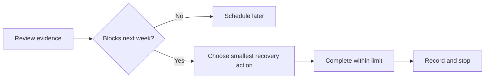
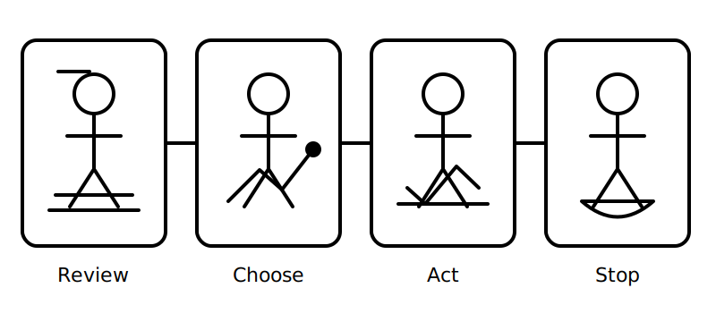

# Rest, Reflection and Catch-Up

## 1. Outcome and entry check

By the end, the learner can identify one secure concept, one fragile concept and one unfinished task from Week 1, then choose a proportionate recovery action without turning a rest block into a full study day.

**Entry check:** From memory, name the Week 1 task that produced the largest gap between confidence and accuracy.

## 2. Why it matters

Consolidation requires both retrieval and recovery. A planned pause reduces unproductive repetition, while a narrow catch-up action prevents small gaps from accumulating into later confusion.

## 3. Core concepts and terminology

- **Consolidation:** stabilising learning after initial practice.
- **Reflection:** examining evidence of learning rather than relying on mood.
- **Catch-up:** completing a specifically identified missed task.
- **Recovery action:** the smallest action likely to correct a defined gap.
- **Study debt:** unfinished work that has a clear effect on later learning.
- **Scope control:** limiting catch-up so rest remains restorative.

## 4. Rule-finding workflow

1. Review the Week 1 error log and completion record.
2. Separate unfinished work from work that merely feels imperfect.
3. Select one gap that blocks the next week.
4. Choose one recovery action: retrieve, clarify, redraw or reschedule.
5. Set a stopping condition before beginning.
6. Record the result and leave remaining non-blocking items scheduled.

## 5. Visual model or worked example

**Worked example:** A learner missed two terminology items and one diagram distinction. Because diagram connectivity is prerequisite knowledge for Week 2, the learner redraws one junction-versus-crossing example, checks it, records the correction and stops. The terminology items are scheduled for the next retrieval block.

## 6. Practical application

Complete a ten-minute review:

1. mark each Week 1 block secure, fragile or incomplete;
2. identify one prerequisite gap for Week 2;
3. perform one bounded recovery action;
4. write one sentence explaining why the action was sufficient;
5. schedule any remaining non-blocking work.

Assessment evidence: a justified priority, a bounded action and an explicit stopping condition.

## 7. Common errors and safety checkpoint

Common errors include rereading everything, selecting work by discomfort rather than prerequisite value, converting rest into punishment, and leaving catch-up without a stopping rule.

**Safety checkpoint:** This block is for study recovery only. It must not be used to rehearse practical electrical procedures without appropriate supervision, authorised instructions and required controls.

## 8. Retrieval and next links

Explain the difference between unfinished work, fragile knowledge and study debt. State one sign that a catch-up action has become too broad.

- Previous: [Block 06 — Retrieval Lab: Terminology and Diagrams](block-06-retrieval-lab-terminology-and-diagrams.md)
- Next: [Block 08 — Circuit Purpose and Load Grouping](block-08-circuit-purpose-and-load-grouping.md)
- Knowledge note: [Rest, Reflection and Catch-Up](../../../knowledge-base/9-week/Block 07 - Rest Reflection and Catch-Up.md)
