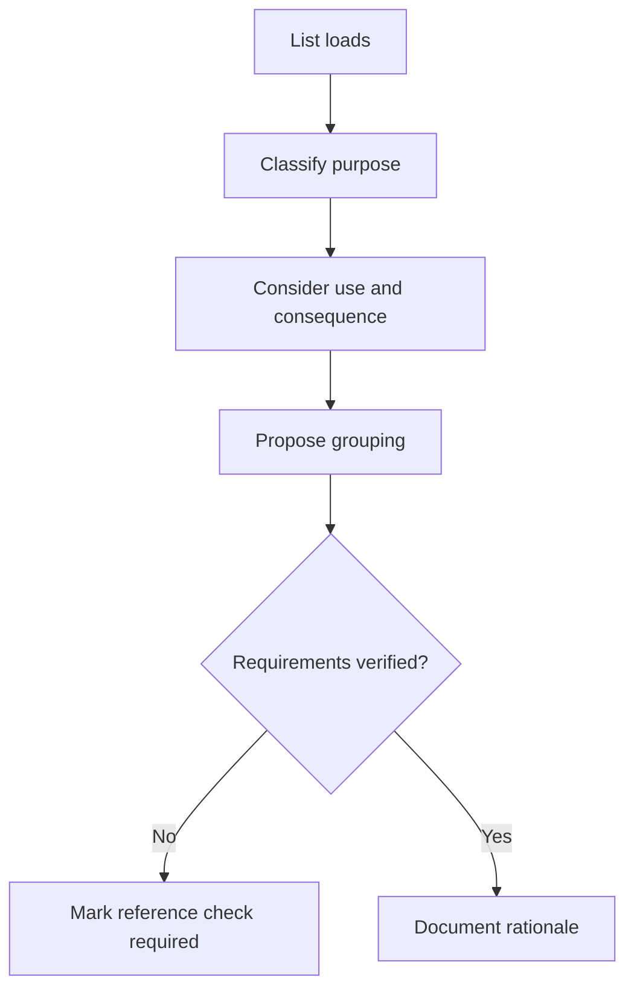
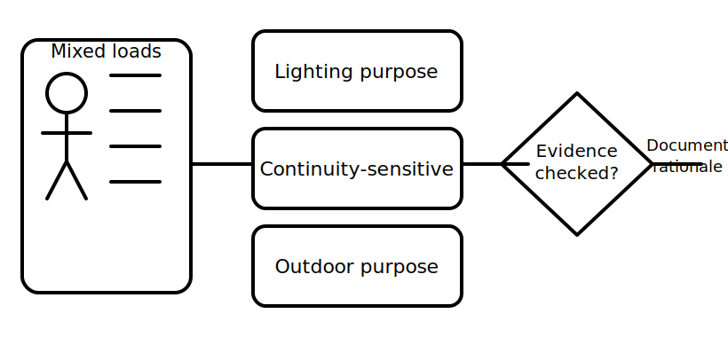

# Circuit Purpose and Load Grouping

## 1. Outcome and entry check

By the end, the learner can classify loads by intended function, explain why circuit grouping is a planning decision, and identify the information still required before making a compliance or design claim.

**Entry check:** Given lighting, socket-outlet and fixed-appliance symbols, group them by function and state one reason the grouping may matter.

## 2. Why it matters

A circuit is more than connected components. Its purpose affects expected use, continuity needs, protection reasoning, isolation planning and the consequences of a fault. Functional grouping is therefore an evidence-based design step, not a naming exercise.

## 3. Core concepts and terminology

- **Load:** equipment that uses electrical energy to perform a function.
- **Circuit purpose:** the service or outcome the circuit supports.
- **Load grouping:** organising loads according to a stated planning rationale.
- **Diversity:** recognition that loads may not all operate at full demand simultaneously; exact treatment requires authorised references.
- **Continuity consequence:** the effect of losing supply to a group.
- **Segregation:** keeping selected functions or systems appropriately separated; requirements are context-dependent.
- **Design assumption:** a stated condition used provisionally until verified.

## 4. Rule-finding workflow

1. List each load and its intended function.
2. Identify operating pattern, location and continuity consequence.
3. Note environmental, control or supply characteristics that may change grouping.
4. Propose a grouping rationale without assigning remembered limits.
5. Identify the authorised source needed to verify requirements.
6. Record assumptions and unresolved decisions separately.
7. Reject any grouping that cannot be explained from evidence.

## 5. Visual model or worked example

**Worked example:** A small premises scenario includes general lighting, refrigeration and outdoor equipment. A learner proposes three groups because their functions, loss consequences and environmental conditions differ. The proposal remains provisional until current authorised requirements and project constraints are checked.

## 6. Practical application

For a hypothetical premises with eight named loads:

1. classify each load by purpose;
2. propose no more than four groups;
3. give one operational reason for each group;
4. identify one consequence if each group loses supply;
5. list the source questions that must be verified before design approval.

Assessment evidence: coherent classification, explicit rationale, visible assumptions and no unsupported compliance claim.

## 7. Common errors and safety checkpoint

Common errors include grouping only by room, assuming every appliance needs a dedicated circuit, using familiar labels without defining purpose, and inserting remembered limits as if verified.

**Safety checkpoint:** This module supports conceptual planning only. Circuit design, selection, installation and alteration require current authorised information, competent supervision and applicable workplace controls.

## 8. Retrieval and next links

Define circuit purpose, load grouping and continuity consequence. Explain why a plausible grouping can still be unverified.

- Previous: [Block 07 — Rest, Reflection and Catch-Up](block-07-rest-reflection-and-catch-up.md)
- Next: [Block 09 — Conductor Roles and Identification](block-09-conductor-roles-and-identification.md)
- Knowledge note: [Circuit Purpose and Load Grouping](../../../knowledge-base/9-week/Block 08 - Circuit Purpose and Load Grouping.md)
