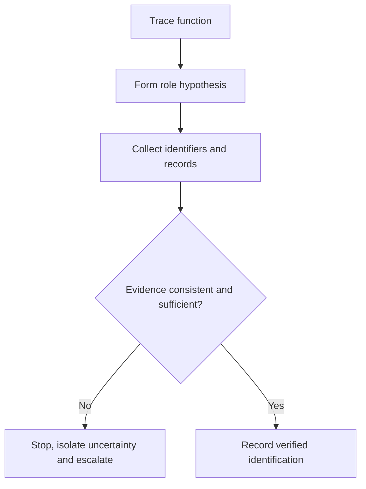
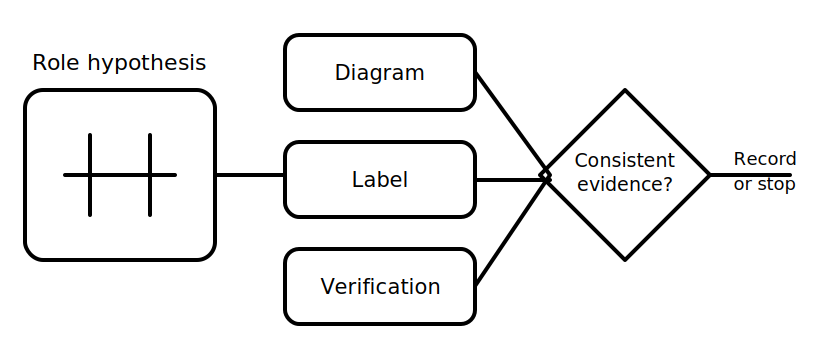

# Conductor Roles and Identification

## 1. Outcome and entry check

By the end, the learner can distinguish conductor function from appearance, classify common functional roles in a simplified circuit, and state what evidence is needed before identifying a real conductor.

**Entry check:** On a simple source-load diagram, point to the outgoing path, returning path and protective path without assigning colours.

## 2. Why it matters

Incorrect identification can create serious risk. Colour, position, labels and prior assumptions are clues, not complete proof. Reliable reasoning starts with function and requires appropriate verification before action.

## 3. Core concepts and terminology

- **Active conductor:** a conductor intended to carry energy from the source under normal conditions; exact definitions require authorised verification.
- **Neutral conductor:** a conductor associated with the return/reference function in the supply arrangement; it must not be treated as inherently safe.
- **Protective earthing conductor:** a protective path intended to support fault protection, not normal load current.
- **Switched active:** an active conductor controlled by a switching device.
- **Identification:** markings or features used to distinguish a conductor.
- **Verification:** obtaining sufficient evidence that the assumed role is correct.
- **Role-appearance distinction:** separating electrical function from colour, location or shape.

## 4. Rule-finding workflow

1. Start with the circuit function and represented connectivity.
2. Form a provisional role hypothesis for each conductor.
3. Record visible identifiers without treating them as proof.
4. Check diagrams, labels, documentation and authorised requirements.
5. Identify contradictions or missing evidence.
6. Stop and escalate where safe verification cannot be established.
7. Document the verified role separately from the initial assumption.

## 5. Visual model or worked example

**Worked example:** A conductor's appearance suggests one role, but the diagram and destination suggest another. The learner records a contradiction and refuses to relabel or rely on the conductor until authorised verification resolves the mismatch.

## 6. Practical application

Using a simplified de-energised training diagram:

1. label each represented conductor by provisional function;
2. list the evidence supporting each label;
3. identify one clue that could be misleading;
4. mark each conclusion assumed, supported or verified;
5. write the stop condition for unresolved contradictions.

Assessment evidence: correct functional distinctions, evidence grading and an explicit refusal to infer safety from appearance alone.

## 7. Common errors and safety checkpoint

Common errors include treating colour as proof, assuming neutral means harmless, confusing protective and normal current paths, and carrying labels from one diagram into a different installation context.

**Safety checkpoint:** Never identify, touch, disconnect or test a real conductor from appearance alone. Practical verification must follow current authorised procedures, competency requirements, supervision and site controls.

## 8. Retrieval and next links

Explain the difference between conductor role, identification and verification. State why a neutral conductor cannot be assumed safe.

- Previous: [Block 08 — Circuit Purpose and Load Grouping](block-08-circuit-purpose-and-load-grouping.md)
- Next: [Block 10 — Current Paths in Normal Operation](block-10-current-paths-in-normal-operation.md)
- Knowledge note: [Conductor Roles and Identification](../../../knowledge-base/9-week/Block 09 - Conductor Roles and Identification.md)
