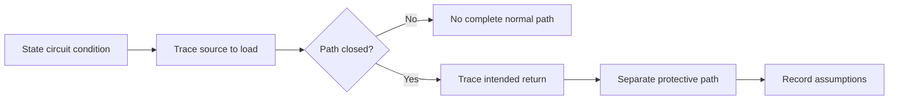
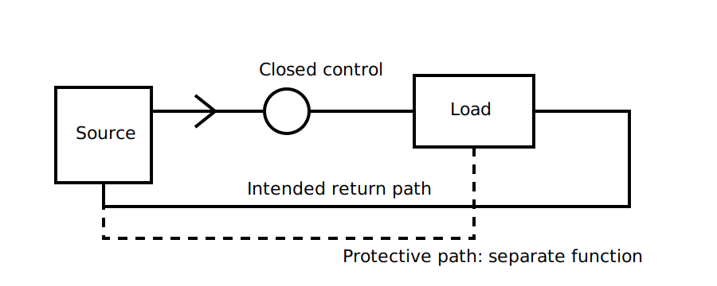

# Current Paths in Normal Operation

## 1. Outcome and entry check

By the end, the learner can trace a simplified normal operating current path, distinguish the intended outgoing and return paths from the protective path, and explain how an open control point changes the path.

**Entry check:** Identify the source, load, switching point and represented conductor roles on a de-energised training diagram.

## 2. Why it matters

Protection and fault reasoning depend on first understanding the intended operating path. A learner who cannot trace the normal path may confuse neutral, protective earthing and fault-current functions or assume that every drawn conductor carries current in every state.

## 3. Core concepts and terminology

- **Closed path:** a represented conductive route capable of supporting current in the stated circuit condition.
- **Open path:** a break that prevents current through that route.
- **Normal operating current:** current associated with the intended operation of the load.
- **Outgoing path:** the path from the source toward the load in the simplified model.
- **Return path:** the intended path from the load back toward the source arrangement.
- **Protective path:** a path provided for protection and fault conditions, not intended as the normal load-current return.
- **Circuit state:** the stated combination of source availability, switch position and load condition.

## 4. Rule-finding workflow

1. State the circuit condition before tracing.
2. Mark the source and load terminals.
3. Follow represented connectivity from source to load.
4. Check every switch, control and open point.
5. Trace the intended return path.
6. Keep the protective path visually separate.
7. Record assumptions and seek authorised verification before applying the model to real equipment.

## 5. Visual model or worked example

**Worked example:** With the control point closed, the learner traces an outgoing path through the load and an intended return path. When the control point is opened, the learner identifies the break and explains that the protective conductor does not become the normal return path.

## 6. Practical application

For three simplified circuit states—closed control, open control and disconnected source—annotate:

1. whether a complete normal path is represented;
2. the outgoing and return portions;
3. the protective path;
4. the exact point that changes the state;
5. one assumption that prevents direct transfer to a real installation.

Assessment evidence: accurate path tracing, state-dependent reasoning and clear separation of normal and protective functions.

## 7. Common errors and safety checkpoint

Common errors include tracing without stating switch state, assuming a drawn line always carries current, treating the protective conductor as the normal return, and confusing connectivity with proof of safe condition.

**Safety checkpoint:** Diagram tracing is not isolation, testing or verification. Never infer that real conductors are safe from a schematic alone; use current authorised procedures, suitable equipment, competency controls and supervision.

## 8. Retrieval and next links

From memory, draw a source, control, load, return path and separate protective path. Explain what changes when the control opens.

- Previous: [Block 09 — Conductor Roles and Identification](block-09-conductor-roles-and-identification.md)
- Next: [Block 11 — Overload and Short-Circuit Concepts](block-11-overload-and-short-circuit-concepts.md)
- Knowledge note: [Current Paths in Normal Operation](../../../knowledge-base/9-week/Block 10 - Current Paths in Normal Operation.md)
