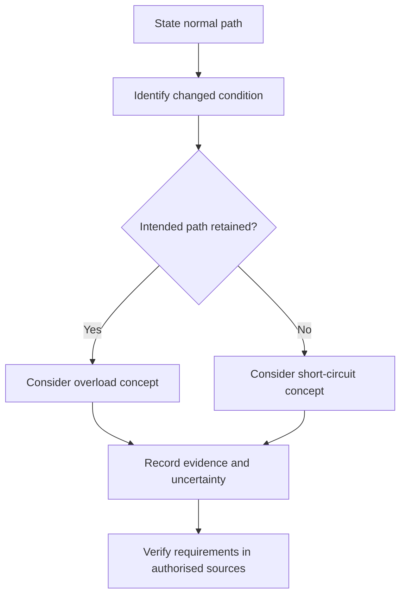
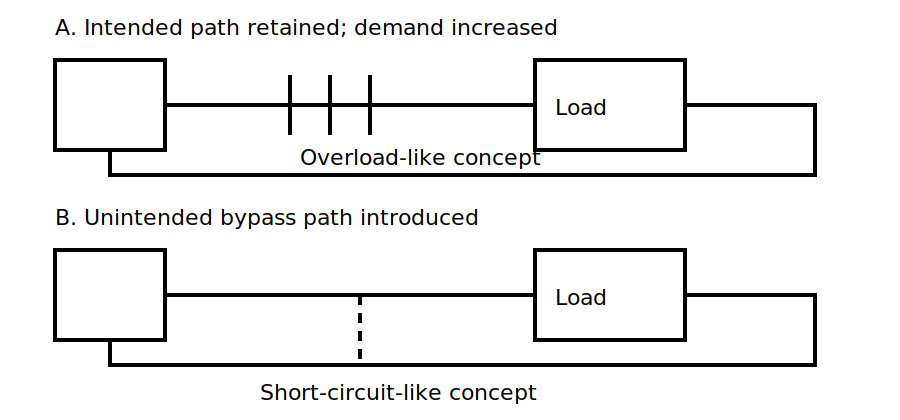

# Overload and Short-Circuit Concepts

## 1. Outcome and entry check

By the end, the learner can distinguish overload from short-circuit conditions in simplified scenarios, identify the evidence supporting each classification, and avoid assigning exact operating values without an authorised source.

**Entry check:** Trace the intended normal current path from Block 10 and identify the load.

## 2. Why it matters

Different abnormal-current conditions arise through different mechanisms. Confusing them weakens protection selection, fault reasoning and communication, even when both may produce excessive current and heating risk.

## 3. Core concepts and terminology

- **Overcurrent:** current exceeding the intended or permitted condition; exact definitions require authorised verification.
- **Overload:** excessive current in an otherwise intended conductive path, commonly associated with load demand or operating conditions.
- **Short circuit:** an unintended low-impedance connection between points at different potential, creating an abnormal path.
- **Fault path:** the route taken by current during an abnormal condition.
- **Prospective current:** a source-and-path-dependent quantity that must not be guessed from a sketch.
- **Thermal effect:** heating associated with current magnitude and duration.

## 4. Rule-finding workflow

1. State the normal circuit path.
2. Identify what changed: load demand, connection or insulation boundary.
3. Decide whether the abnormal current remains in the intended path or uses an unintended path.
4. Separate observed evidence from inferred cause.
5. Record uncertainty and required authorised references.
6. Do not infer device operation time or current from memory.

## 5. Visual model or worked example

**Worked example:** Scenario A adds excessive demand while current still passes through the intended load path. Scenario B introduces an unintended connection that bypasses part of the load. The learner classifies the concepts but does not claim exact current magnitude or device response.

## 6. Practical application

Classify four simplified scenarios as overload-like, short-circuit-like or insufficient evidence. For each, state:

1. the normal path;
2. the changed condition;
3. intended versus unintended path;
4. observed facts;
5. one claim requiring authorised verification.

Assessment evidence: defensible classification, clear evidence language and no invented technical values.

## 7. Common errors and safety checkpoint

Common errors include calling every overcurrent a short circuit, assuming visible damage proves the initiating cause, predicting protective-device timing without data, and overlooking source impedance or path uncertainty.

**Safety checkpoint:** Abnormal-current scenarios can involve arc, fire and shock hazards. Do not reproduce faults or energise training arrangements except under approved procedures, competent supervision and controlled equipment.

## 8. Retrieval and next links

Explain the path-based difference between overload and short circuit. Give one reason exact current and operating time cannot be inferred from a generic diagram.

- Previous: [Block 10 — Current Paths in Normal Operation](block-10-current-paths-in-normal-operation.md)
- Next: [Block 12 — Protective Device Purpose Matching](block-12-protective-device-purpose-matching.md)
- Knowledge note: [Overload and Short-Circuit Concepts](../../../knowledge-base/9-week/Block 11 - Overload and Short-Circuit Concepts.md)
