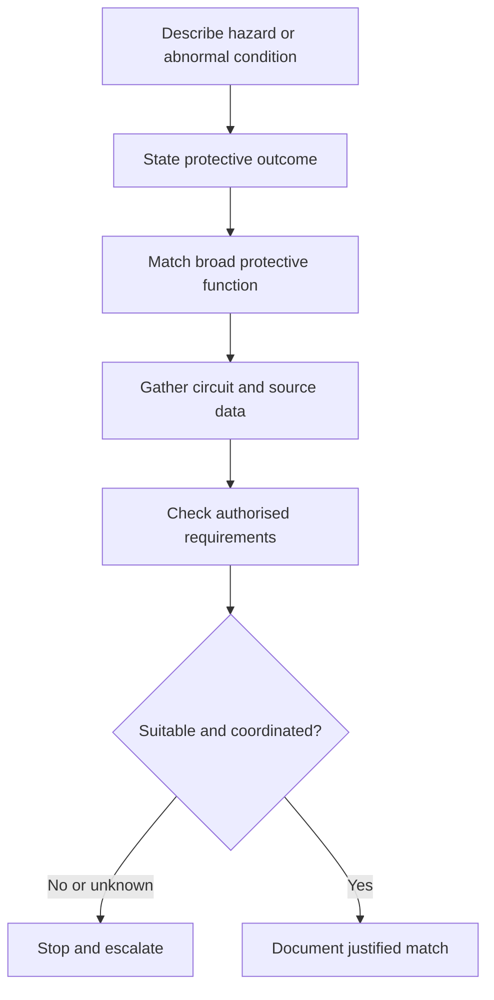
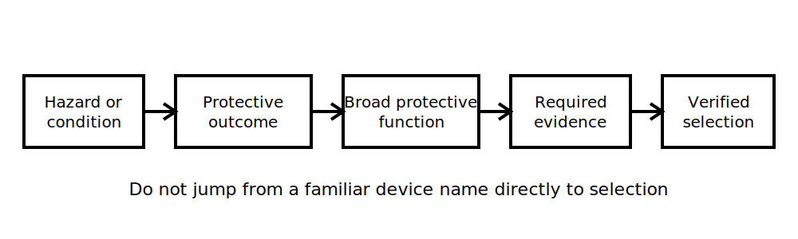

# Protective Device Purpose Matching

## 1. Outcome and entry check

By the end, the learner can match simplified hazard and fault scenarios to broad protective functions, explain the limits of each match, and identify when exact device selection requires authorised data.

**Entry check:** Distinguish overload-like and short-circuit-like paths without using exact current values.

## 2. Why it matters

Protective devices are not interchangeable labels. Sound reasoning starts with the hazard, abnormal condition, intended protective function and system context before any device type or rating is considered.

## 3. Core concepts and terminology

- **Protective function:** the risk-reduction purpose a device or arrangement is intended to support.
- **Overcurrent protection:** protection associated with excessive current conditions; exact scope requires authorised verification.
- **Additional protection:** supplementary risk reduction that does not replace primary protective measures.
- **Automatic disconnection:** interruption of supply under defined conditions; criteria and times must come from authorised sources.
- **Coordination:** ensuring conductors, devices and upstream/downstream protection work together as intended.
- **Selectivity:** limiting interruption to the intended part of the installation where the design permits.
- **Device rating:** a declared characteristic, not proof that the device is suitable for every circuit.

## 4. Rule-finding workflow

1. Describe the hazard or abnormal condition.
2. State the intended protective outcome.
3. Identify the broad protective function required.
4. List circuit, source, conductor and environmental information still needed.
5. Check authorised requirements and manufacturer data.
6. Confirm coordination and limitations.
7. Record what remains unresolved; do not select from name or rating alone.

## 5. Visual model or worked example

**Worked example:** A scenario describes excessive load current in an intended path. The learner first identifies the need to limit harmful overcurrent effects, then lists conductor, load, source and device information required before any device type or rating could be justified.

## 6. Practical application

For four simplified scenarios, complete a purpose-matching table with:

1. hazard or abnormal condition;
2. required protective outcome;
3. broad protective function;
4. missing selection data;
5. one coordination question;
6. stop or escalation condition.

Assessment evidence: purpose-first reasoning, explicit data gaps and refusal to treat a device label as complete justification.

## 7. Common errors and safety checkpoint

Common errors include matching by familiar device name, assuming one device addresses every hazard, confusing additional and primary protection, ignoring conductor coordination, and inventing ratings or operating times.

**Safety checkpoint:** Device selection, alteration and verification are safety-critical. Use current authorised standards, manufacturer instructions, installation data, approved procedures and qualified review. This module does not authorise work on energised equipment.

## 8. Retrieval and next links

Choose one simplified fault scenario and explain the chain from hazard to protective outcome to function to required evidence.

- Previous: [Block 11 — Overload and Short-Circuit Concepts](block-11-overload-and-short-circuit-concepts.md)
- Next: [Block 13 — Mixed Retrieval and Application](block-13-mixed-retrieval-and-application.md)
- Knowledge note: [Protective Device Purpose Matching](../../../knowledge-base/9-week/Block 12 - Protective Device Purpose Matching.md)
