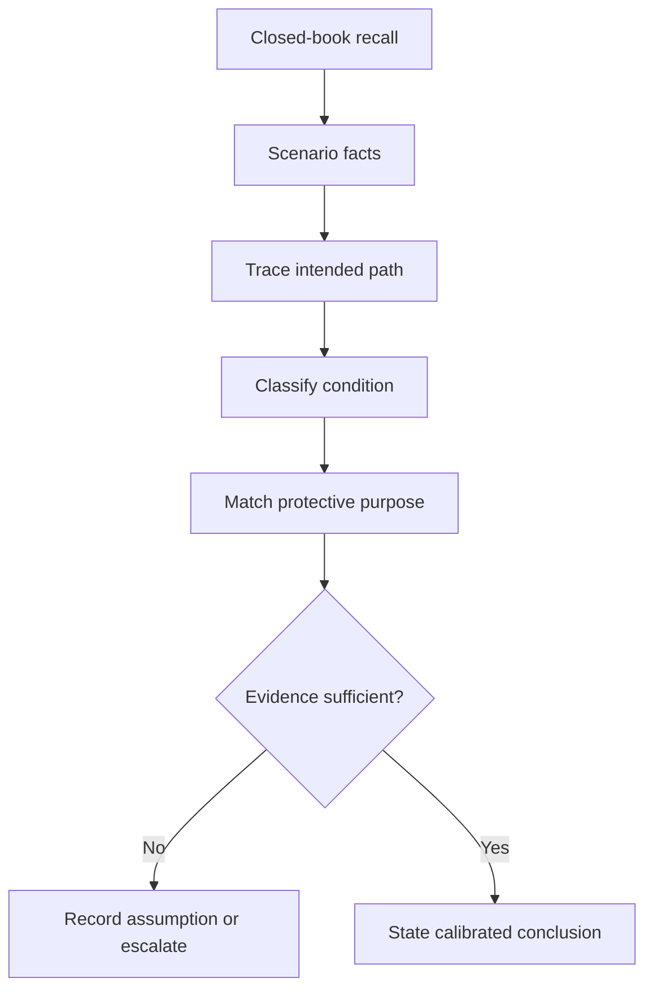
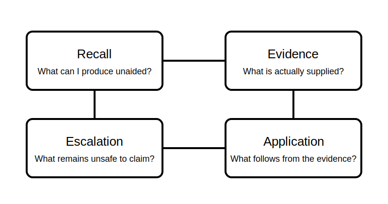

# Mixed Retrieval and Application

## 1. Outcome and entry check

By the end, the learner can retrieve key Week 2 concepts without prompts, apply them to a new simplified circuit scenario, and separate justified conclusions from assumptions and unresolved technical questions.

**Entry check:** From memory, define load, conductor role, normal current path, overload, short circuit and protective function in one sentence each.

## 2. Why it matters

Assessment and workplace reasoning require more than recognition. The learner must recall concepts, connect them under pressure and avoid converting incomplete evidence into a confident technical claim.

## 3. Core concepts and terminology

- **Retrieval:** producing knowledge without looking at notes first.
- **Transfer:** applying an idea to a scenario that differs from the practice example.
- **Evidence statement:** a claim directly supported by the supplied diagram or facts.
- **Inference:** a reasoned interpretation that must be labelled and tested.
- **Assumption:** information treated as true without adequate evidence.
- **Confidence calibration:** matching confidence to the strength of available evidence.
- **Escalation trigger:** a missing or contradictory fact that prevents a safe conclusion.

## 4. Rule-finding workflow

1. Attempt closed-book recall.
2. Mark uncertain terms before checking notes.
3. Read the new scenario and list supplied facts only.
4. Trace the intended current path and identify conductor roles.
5. Classify any abnormal condition using path evidence.
6. Match the required protective outcome at a broad level.
7. Separate evidence, inference, assumption and unknowns.
8. Verify technical claims against authorised sources before use.

## 5. Visual model or worked example

**Worked example:** A diagram shows a source, control, load and return path, plus an unintended low-impedance connection. The learner identifies the normal path, labels the added path as short-circuit-like, states the broad protective purpose, and refuses to predict operating time without verified device and source data.

## 6. Practical application

Complete a 20-minute mixed exercise:

1. six closed-book definitions;
2. one normal-path trace;
3. one overload-like versus short-circuit-like comparison;
4. one protective-purpose match;
5. an evidence/inference/assumption table;
6. one authorised-source question and one escalation trigger.

Assessment evidence: accurate recall, transfer to a new representation, explicit uncertainty and no invented clauses, values or device behaviour.

## 7. Common errors and safety checkpoint

Common errors include checking notes before attempting recall, treating diagram appearance as verified installation evidence, confusing symptom with cause, selecting a device from its name alone, and hiding uncertainty behind vague wording.

**Safety checkpoint:** This is a paper-based reasoning exercise. Do not energise, alter, test or diagnose an installation from this module. Exact protective requirements and device behaviour require current authorised sources, installation data and qualified review.

## 8. Retrieval and next links

Without notes, explain how conductor role, current path, abnormal condition and protective purpose form one reasoning chain.

- Previous: [Block 12 — Protective Device Purpose Matching](block-12-protective-device-purpose-matching.md)
- Next: [Block 14 — Rest, Reflection and Catch-Up](block-14-rest-reflection-and-catch-up.md)
- Knowledge note: [Mixed Retrieval and Application](../../../knowledge-base/9-week/Block 13 - Mixed Retrieval and Application.md)
