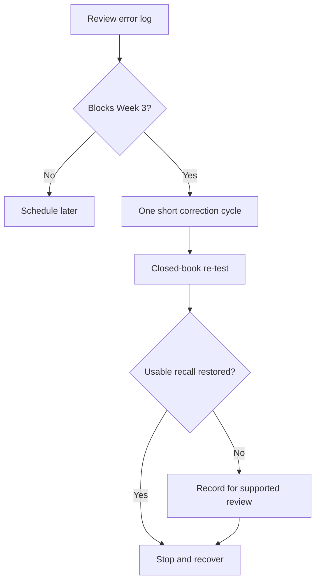
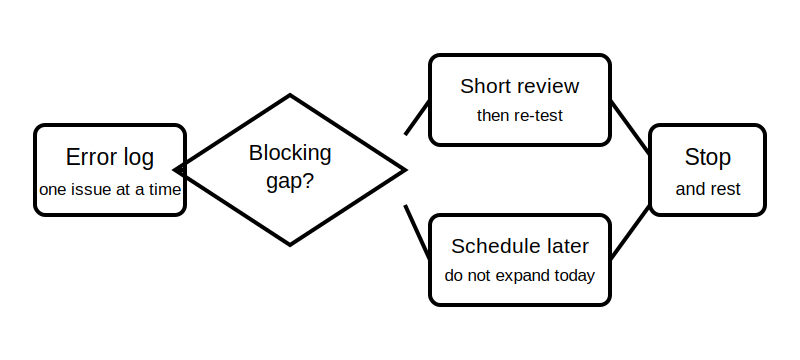

# Rest, Reflection and Catch-Up

## 1. Outcome and entry check

By the end, the learner can identify one blocking misconception, complete only the minimum catch-up needed, and preserve a genuine recovery period before Week 3.

**Entry check:** Review the Block 13 error log and circle only errors that would prevent safe reasoning about current paths, abnormal conditions or protective purpose.

## 2. Why it matters

Rest supports consolidation. Catch-up becomes counterproductive when every unfinished item is treated as urgent, so this block uses a strict gate: repair prerequisite gaps, record non-blocking work, then stop.

## 3. Core concepts and terminology

- **Blocking gap:** a missing prerequisite that prevents the next topic from being understood safely.
- **Non-blocking gap:** useful unfinished work that can be scheduled later.
- **Minimum effective review:** the smallest activity that restores usable recall.
- **Consolidation:** strengthening and organising learning after practice.
- **Stop rule:** a predefined condition that ends catch-up work.
- **Recovery period:** protected time without new technical content.

## 4. Rule-finding workflow

1. Review errors from Blocks 08–13.
2. Classify each as blocking, non-blocking or administrative.
3. Choose at most one blocking gap.
4. Complete one short retrieval-and-correction cycle.
5. Re-test without notes.
6. Record any remaining uncertainty for later review.
7. Stop when the prerequisite is restored or the time limit is reached.

## 5. Visual model or worked example

**Worked example:** A learner can distinguish overload and short circuit but still confuses neutral and protective-earthing purposes. Because Week 3 depends on that distinction, they complete one comparison prompt, re-test from memory, record residual uncertainty and stop.

## 6. Practical application

Use a 30-minute maximum:

1. five minutes to classify errors;
2. fifteen minutes for one blocking gap;
3. five minutes for closed-book re-test;
4. five minutes to schedule unresolved work;
5. then no new technical study.

Assessment evidence: accurate prioritisation, a bounded correction attempt and compliance with the stop rule.

## 7. Common errors and safety checkpoint

Common errors include re-reading everything, starting new material, treating low confidence as failure, extending the session indefinitely and attempting practical electrical work as revision.

**Safety checkpoint:** Catch-up is limited to notes, diagrams and paper-based reasoning. Unresolved technical or safety-critical questions should be recorded for authorised-source checking and qualified review, not tested on equipment.

## 8. Retrieval and next links

State the difference between a blocking and non-blocking gap, then name the stop rule you used.

- Previous: [Block 13 — Mixed Retrieval and Application](block-13-mixed-retrieval-and-application.md)
- Next: [Block 15 — Protective Earthing Purpose](block-15-protective-earthing-purpose.md)
- Knowledge note: [Rest, Reflection and Catch-Up](../../../knowledge-base/9-week/Block 14 - Rest Reflection and Catch-Up.md)
