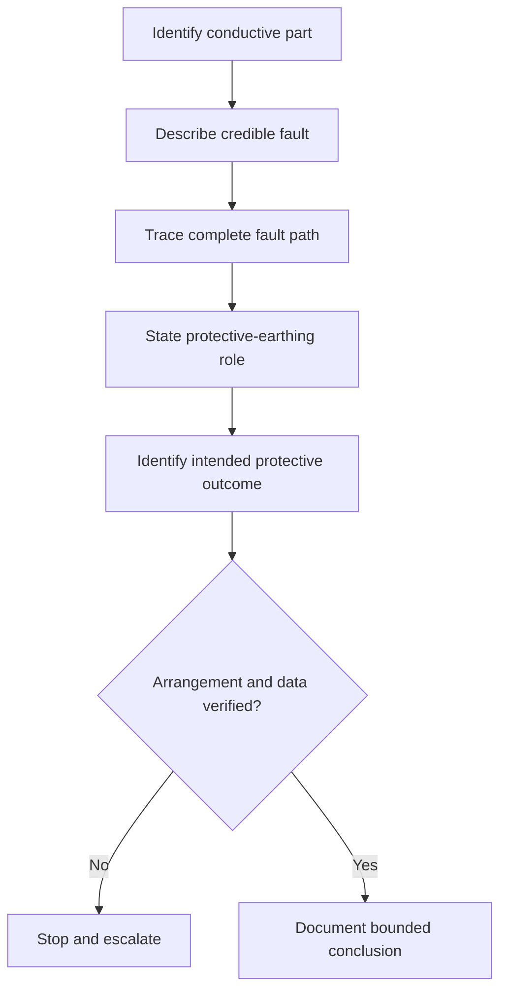
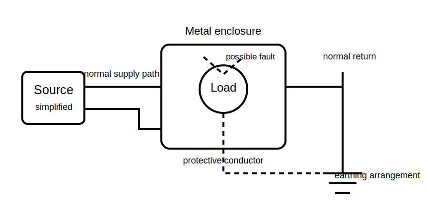

# Protective Earthing Purpose

## 1. Outcome and entry check

By the end, the learner can explain the broad protective purpose of earthing, distinguish exposed conductive parts from normal current-carrying conductors, and identify why exact arrangements and disconnection requirements need authorised verification.

**Entry check:** Explain the difference between an intended load-current path and an abnormal fault-current path without naming exact values or times.

## 2. Why it matters

Protective earthing is often reduced to slogans. Safe reasoning requires a purpose-first model: identify the conductive part, the fault condition, the intended fault path and the protective outcome, while avoiding claims that a protective conductor normally carries load current.

## 3. Core concepts and terminology

- **Protective earthing:** measures intended to connect relevant conductive parts to an earthing arrangement for safety under fault conditions; exact requirements are jurisdiction-specific.
- **Exposed conductive part:** a conductive part that can be touched and may become live under a fault; formal definitions require authorised checking.
- **Protective conductor:** a conductor provided for a protective purpose, not an intended normal load-current return path.
- **Fault current:** current resulting from an abnormal conductive connection.
- **Fault path:** the complete route available to fault current.
- **Equipotential intent:** reducing hazardous differences in potential between relevant conductive parts; exact application requires verified rules.
- **Automatic disconnection:** interruption of supply under defined fault conditions; prescribed criteria must not be supplied from memory.

## 4. Rule-finding workflow

1. Identify the conductive part and whether it is normally energised.
2. Describe the credible fault without assuming a value.
3. Trace the proposed fault-current path from source and back.
4. Identify the protective conductor's broad role.
5. State the intended protective outcome.
6. List missing source, conductor, connection and protective-device data.
7. Check current authorised requirements and manufacturer information.
8. Stop if continuity, arrangement or disconnection conditions cannot be justified.

## 5. Visual model or worked example

**Worked example:** A simplified metal enclosure contains a live conductor that could contact the enclosure under a fault. The learner traces a provisional fault path through the protective conductor, states the intended outcome at a broad level, and records that conductor continuity, source arrangement and protective-device response require authorised verification.

## 6. Practical application

For three paper-based scenarios, record:

1. the exposed or potentially exposed conductive part;
2. the normal current path;
3. the credible fault;
4. the proposed fault path;
5. the protective-earthing purpose;
6. missing evidence;
7. the stop or escalation condition.

Assessment evidence: clear separation of normal and fault paths, correct use of broad terminology, and refusal to claim compliance or disconnection performance without verified data.

## 7. Common errors and safety checkpoint

Common errors include treating earth and neutral as interchangeable, assuming a protective conductor normally carries load current, drawing an incomplete return path, relying on colour alone, and claiming that any earth connection guarantees safety.

**Safety checkpoint:** Earthing arrangements, continuity verification, fault-loop behaviour and disconnection performance are safety-critical. This module is conceptual only and does not authorise live work, testing, alteration or compliance decisions. Use current authorised sources, approved procedures and qualified review.

## 8. Retrieval and next links

From memory, explain why a protective conductor is not an intended normal return conductor, then trace a broad fault-path sequence.

- Previous: [Block 14 — Rest, Reflection and Catch-Up](block-14-rest-reflection-and-catch-up.md)
- Next: [Block 16 — MEN System Concept Map](block-16-men-system-concept-map.md)
- Knowledge note: [Protective Earthing Purpose](../../../knowledge-base/9-week/Block 15 - Protective Earthing Purpose.md)
