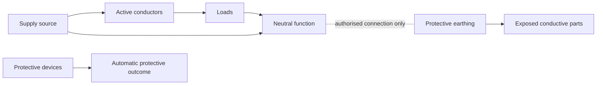
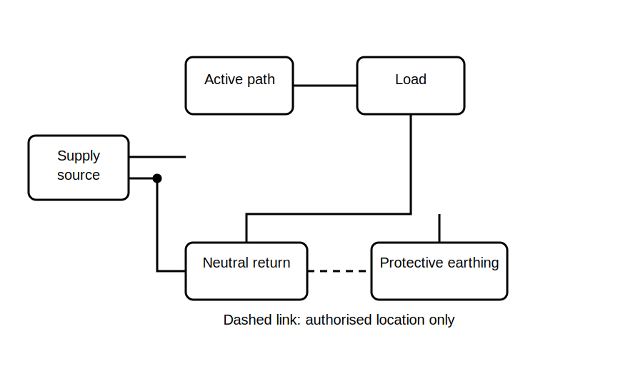

# MEN System Concept Map

## 1. Outcome and entry check

By the end, the learner can construct a bounded concept map showing source, neutral, protective earthing, the main earthing connection and protective devices, while identifying which relationships require authorised verification.

**Entry check:** State why protective earthing and the normal neutral return must not be treated as interchangeable.

## 2. Why it matters

MEN reasoning fails when learners memorise labels without tracing purpose and connection. A concept map helps separate normal-current functions, protective functions and the single verified relationship that links them within the relevant installation arrangement.

## 3. Core concepts and terminology

- **MEN system:** a jurisdiction-specific earthing arrangement whose exact configuration and requirements must be checked in current authorised sources.
- **Neutral:** the intended normal return conductor for relevant circuits.
- **Protective earthing conductor:** a conductor provided for protective purposes.
- **Main earthing conductor:** the conductor connecting the installation earthing arrangement to its nominated earthing point; exact terminology and arrangement require verification.
- **Main earthing connection:** the installation-specific connection between neutral and earth functions at the authorised location; do not infer location from memory.
- **Protective device:** equipment intended to interrupt supply under defined abnormal conditions.
- **Equipotential objective:** limiting hazardous potential differences between relevant conductive parts.

## 4. Rule-finding workflow

1. Draw the source and installation boundary.
2. Mark normal-current conductors separately from protective conductors.
3. Add the earthing electrode or earthing arrangement only as a broad concept.
4. Mark the proposed neutral-earth relationship as `verify location and form`.
5. Add protective devices and the outcome they support.
6. List all missing jurisdiction, supply and installation data.
7. Check authorised rules and approved diagrams.
8. Stop if the arrangement cannot be justified from current sources.

## 5. Visual model or worked example

**Worked example:** Given a simplified installation sketch, the learner labels each line as normal-current, protective, or relationship-to-be-verified. The learner must leave the neutral-earth connection location unresolved until an authorised source is checked.

## 6. Practical application

Create two concept maps: one from a clean template and one from a deliberately misleading diagram. For each, record the role of every conductor, the evidence supporting each connection, and one stop condition.

Assessment evidence: correct role separation, explicit uncertainty labels, and no compliance claim without authorised verification.

## 7. Common errors and safety checkpoint

Common errors include drawing several neutral-earth links without evidence, treating the electrode as the sole fault-current return, merging neutral and protective conductors conceptually, and assuming every installation has the same arrangement.

**Safety checkpoint:** This module is conceptual only. MEN arrangements, connection points and protective outcomes are safety-critical and must be verified against current authorised requirements and reviewed by a qualified person. It does not authorise inspection, testing, alteration or live work.

## 8. Retrieval and next links

From memory, redraw the concept map using distinct normal-current, protective and verification-required relationships.

- Previous: [Block 15 — Protective Earthing Purpose](block-15-protective-earthing-purpose.md)
- Next: [Block 17 — Fault-Current Path Reasoning](block-17-fault-current-path-reasoning.md)
- Knowledge note: [MEN System Concept Map](../../../knowledge-base/9-week/Block 16 - MEN System Concept Map.md)
