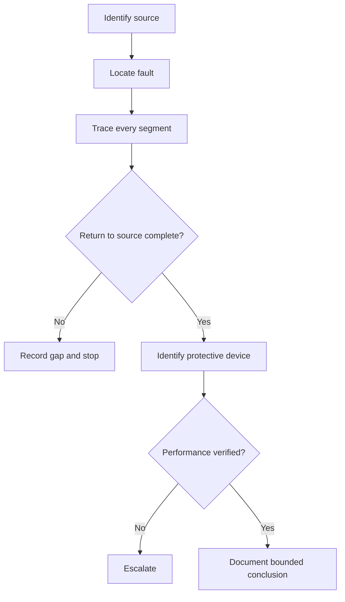
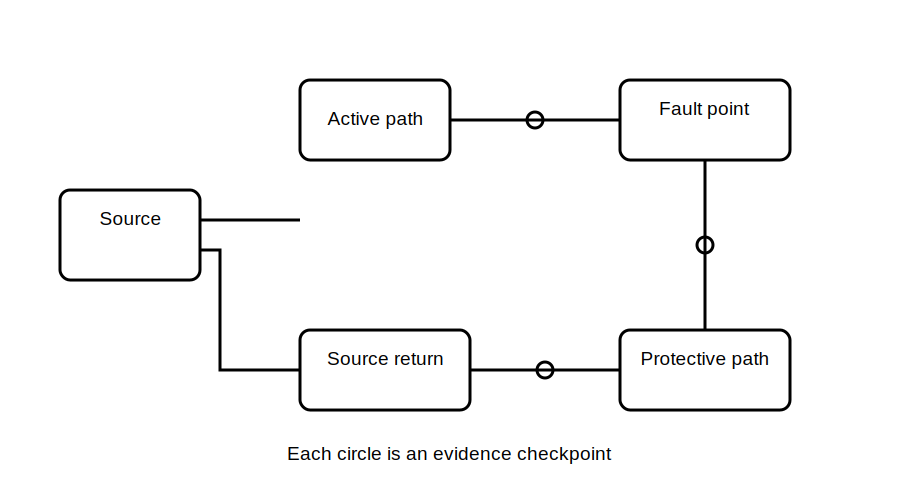

# Fault-Current Path Reasoning

## 1. Outcome and entry check
By the end, the learner can trace a complete provisional fault-current path, identify missing path evidence, and distinguish path existence from sufficient protective performance.

**Entry check:** Mark normal and protective paths separately on a simple diagram.

## 2. Why it matters
A partial path sketch creates false confidence. Safe reasoning requires a closed loop back to the source, evidence for each connection, and a separate check of protective performance.

## 3. Core concepts and terminology
- **Fault origin:** abnormal connection initiating the fault.
- **Fault-current path:** complete route from source, through the fault, and back to the source.
- **Path continuity:** whether every segment is electrically continuous.
- **Path impedance:** opposition of the complete loop; criteria require authorised verification.
- **Protective response:** intended protective-device operation under verified conditions.
- **Evidence gap:** a segment or connection not established.

## 4. Rule-finding workflow
1. Identify source and source state.
2. Mark the fault origin.
3. Trace outward and return segments.
4. Label each segment observed, documented, inferred or unknown.
5. Identify the expected protective device.
6. Separate `path may exist` from `performance demonstrated`.
7. Check authorised criteria and approved procedures.
8. Stop where a critical segment or performance claim is unsupported.

## 5. Visual model or worked example

**Worked example:** A conductor contacts a metal enclosure. Trace source, active, fault point, enclosure, protective conductor, installation earthing relationship and source return, flagging every unverified connection.

## 6. Practical application
For three paper scenarios, create a table of segment, function, evidence, uncertainty and stop condition. Explain why a complete drawing does not prove adequate performance.

Assessment evidence: closed loop, explicit source return, uncertainty labels and no unsupported timing or compliance claim.

## 7. Common errors and safety checkpoint
Errors include stopping at the electrode, omitting the source return, assuming continuity from a drawing and equating a possible path with adequate protection.

**Safety checkpoint:** Fault-loop behaviour, continuity and device performance are safety-critical. This module does not authorise live work, testing or compliance decisions.

## 8. Retrieval and next links
List the minimum elements of a complete fault-current path and one reason a complete sketch may still be insufficient.

- Previous: [Block 16 — MEN System Concept Map](block-16-men-system-concept-map.md)
- Next: [Block 18 — Touch-Voltage Risk Concepts](block-18-touch-voltage-risk-concepts.md)
- Knowledge note: [Fault-Current Path Reasoning](../../../knowledge-base/9-week/Block 17 - Fault-Current Path Reasoning.md)
