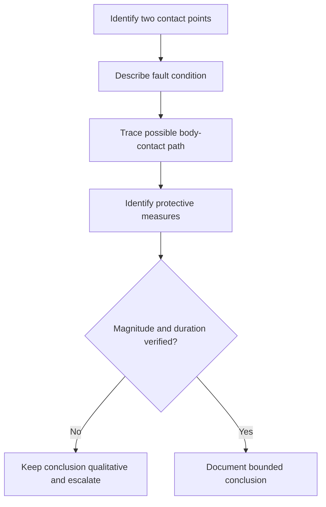
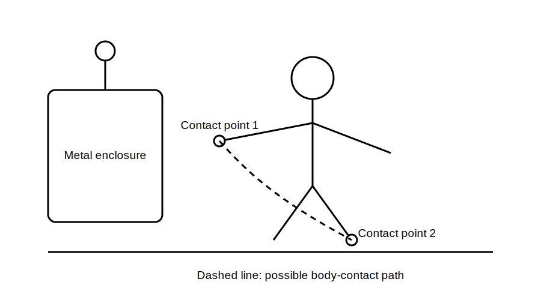

# Touch-Voltage Risk Concepts

## 1. Outcome and entry check
By the end, the learner can explain touch-voltage risk as a potential difference across a possible body-contact path, identify factors that influence exposure, and state why numerical limits require authorised verification.

**Entry check:** Explain why a conductive enclosure may be safe in normal operation yet hazardous after a fault.

## 2. Why it matters
The phrase `voltage to earth` can conceal the actual exposure path. Risk reasoning must identify two contact points, the potential difference between them, the duration and the protective measures intended to limit exposure.

## 3. Core concepts and terminology
- **Touch voltage:** potential difference that may appear between simultaneously accessible conductive parts; formal definitions require authorised checking.
- **Contact path:** the route through which a person could bridge two points.
- **Reference point:** the second point against which potential is considered.
- **Exposure duration:** how long the hazardous condition persists; exact criteria must not be recalled from memory.
- **Prospective condition:** a reasoned scenario, not a measured or verified value.
- **Protective outcome:** limiting magnitude, duration or accessibility through verified protective measures.

## 4. Rule-finding workflow
1. Identify the two simultaneously accessible contact points.
2. Describe the fault or source condition that could separate their potentials.
3. Trace the relevant current and protective paths.
4. Identify what limits magnitude, duration or accessibility.
5. Separate qualitative risk from any numerical claim.
6. List missing source, bonding, continuity and device information.
7. Check current authorised definitions and criteria.
8. Stop where the exposure or protective outcome cannot be justified.

## 5. Visual model or worked example

**Worked example:** A fault may energise a metal enclosure while a person also contacts a second conductive reference. The learner identifies the two points, traces the provisional exposure path and records that actual magnitude, duration and protective response require authorised evidence.

## 6. Practical application
For three diagrams, mark both contact points, the initiating condition, the possible exposure path, the protective measures and the evidence gap. Rank scenarios only by stated qualitative factors, not invented values.

Assessment evidence: two-point reasoning, correct separation of possibility from measurement, and explicit refusal to quote unverified limits.

## 7. Common errors and safety checkpoint
Errors include naming only one contact point, treating earth as a zero-risk reference, assuming bonding removes every hazard, and quoting remembered voltage or time thresholds.

**Safety checkpoint:** Touch-voltage assessment is safety-critical. This conceptual module does not authorise approach, contact, testing, energisation or compliance decisions. Use current authorised sources, approved procedures and qualified review.

## 8. Retrieval and next links
From memory, define touch-voltage risk using two contact points, a potential difference, an exposure path and a duration boundary.

- Previous: [Block 17 — Fault-Current Path Reasoning](block-17-fault-current-path-reasoning.md)
- Next: [Block 19 — Earthing versus Neutral Misconceptions](block-19-earthing-versus-neutral-misconceptions.md)
- Knowledge note: [Touch-Voltage Risk Concepts](../../../knowledge-base/9-week/Block 18 - Touch-Voltage Risk Concepts.md)
