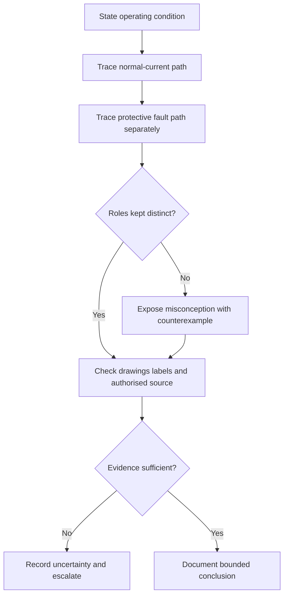
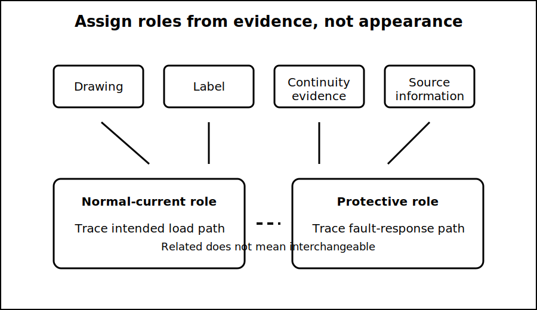

# Earthing versus Neutral Misconceptions

## 1. Outcome and entry check
By the end, the learner can distinguish normal-current, protective and bonding roles; diagnose four common neutral/earthing misconceptions; and state what evidence is required before identifying a conductor or connection.

**Entry check:** In one sentence each, describe the intended role of a neutral conductor and a protective earthing conductor without referring only to colour.

## 2. Why it matters
Neutral and protective earthing may be related at an authorised point, but they are not interchangeable throughout an installation. Collapsing their roles can hide normal current on exposed parts, broken protective paths and unsafe assumptions about identification.

## 3. Core concepts and terminology
- **Neutral conductor:** a circuit conductor associated with the system reference and normal return-current paths; the formal definition and arrangement require authorised verification.
- **Protective earthing conductor:** a conductor intended to support a protective path under fault conditions, not a normal load-current return.
- **Bonding:** intentional connection of conductive parts for a protective purpose; exact scope and requirements require authorised sources.
- **Functional role:** what a conductor or connection is intended to do in the stated system state.
- **Identification evidence:** drawings, labels, continuity evidence, source information and approved records used together rather than appearance alone.
- **Misconception test:** a counterexample that reveals why a broad claim is unsafe or incomplete.

## 4. Rule-finding workflow
1. State the operating state: normal, fault or isolated.
2. Mark each conductor or connection by claimed function, not colour.
3. Trace the expected normal-current path.
4. Trace the proposed protective fault path separately.
5. Test the claim against a counterexample, such as an open neutral or damaged protective conductor.
6. Identify the authorised source needed to confirm the arrangement.
7. Record contradictions and missing evidence.
8. Stop before treating a conceptual label as verified field identification.

## 5. Visual model or worked example

**Worked example:** A learner claims that neutral and earth are effectively the same because they may be connected at one authorised location. Separate path traces show that normal load current belongs on the intended circuit path, while the protective path serves a different fault-response purpose. The exact permitted connection point remains a reference check.

## 6. Practical application
Classify six statements as accurate, incomplete or unsafe. For each incomplete or unsafe statement, write a corrected version, a counterexample and the evidence needed to verify it. Include: “earth is always zero volts,” “neutral is always safe to touch,” “green/yellow proves continuity,” and “bonding removes every touch risk.”

Assessment evidence: distinct path reasoning, useful counterexamples, evidence-based identification and refusal to convert a diagram assumption into a field conclusion.

## 7. Common errors and safety checkpoint
Errors include identifying by colour alone, treating neutral as inherently safe, using “earth” for every reference point, assuming bonding guarantees protection, and drawing an MEN connection at a remembered location.

**Safety checkpoint:** Neutral and earthing arrangements are safety-critical. This module does not authorise contact, testing, alteration, energisation or compliance decisions. Verify current requirements and system details through authorised sources and qualified review.

## 8. Retrieval and next links
From memory, explain one difference between a normal-current role and a protective role, then give one counterexample to “neutral and earth are the same.”

- Previous: [Block 18 — Touch-Voltage Risk Concepts](block-18-touch-voltage-risk-concepts.md)
- Next: [Block 20 — Cumulative Fault-Path Exercise](block-20-cumulative-fault-path-exercise.md)
- Knowledge note: [Earthing versus Neutral Misconceptions](../../../knowledge-base/9-week/Block 19 - Earthing versus Neutral Misconceptions.md)
