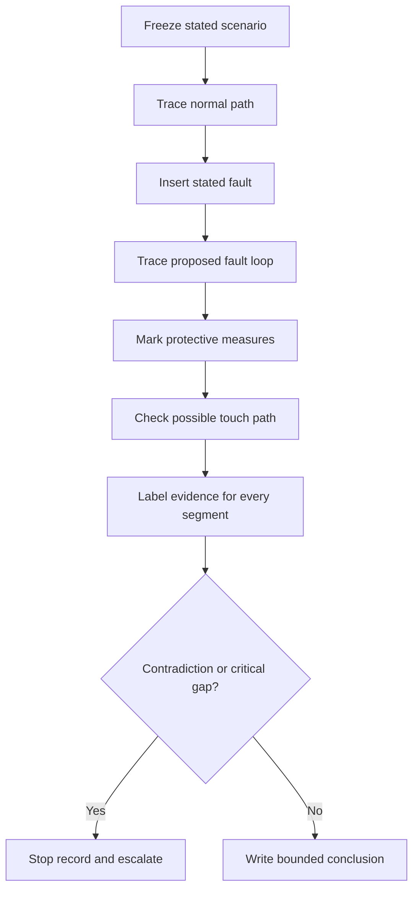
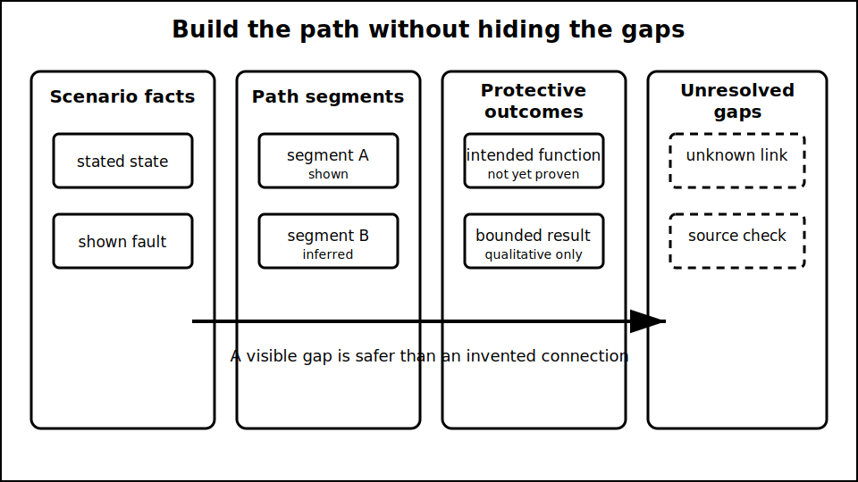

# Cumulative Fault-Path Exercise

## 1. Outcome and entry check
By the end, the learner can analyse a new fault scenario by separating normal, fault, protective and possible body-contact paths; label evidence quality; and produce a bounded conclusion with explicit stop conditions.

**Entry check:** Draw four empty columns headed normal path, initiating fault, protective path and unresolved evidence. Place one remembered Week 3 concept in each.

## 2. Why it matters
Knowing isolated definitions is not enough. Safe reasoning depends on integrating system state, conductor roles, protective measures, touch-risk exposure and evidence gaps without converting a plausible diagram into a verified installation conclusion.

## 3. Core concepts and terminology
- **Scenario state:** the stated arrangement and operating condition at a particular moment.
- **Initiating fault:** the first abnormal event supplied by the scenario, not an invented root cause.
- **Path segment:** one bounded part of a proposed current route.
- **Evidence label:** `stated`, `shown`, `inferred`, `assumed` or `unknown`.
- **Contradiction:** evidence that cannot coexist with the current explanation.
- **Bounded conclusion:** a claim limited to what the scenario and authorised evidence support.
- **Stop condition:** missing or contradictory information that prevents a safety-critical decision.

## 4. Rule-finding workflow
1. Freeze the scenario facts and operating state.
2. Trace the normal-current path before introducing the fault.
3. Insert only the stated initiating fault.
4. Trace each proposed fault-path segment back toward the source.
5. Mark protective measures and their intended outcomes.
6. Identify two-point touch-risk paths where relevant.
7. Label every segment by evidence quality and test contradictions.
8. State the bounded conclusion, reference checks and stop conditions.

## 5. Visual model or worked example

**Worked example:** A diagram shows a source, protective device, load enclosure and several conductors, while the condition of one protective connection is unknown. The learner can trace a possible loop, but must label the unknown segment and cannot claim effective fault clearance or acceptable touch risk.

## 6. Practical application
Complete one 30-minute case in three passes: closed-book path map; evidence and contradiction review; then authorised-source query plan. Submit a one-page response containing the four path types, evidence labels, two rejected assumptions and one exact escalation statement.

Assessment evidence: complete-loop reasoning, separation of normal and protective roles, two-point touch-risk analysis, confidence calibration and a conclusion no broader than the evidence.

## 7. Common errors and safety checkpoint
Errors include beginning with a memorised device outcome, omitting the return to the source, treating earth as an abstract sink, filling unknown segments with assumptions, and declaring compliance from a conceptual diagram.

**Safety checkpoint:** This is a paper-based reasoning exercise only. It does not authorise live work, testing, approach, switching, alteration or compliance decisions. Any exact arrangement, value, protective performance or procedure requires current authorised sources and qualified review.

## 8. Retrieval and next links
Without notes, list the eight workflow steps and explain why a complete-looking path may still support only an inconclusive result.

- Previous: [Block 19 — Earthing versus Neutral Misconceptions](block-19-earthing-versus-neutral-misconceptions.md)
- Next: [Block 21 — Rest, Reflection and Catch-Up](block-21-rest-reflection-and-catch-up.md)
- Knowledge note: [Cumulative Fault-Path Exercise](../../../knowledge-base/9-week/Block 20 - Cumulative Fault-Path Exercise.md)
