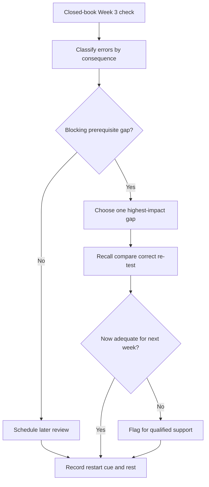
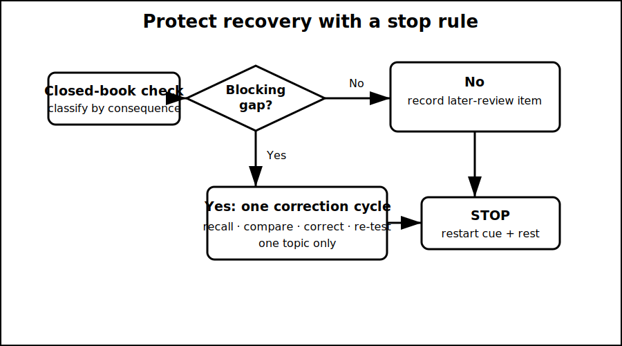

# Rest, Reflection and Catch-Up

## 1. Outcome and entry check
By the end, the learner can identify one blocking Week 3 gap, complete one bounded correction cycle if needed, and stop study with a documented restart cue rather than turning recovery time into an unplanned full session.

**Entry check:** Without notes, write one sentence each for protective earthing, MEN relationship, complete fault path, touch-risk path and neutral-versus-earthing distinction. Mark confidence high, medium or low.

## 2. Why it matters
Rest supports consolidation, but unresolved prerequisite gaps can undermine the next week. The purpose of this block is not to redo Week 3. It is to distinguish a true blocker from ordinary imperfection, repair at most one blocker and preserve recovery.

## 3. Core concepts and terminology
- **Blocking gap:** an error that prevents safe interpretation of the next prerequisite concept.
- **Non-blocking gap:** an incomplete detail that can be scheduled later without corrupting the next step.
- **Correction cycle:** recall, compare, correct, re-test and stop.
- **Confidence calibration:** comparing felt certainty with demonstrated recall.
- **Restart cue:** a short note naming where and how to resume.
- **Recovery boundary:** the pre-set limit that protects rest from expanding into catch-up overload.

## 4. Rule-finding workflow
1. Complete the five-item entry check closed-book.
2. Compare answers with the Week 3 notes and mark errors by consequence.
3. Ask whether any error blocks understanding of switching and isolation.
4. If no blocker exists, record one later-review item and stop.
5. If one blocker exists, choose only the highest-impact gap.
6. Run one correction cycle using the relevant module and diagram.
7. Re-test with a changed prompt after a short break.
8. Record the restart cue and end the session at the recovery boundary.

## 5. Visual model or worked example

**Worked example:** A learner remembers most Week 3 terms but still treats earth as a place where current disappears. Because that misconception blocks later isolation reasoning, they revisit only the complete-loop concept, redraw one changed scenario, explain the return to the source and then stop.

## 6. Practical application
Use a 25-minute maximum: five minutes closed-book recall, five minutes classification, ten minutes for one correction cycle only if required, and five minutes for a changed re-test and restart cue. Do not extend the block to improve every low-confidence item.

Assessment evidence: accurate blocker classification, one focused correction where justified, improved changed-prompt recall and adherence to the stop rule.

## 7. Common errors and safety checkpoint
Errors include treating low confidence as automatic failure, rereading everything, correcting several topics at once, using the block to chase technical values, and skipping rest because the program remains incomplete.

**Safety checkpoint:** This block reviews conceptual learning only. Any unresolved safety-critical technical question remains `review-required` and must not be resolved through memory, guessing or unsupervised practical work.

## 8. Retrieval and next links
State the difference between a blocking and non-blocking gap, then describe the five actions in one correction cycle.

- Previous: [Block 20 — Cumulative Fault-Path Exercise](block-20-cumulative-fault-path-exercise.md)
- Next: [Block 22 — Functional Switching versus Isolation](block-22-functional-switching-versus-isolation.md)
- Knowledge note: [Rest, Reflection and Catch-Up](../../../knowledge-base/9-week/Block 21 - Rest, Reflection and Catch-Up.md)
