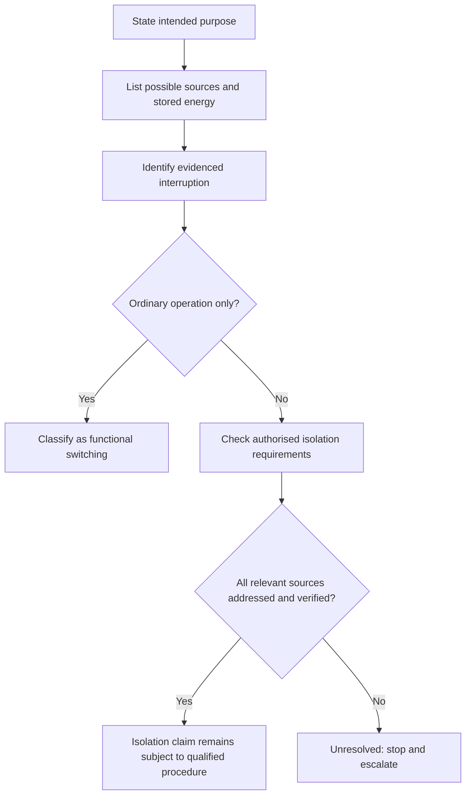
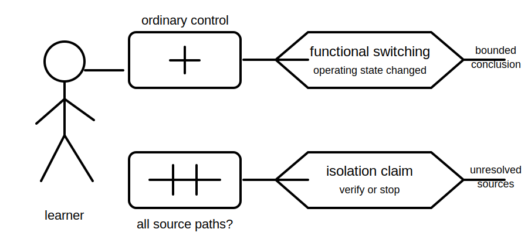

# Functional Switching versus Isolation

## 1. Outcome and entry check
By the end, the learner can classify a stated action as functional switching, isolation, or unresolved; justify the classification from purpose and evidence; and identify when a safe stop-and-verify boundary applies.

**Entry check:** In one sentence each, explain what changes when a circuit is switched for ordinary use and what evidence would be needed before claiming it is isolated.

## 2. Why it matters
A control that stops equipment operating is not automatically evidence that every relevant source has been separated. Confusing operation with isolation can create a false sense of safety, especially where remote control, stored energy, automatic operation or another supply may exist.

## 3. Core concepts and terminology
- **Functional switching:** changing normal operation, such as starting, stopping or selecting a mode.
- **Isolation:** separating equipment or a circuit from relevant sources for a safety purpose, subject to authorised requirements and verification.
- **Control state:** the commanded or indicated operating position of a control.
- **Source state:** the actual relationship between each possible source and the equipment.
- **Stored energy:** energy that can remain after a source is switched or separated.
- **Unresolved state:** a condition where available evidence does not support a safe conclusion.

## 4. Rule-finding workflow
1. State the intended purpose: ordinary control, emergency action, maintenance preparation or another purpose.
2. List every known or plausible source, including control and stored-energy sources.
3. Identify what the device or action is evidenced to interrupt.
4. Separate labels, indicators and commands from verified source state.
5. Check authorised requirements for the specific equipment, task and jurisdiction.
6. Identify any automatic, remote, alternate or backfeed path.
7. Record what remains unknown and whether verification is required.
8. Conclude functional switching, isolation, or stop and escalate.

## 5. Visual model or worked example

**Worked example:** Pressing a local stop button makes a machine cease moving. The learner records this as evidence of a stopped operating state, not proof of isolation, because remote commands, control supplies, stored energy and another source have not been excluded.

## 6. Practical application
For four short scenarios, complete a table with purpose, known sources, action taken, evidence available, unknowns and classification. At least one scenario must remain unresolved rather than being forced into a yes-or-no answer.

Assessment evidence: correct purpose classification, explicit source inventory, separation of indication from verification, and a defensible stop condition.

## 7. Common errors and safety checkpoint
Common errors include treating OFF as isolated, assuming one control addresses every source, ignoring stored energy, relying on labels alone, and turning a conceptual exercise into an unsupervised field procedure.

**Safety checkpoint:** Do not provide or perform an isolation procedure from this draft. Exact device requirements, switching sequences, verification methods and re-energisation controls require current authorised sources, workplace procedures and qualified supervision.

## 8. Retrieval and next links
Without notes, state three differences between functional switching and isolation, then name two conditions that force an unresolved conclusion.

- Previous: [Block 21 — Rest, Reflection and Catch-Up](block-21-rest-reflection-and-catch-up.md)
- Next: [Block 23 — Main Switches and Control Points](block-23-main-switches-and-control-points.md)
- Knowledge note: [Functional Switching versus Isolation](../../../knowledge-base/9-week/Block 22 - Functional Switching versus Isolation.md)