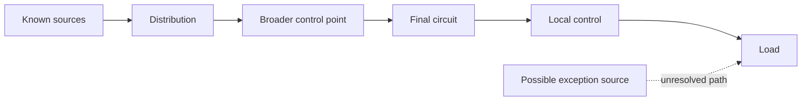
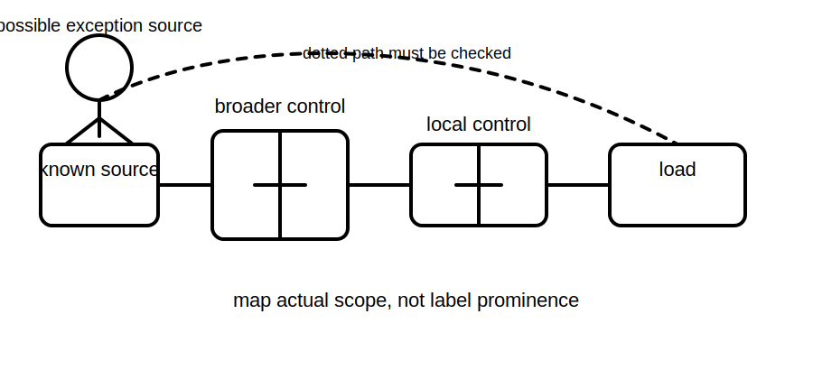

# Main Switches and Control Points

## 1. Outcome and entry check
By the end, the learner can map a control point to the equipment, conductors or source relationship it is evidenced to affect, distinguish local control from source control, and identify gaps that prevent a whole-installation conclusion.

**Entry check:** Sketch a source, distribution point, final circuit, local control and load. Circle the point you think controls the broadest scope, then write what evidence would confirm that scope.

## 2. Why it matters
Names such as main switch, isolator, stop control and local switch suggest purpose, but labels alone do not prove actual scope. Sound reasoning follows connections, source arrangements and documented function instead of assuming that the most prominent control addresses every energising path.

## 3. Core concepts and terminology
- **Control point:** a location where an operating or switching action can be initiated.
- **Main switch:** a designated switching device whose exact required function and scope depend on the installation and authorised rules.
- **Local control:** a control associated with nearby equipment or a limited operating function.
- **Scope of control:** the circuits, conductors, equipment or sources actually affected by an action.
- **Control hierarchy:** the relationship between broader and narrower control points.
- **Exception path:** a supply or function not affected by the control under consideration.

## 4. Rule-finding workflow
1. Draw the source-to-load arrangement from available evidence.
2. Place every identified control point on the map.
3. For each control, state its intended function and claimed scope.
4. Trace which conductors or source paths the action is evidenced to interrupt.
5. Search for exceptions: separate supplies, control circuits, bypasses, automatic operation and stored energy.
6. Compare labels and documentation with the traced arrangement.
7. Check current authorised requirements for designation, accessibility and scope.
8. Record a bounded conclusion and every unresolved exception.

## 5. Visual model or worked example

**Worked example:** A labelled main switch is shown upstream of several final circuits, while a communications supply and generator connection are only partly documented. The learner can describe the evidenced circuits affected by the switch but cannot claim that the entire site has one source or one complete control point.

## 6. Practical application
Given a simplified installation map, annotate each control with intended function, evidenced scope, exceptions and confidence. Then rewrite two overconfident statements into bounded conclusions that distinguish what is shown from what still requires verification.

Assessment evidence: accurate scope mapping, detection of at least one exception path, correct use of evidence labels and refusal to overstate whole-installation control.

## 7. Common errors and safety checkpoint
Common errors include treating a device name as proof of scope, confusing physical prominence with electrical coverage, ignoring auxiliary supplies, and assuming that local stopping means upstream separation.

**Safety checkpoint:** This module is conceptual. Exact main-switch arrangements, conductor switching requirements, access rules and isolation practices must be checked against current authorised sources and qualified procedures before practical use.

## 8. Retrieval and next links
Explain why a control hierarchy is not necessarily a complete source hierarchy. Name four exception paths that must be considered.

- Previous: [Block 22 — Functional Switching versus Isolation](block-22-functional-switching-versus-isolation.md)
- Next: [Block 24 — Alternative and Multiple Supplies](block-24-alternative-and-multiple-supplies.md)
- Knowledge note: [Main Switches and Control Points](../../../knowledge-base/9-week/Block 23 - Main Switches and Control Points.md)