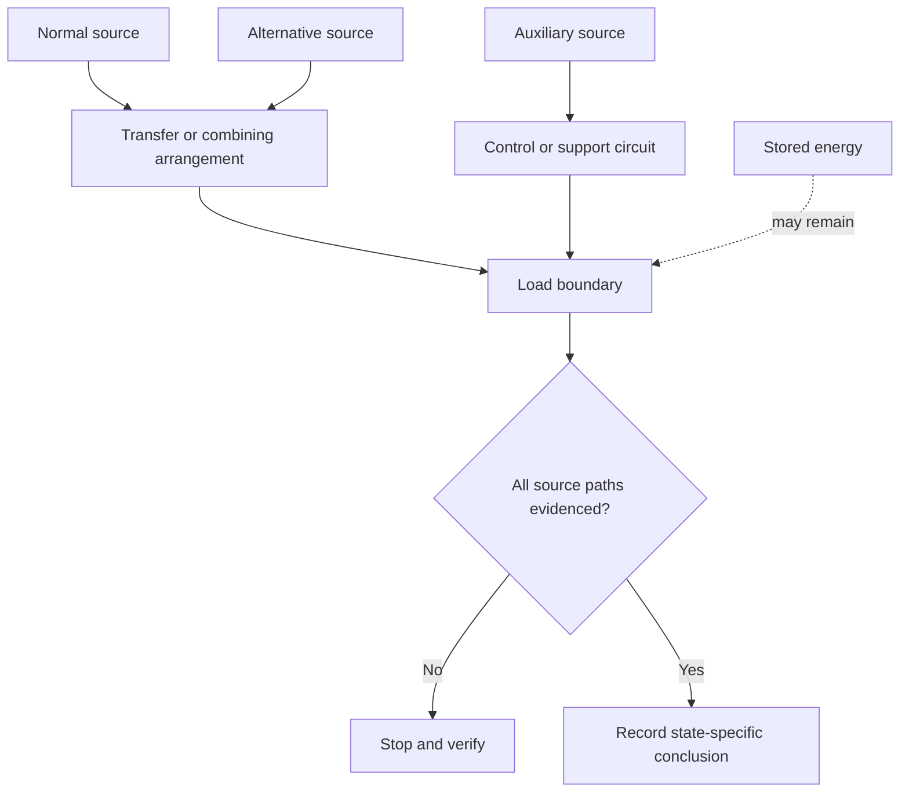
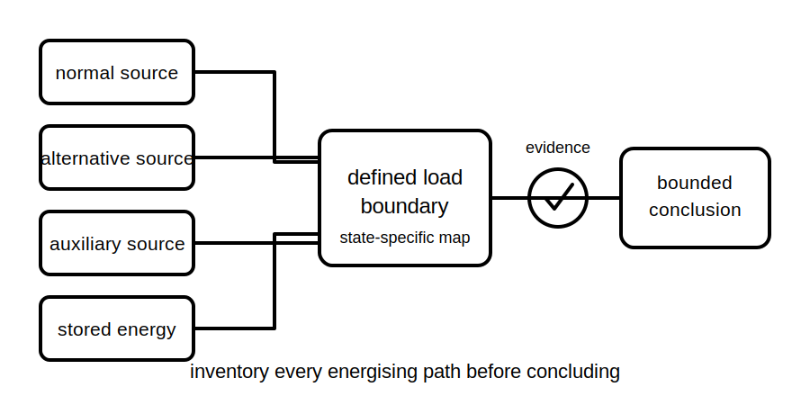

# Alternative and Multiple Supplies

## 1. Outcome and entry check
By the end, the learner can build a source inventory for a simplified installation, distinguish normal, alternative, auxiliary and stored-energy sources, identify possible transfer or backfeed paths, and state when the source picture remains incomplete.

**Entry check:** List all ways equipment might receive energy even after the usual upstream control is opened. Separate actual sources from control commands and stored energy.

## 2. Why it matters
Modern installations can include grid supply, generators, batteries, photovoltaic systems, uninterruptible supplies, control power and stored mechanical or electrical energy. A single-source mental model can invalidate switching and isolation conclusions.

## 3. Core concepts and terminology
- **Normal supply:** the source ordinarily used in the stated operating condition.
- **Alternative supply:** a source intended to supply the load instead of the normal source in some states.
- **Multiple supplies:** two or more sources or energising paths relevant to the same installation or equipment.
- **Auxiliary supply:** a separate source serving controls, monitoring or support functions.
- **Transfer arrangement:** equipment or logic that changes which source supplies a load.
- **Backfeed:** an unintended or unexpected energising path from another source or connected system.
- **Source inventory:** a documented list of possible sources, states, paths and uncertainties.

## 4. Rule-finding workflow
1. Define the equipment or boundary being analysed.
2. List normal, alternative, auxiliary and stored-energy sources.
3. Map each source through switching, transfer and conversion equipment to the boundary.
4. Describe credible operating states: normal, transferred, parallel if evidenced, shutdown and faulted.
5. Look for shared conductors, reverse paths, control supplies and embedded storage.
6. Compare the map with labels, diagrams and authorised documentation.
7. Mark every assumed or unknown source relationship.
8. Conclude only for the stated operating state, or stop if the inventory is incomplete.

## 5. Visual model or worked example

**Worked example:** A load is normally grid supplied, can transfer to a generator, has a battery-backed controller and contains a charged component. Opening the normal supply control changes one path only; the learner records the remaining generator, controller and stored-energy questions before any isolation claim.

## 6. Practical application
Create a source-state table for a scenario with four possible energising mechanisms. For each operating state, mark the source as connected, disconnected, possible, stored or unknown, and write one evidence request that would resolve the highest-risk unknown.

Assessment evidence: complete source categories, state-specific reasoning, recognition of possible backfeed or auxiliary energisation, and a bounded evidence request.

## 7. Common errors and safety checkpoint
Common errors include counting only power sources shown on the first diagram, ignoring controls and storage, assuming transfer equipment prevents every unwanted state, and treating shutdown mode as proof of de-energisation.

**Safety checkpoint:** Do not infer switching sequences, interlocking performance or safe isolation from this learning map. Exact arrangements and verification steps require current authorised information, equipment documentation, site procedures and qualified review.

## 8. Retrieval and next links
Name four source categories and explain why a source inventory must be tied to a stated operating condition.

- Previous: [Block 23 — Main Switches and Control Points](block-23-main-switches-and-control-points.md)
- Next: [Block 25 — Source-State Mapping](block-25-source-state-mapping.md)
- Knowledge note: [Alternative and Multiple Supplies](../../../knowledge-base/9-week/Block 24 - Alternative and Multiple Supplies.md)