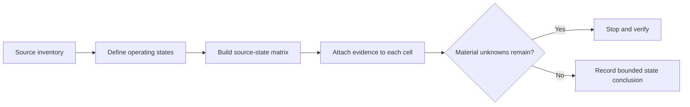
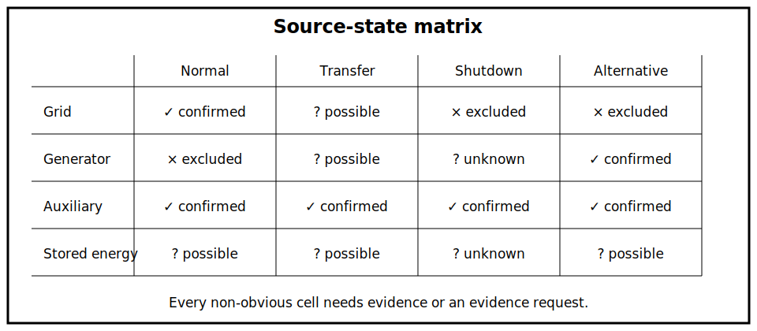

# Source-State Mapping

## 1. Outcome and entry check
By the end, the learner can construct a state matrix showing which sources and energising paths are confirmed, excluded, possible or unknown in each stated operating condition.

**Entry check:** From memory, list the source categories from Block 24 and explain why a source list without operating states is incomplete.

## 2. Why it matters
A source may be present but disconnected, absent but capable of automatic connection, or unable to supply power while still energising a control circuit. State mapping prevents a static diagram from being mistaken for a complete energy picture.

## 3. Core concepts and terminology
- **Operating state:** a clearly described combination of source, control and equipment conditions.
- **State matrix:** a table comparing source paths across defined operating states.
- **Confirmed path:** a path supported by current evidence.
- **Excluded path:** a path shown not to apply in the stated state.
- **Possible path:** a credible path not yet resolved.
- **Transition state:** the period while equipment changes between operating states.
- **Residual energy:** energy remaining after a supply path changes state.

## 4. Rule-finding workflow
1. Define the equipment boundary and the exact operating states being compared.
2. Carry forward every source from the Block 24 inventory.
3. Add transfer, control, conversion and stored-energy paths.
4. Mark each source-state cell confirmed, excluded, possible or unknown.
5. Record the evidence supporting each confirmed or excluded judgement.
6. Examine transition states rather than only stable end states.
7. Identify contradictions between diagrams, labels, indications and observations.
8. Stop before making a safety conclusion if any material source-state cell remains unresolved.

## 5. Visual model or worked example

**Worked example:** A load has grid, generator and battery-backed control supplies. The grid path is confirmed in normal state, the generator path is possible during transfer, and the control supply remains confirmed during shutdown. The learner records three different conclusions rather than one global “off” statement.

## 6. Practical application
Build a four-state matrix for a supplied scenario: normal operation, commanded shutdown, transfer in progress and alternative-supply operation. Add one evidence citation or evidence request to every non-obvious cell.

Assessment evidence: complete source carry-forward, state-specific classifications, explicit transition-state reasoning, evidence-linked judgements and a bounded conclusion.

## 7. Common errors and safety checkpoint
Common errors include using equipment mode names as proof, omitting transition states, treating an open power path as evidence that every auxiliary circuit is dead, and leaving possible paths unlabelled.

**Safety checkpoint:** This is a reasoning framework, not an isolation procedure. Required switching, proving, discharge, interlocking and verification steps must come from current authorised sources, equipment information, site procedures and qualified review.

## 8. Retrieval and next links
Without notes, explain the difference between a source inventory and a source-state matrix, then give one example of a material unknown that blocks a safety conclusion.

- Previous: [Block 24 — Alternative and Multiple Supplies](block-24-alternative-and-multiple-supplies.md)
- Next: [Block 26 — Isolation Evidence and Stop Conditions](block-26-isolation-evidence-and-stop-conditions.md)
- Knowledge note: [Source-State Mapping](../../../knowledge-base/9-week/Block 25 - Source-State Mapping.md)
