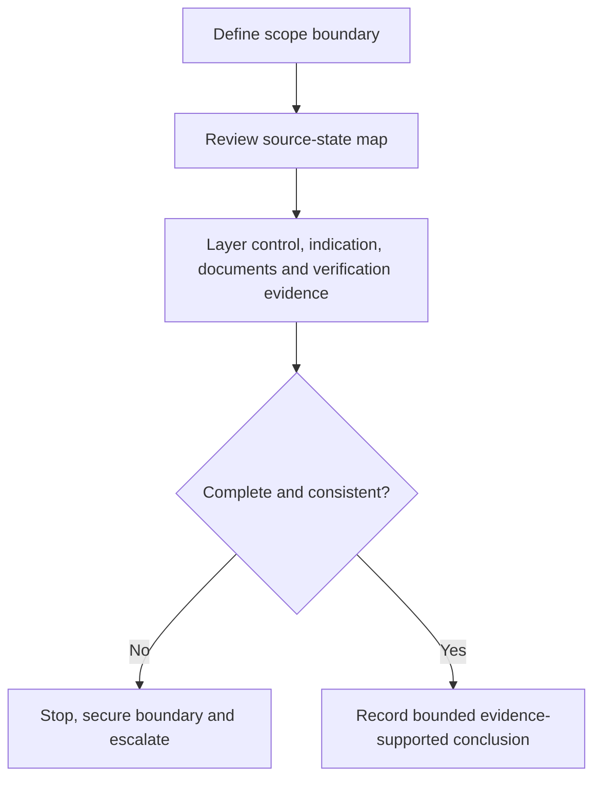
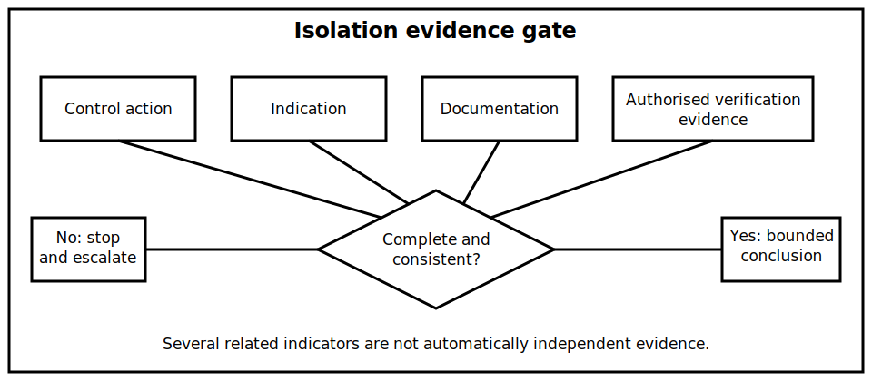

# Isolation Evidence and Stop Conditions

## 1. Outcome and entry check
By the end, the learner can distinguish a control action from evidence supporting an isolation conclusion, organise evidence into independent layers, and identify explicit stop conditions when the evidence chain is incomplete or contradictory.

**Entry check:** Explain why “the switch is off” and “the equipment is isolated” are different claims.

## 2. Why it matters
An isolation conclusion is stronger than a description of a control position. It depends on the defined boundary, all relevant sources, the state of each path and authorised verification evidence. Weak evidence can create false confidence.

## 3. Core concepts and terminology
- **Isolation claim:** a bounded conclusion that specified energy paths have been addressed for a defined purpose.
- **Control indication:** a label, position, status light or command showing an intended state.
- **Independent evidence:** information obtained through a different evidence channel rather than repetition of the same indication.
- **Evidence chain:** the linked observations and authorised checks supporting a conclusion.
- **Contradiction:** evidence that does not agree with another source or expected state.
- **Stop condition:** a predefined reason to halt and escalate rather than infer.
- **Scope boundary:** the exact equipment, conductors, sources and energy forms covered by the conclusion.

## 4. Rule-finding workflow
1. State the purpose and scope boundary of the proposed conclusion.
2. Bring forward the complete source-state map from Block 25.
3. Separate control actions, indications, documentation and verification evidence.
4. Check whether each material source path has independent supporting evidence.
5. Identify stored energy, automatic reconnection and transition-state uncertainties.
6. Compare expected and observed states for contradictions.
7. Apply stop conditions whenever scope, source coverage, evidence validity or authorised procedure is unresolved.
8. Record only the conclusion supported by the available evidence.

## 5. Visual model or worked example

**Worked example:** A control is labelled off and its indicator is dark, but an auxiliary source remains possible in the state matrix and no current authorised verification evidence is available. The learner records the two observations, rejects an isolation conclusion and names the missing evidence.

## 6. Practical application
Given a scenario pack containing a diagram, label, control position, status indication and incomplete source record, sort each item by evidence type. Write the strongest justified conclusion and list every active stop condition.

Assessment evidence: precise scope, evidence-type separation, complete source carry-forward, contradiction handling, explicit stop conditions and no overclaiming.

## 7. Common errors and safety checkpoint
Common errors include treating several related indicators as independent proof, omitting the equipment boundary, forgetting stored energy, assuming a documented design matches the present installation and continuing after contradictory evidence appears.

**Safety checkpoint:** This module does not teach or authorise a safe-isolation procedure. The sequence, instruments, proving methods, discharge controls and required records must be verified against current authorised sources, equipment instructions, site procedures and qualified supervision.

## 8. Retrieval and next links
Name four evidence layers, then state three stop conditions that would prevent an isolation conclusion.

- Previous: [Block 25 — Source-State Mapping](block-25-source-state-mapping.md)
- Next: [Block 27 — Interleaved Switching and Fault Retrieval](block-27-interleaved-switching-and-fault-retrieval.md)
- Knowledge note: [Isolation Evidence and Stop Conditions](../../../knowledge-base/9-week/Block 26 - Isolation Evidence and Stop Conditions.md)
