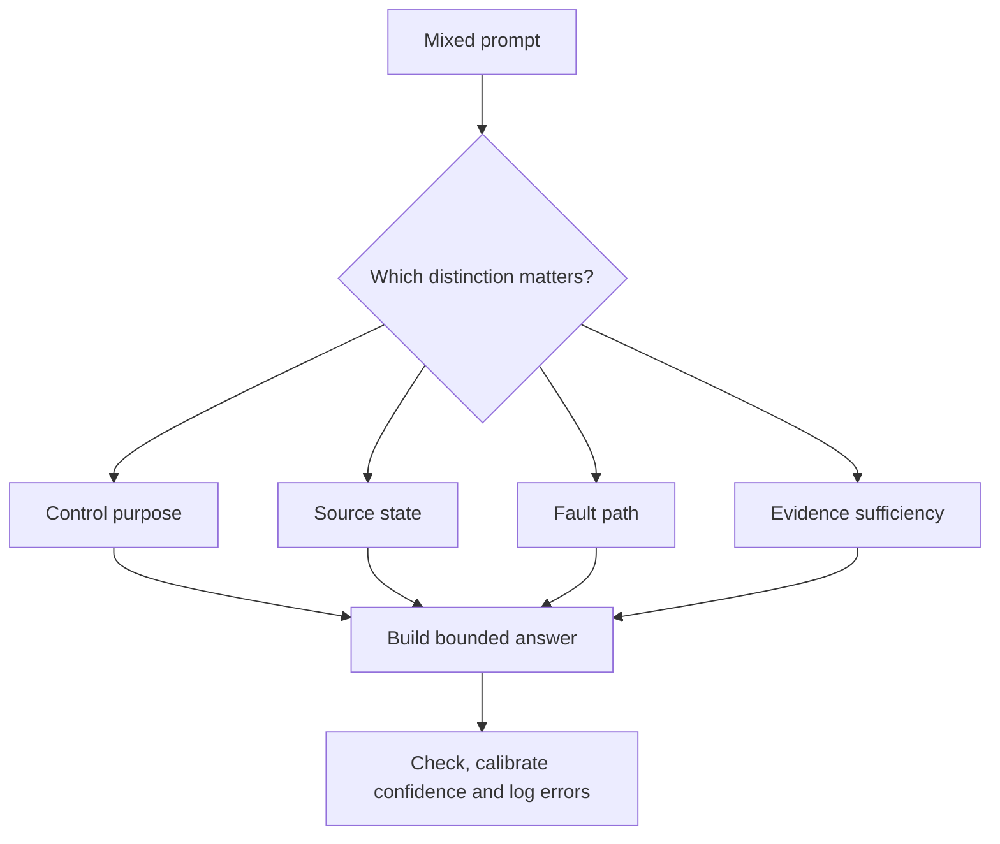
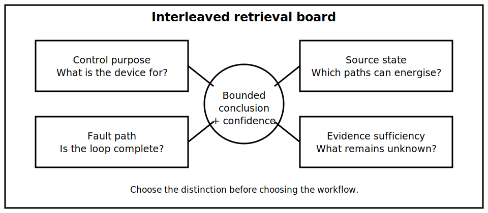

# Interleaved Switching and Fault Retrieval

## 1. Outcome and entry check
By the end, the learner can retrieve and apply switching, source-state, earthing and fault-path concepts in a mixed scenario without collapsing them into one undifferentiated safety claim.

**Entry check:** Without notes, define functional switching, isolation, source-state mapping, fault path and stop condition in one sentence each.

## 2. Why it matters
Assessment and field reasoning rarely present concepts in tidy topic groups. Interleaving exposes confusion between control purpose, source coverage, protective paths and evidence quality before those errors become habitual.

## 3. Core concepts and terminology
- **Interleaving:** practising different but related concepts in mixed order.
- **Retrieval cue:** a prompt that requires recall rather than recognition.
- **Discrimination:** selecting the correct concept for the evidence presented.
- **Transfer:** applying a known reasoning process to a new scenario.
- **Confidence calibration:** comparing stated confidence with actual evidence quality.
- **Error log:** a record of the error type, cause, correction and future cue.

## 4. Rule-finding workflow
1. Read the scenario once and mark only observable facts.
2. Identify which question is about control purpose, source state, fault path or evidence sufficiency.
3. Retrieve the relevant definition before opening notes.
4. Build the smallest useful diagram or table for that question.
5. Label facts, inferences, assumptions and unknowns separately.
6. Apply the relevant stop condition before writing a conclusion.
7. Check the answer against prior modules and authorised references where required.
8. Log one transferable correction for every material error.

## 5. Visual model or worked example

**Worked example:** A labelled main control is open, an alternative source is possible, and a conductive enclosure is involved in a fault scenario. The learner separately classifies the control purpose, maps source states, traces the possible fault loop and refuses an isolation or protective-performance claim without the missing evidence.

## 6. Practical application
Complete four short cases in rotating order. For each, identify the governing distinction, produce one diagram or matrix, state the strongest justified conclusion, assign confidence from low to high, and record the evidence that would change the conclusion.

Assessment evidence: accurate concept discrimination, closed-book retrieval, transfer to varied cases, clear evidence labels, calibrated confidence and an actionable error log.

## 7. Common errors and safety checkpoint
Common errors include answering every case with the same workflow, treating an open control as proof of isolation, treating a possible fault path as proof of protective performance, and giving high confidence when material source states remain unknown.

**Safety checkpoint:** Mixed retrieval does not authorise field switching, isolation, testing or fault investigation. Exact procedures, values and acceptance criteria remain subject to current authorised sources, site controls and qualified review.

## 8. Retrieval and next links
Write one diagnostic question for each of these categories: control purpose, source state, fault path and evidence sufficiency.

- Previous: [Block 26 — Isolation Evidence and Stop Conditions](block-26-isolation-evidence-and-stop-conditions.md)
- Next: [Block 28 — Rest, Reflection and Catch-Up](block-28-rest-reflection-and-catch-up.md)
- Knowledge note: [Interleaved Switching and Fault Retrieval](../../../knowledge-base/9-week/Block 27 - Interleaved Switching and Fault Retrieval.md)
