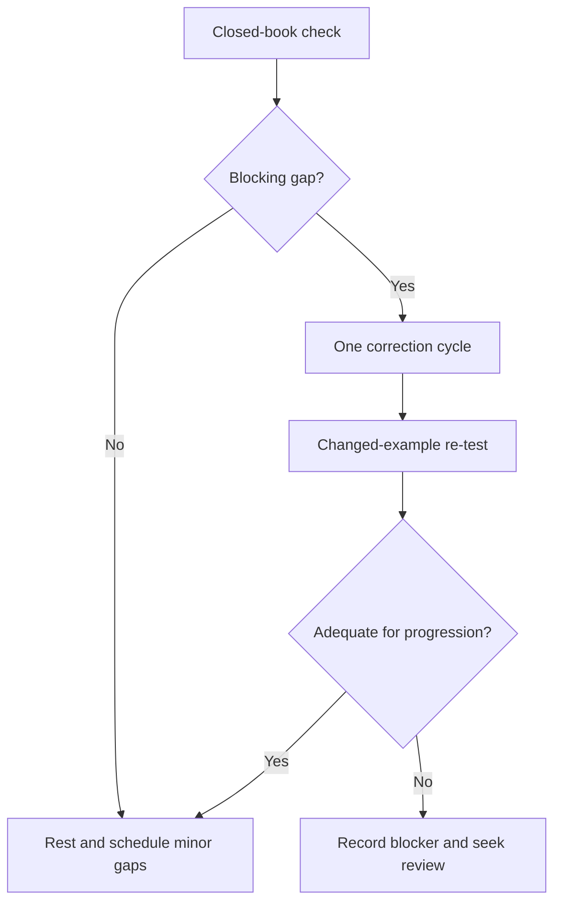
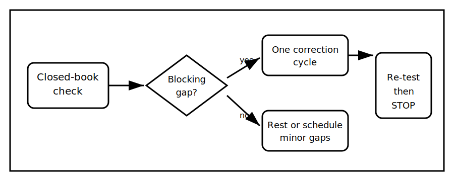

# Rest, Reflection and Catch-Up

## 1. Outcome and entry check
By the end, the learner can identify one blocking misconception from Week 4, complete one bounded correction cycle and stop without turning recovery time into another full study session.

**Entry check:** Without notes, explain the difference between functional switching, isolation, source-state evidence and a stop condition.

## 2. Why it matters
Recovery supports retention only when it is deliberate. Unbounded catch-up creates fatigue, while avoiding a genuine prerequisite gap allows the next week to begin on unstable foundations.

## 3. Core concepts and terminology
- **Blocking gap:** an error that prevents safe or meaningful progress.
- **Non-blocking gap:** unfinished detail that can be scheduled later.
- **Correction cycle:** retrieve, check, correct and re-test once.
- **Confidence mismatch:** confidence that is higher or lower than demonstrated performance.
- **Stop rule:** a predefined boundary that prevents overwork.

## 4. Rule-finding workflow
1. Complete the entry check closed-book.
2. Mark each response correct, partial or unsupported.
3. Select only the highest-impact blocking gap.
4. Revisit the relevant module and authorised source boundary.
5. Write a corrected explanation in your own words.
6. Re-test with a changed example.
7. Record confidence and remaining uncertainty.
8. Stop after one correction cycle or 25 minutes.

## 5. Visual model or worked example

**Worked example:** A learner correctly distinguishes switching from isolation but treats a label as proof that every source is controlled. That misconception is selected as the single blocker; the learner rebuilds a source-state matrix, re-tests on a different scenario and stops.

## 6. Practical application
Use the Week 4 modules to create a five-question closed-book check. Repair at most one blocking gap, then record one strength, one uncertainty and one item deliberately deferred.

Assessment evidence: accurate self-classification, one targeted correction, successful transfer to a changed example and adherence to the stop rule.

## 7. Common errors and safety checkpoint
Common errors include reviewing everything, selecting an easy gap instead of a blocking one, rereading without retrieval, and treating study confidence as evidence of field competence.

**Safety checkpoint:** This recovery block does not authorise switching, isolation, testing or work on electrical equipment. Technical uncertainties remain subject to authorised sources and qualified review.

## 8. Retrieval and next links
State the Week 4 distinction most likely to prevent overclaiming and give one example of its stop condition.

- Previous: [Block 27 — Interleaved Switching and Fault Retrieval](block-27-interleaved-switching-and-fault-retrieval.md)
- Next: [Block 29 — Installation Purpose and Circuit Division](block-29-installation-purpose-and-circuit-division.md)
- Knowledge note: [Rest, Reflection and Catch-Up](../../../knowledge-base/9-week/Block 28 - Rest Reflection and Catch-Up.md)
