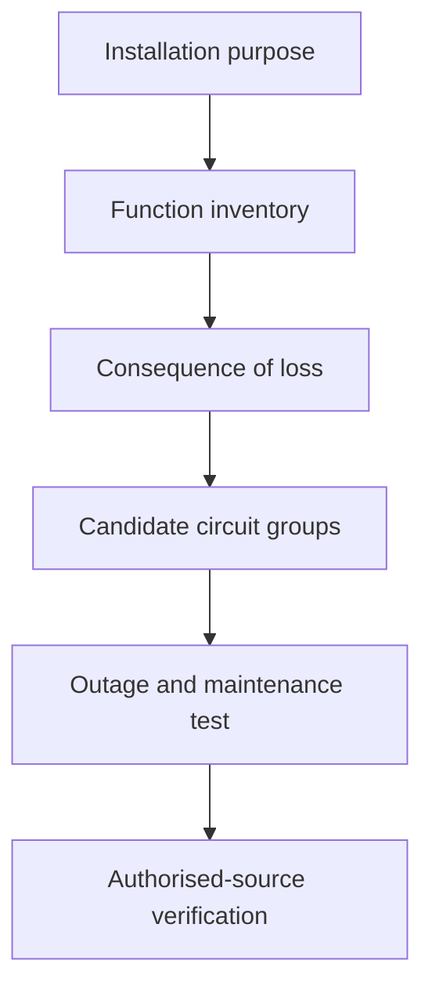
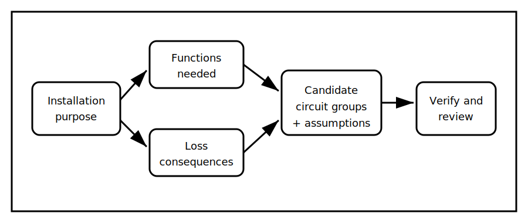

# Installation Purpose and Circuit Division

## 1. Outcome and entry check
By the end, the learner can describe an installation's intended functions, identify consequences of shared failures and propose a provisional circuit-division rationale without claiming compliance from memory.

**Entry check:** List three reasons circuits might be separated and one reason unnecessary fragmentation can create problems.

## 2. Why it matters
Circuit division affects continuity, fault containment, maintainability and clarity. A defensible plan begins with installation purpose and consequence, not with copying a familiar layout.

## 3. Core concepts and terminology
- **Installation purpose:** the services and outcomes the installation is intended to support.
- **Circuit division:** allocating loads or functions across separately controlled or protected circuits.
- **Continuity consequence:** the effect of one circuit becoming unavailable.
- **Common-mode loss:** one event removing multiple important functions together.
- **Operational grouping:** grouping based on use, location, control or consequence.
- **Provisional rationale:** a planning reason that still requires authorised verification.

## 4. Rule-finding workflow
1. Describe the installation and its required functions.
2. Inventory loads by purpose rather than by assumed circuit.
3. Identify safety, continuity and operational consequences of loss.
4. Mark functions that should not share a single failure point without justification.
5. Consider control, location, maintenance and future-change needs.
6. Draft candidate groupings and state assumptions.
7. Test each grouping against plausible fault or outage scenarios.
8. Verify mandatory requirements and exceptions in current authorised sources.

## 5. Visual model or worked example

**Worked example:** A small workplace has general lighting, task lighting, refrigeration, communications equipment and general outlets. The learner identifies which losses would compound one another, proposes provisional separation and records every assumption that needs confirmation.

## 6. Practical application
Create a purpose-and-consequence table for a fictional installation with at least six load groups. Propose two alternative circuit-division strategies and compare continuity, clarity, maintenance and unresolved reference questions.

Assessment evidence: complete function inventory, explicit loss consequences, justified grouping choices, comparison of alternatives and clear reference-check flags.

## 7. Common errors and safety checkpoint
Common errors include grouping only by room, assuming every load needs its own circuit, ignoring common-mode loss, and presenting a familiar arrangement as a universal requirement.

**Safety checkpoint:** This module is conceptual planning only. Final circuit arrangements, protective measures, ratings and mandatory separation requirements must be checked against current authorised sources and reviewed by a qualified person.

## 8. Retrieval and next links
Explain how installation purpose, continuity consequence and common-mode loss influence a provisional circuit-division decision.

- Previous: [Block 28 — Rest, Reflection and Catch-Up](block-28-rest-reflection-and-catch-up.md)
- Next: [Block 30 — Maximum-Demand Reasoning Workflow](block-30-maximum-demand-reasoning-workflow.md)
- Knowledge note: [Installation Purpose and Circuit Division](../../../knowledge-base/9-week/Block 29 - Installation Purpose and Circuit Division.md)
