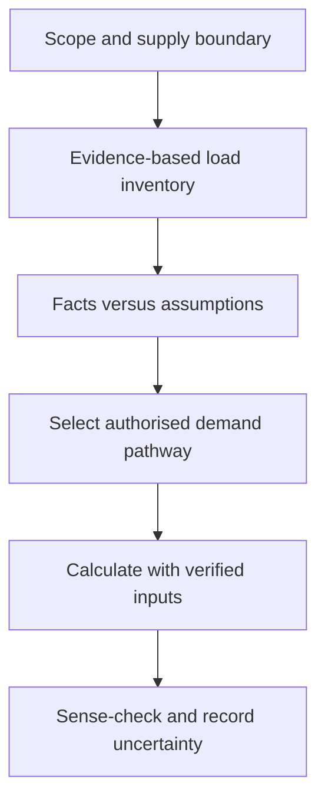
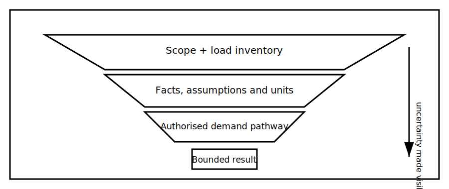

# Maximum-Demand Reasoning Workflow

## 1. Outcome and entry check
By the end, the learner can organise load evidence, distinguish connected load from an assessed demand, select an authorised calculation pathway and document assumptions without inventing diversity factors or prescribed values.

**Entry check:** Explain why adding every nameplate value may not equal the demand used for installation planning.

## 2. Why it matters
Demand reasoning connects installation purpose to supply and conductor decisions. Errors occur when learners jump to arithmetic before confirming load categories, operating patterns, units and the authorised method that applies.

## 3. Core concepts and terminology
- **Connected load:** the combined rated or stated load before an approved demand method is applied.
- **Maximum demand:** the greatest demand assessed using an applicable authorised method and evidence set.
- **Coincidence:** the extent to which loads may operate at the same time.
- **Load profile:** an evidence-based description of when and how loads operate.
- **Demand pathway:** the authorised method selected for the installation and available evidence.
- **Assumption register:** a visible list of uncertain inputs and their effect on the result.

## 4. Rule-finding workflow
1. Define the installation scope and supply boundary.
2. Build a load inventory with quantity, units, phase or supply context and source of each input.
3. Separate fixed facts from provisional assumptions.
4. Group loads according to the categories required by the current authorised method.
5. Identify which demand pathway is applicable and why.
6. Apply only verified factors, allowances and units.
7. Sense-check the result against the load profile and circuit plan.
8. Record unresolved inputs, sensitivity and qualified-review needs.

## 5. Visual model or worked example

**Worked example:** A learner receives a fictional schedule containing lighting, socket outlets, a motor load and equipment with uncertain operating overlap. They build the inventory, mark the uncertain overlap, choose no numerical factor from memory and state what authorised information is required before calculation.

## 6. Practical application
Create a load-evidence worksheet for a fictional installation. Include at least eight loads, their evidence source, operating pattern, units, classification, assumptions and the authorised demand pathway to be checked. Then explain which unknown has the greatest effect on the result.

Assessment evidence: complete inventory, correct separation of connected load and assessed demand, traceable method selection, unit discipline, explicit assumptions and a defensible sensitivity statement.

## 7. Common errors and safety checkpoint
Common errors include summing unlike units, applying remembered factors without scope checks, double-counting loads, ignoring phase or operating context, and presenting a provisional result as a verified supply requirement.

**Safety checkpoint:** This module provides a reasoning framework, not demand values or a compliant calculation. Factors, allowances, categories, supply limits and final design decisions require current authorised sources and qualified technical review.

## 8. Retrieval and next links
Describe the evidence chain from installation scope to a bounded maximum-demand conclusion, including where assumptions and authorised verification enter.

- Previous: [Block 29 — Installation Purpose and Circuit Division](block-29-installation-purpose-and-circuit-division.md)
- Next: [Block 31 — Conductor-Selection Variables](block-31-conductor-selection-variables.md)
- Knowledge note: [Maximum-Demand Reasoning Workflow](../../../knowledge-base/9-week/Block 30 - Maximum-Demand Reasoning Workflow.md)
