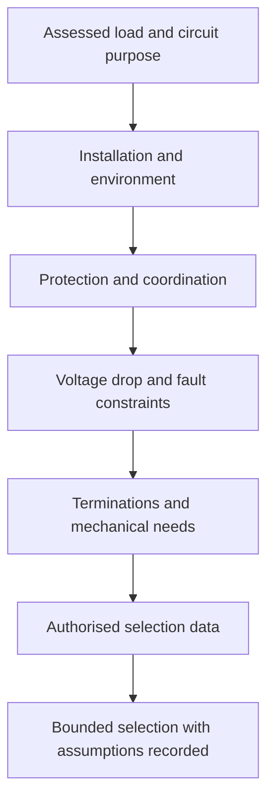
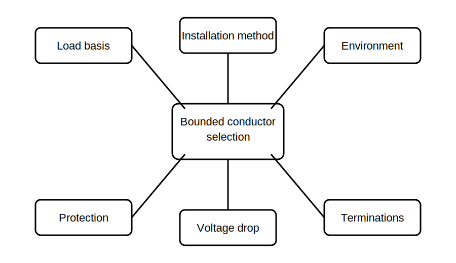

# Conductor-Selection Variables

## 1. Outcome and entry check
By the end, the learner can identify and organise the main variables that influence conductor selection, separate verified inputs from assumptions, and explain why no single variable proves suitability.

**Entry check:** Name three installation conditions that could change a conductor-selection decision even when the design current is unchanged.

## 2. Why it matters
Conductor selection is a coordination problem, not a lookup performed from current alone. Load characteristics, installation method, ambient conditions, grouping, protective-device behaviour, voltage-drop needs, mechanical demands and termination constraints can interact. Missing one material variable can invalidate an otherwise neat calculation.

## 3. Core concepts and terminology
- **Design current:** the current expected from the assessed load under the applicable design basis.
- **Current-carrying capacity:** the current a conductor may carry under stated reference and installation conditions.
- **Installation method:** the physical arrangement that affects heat dissipation and applicable selection data.
- **Correction factor:** an authorised adjustment applied for a defined condition and scope.
- **Grouping:** proximity to other loaded conductors that may affect heat dissipation.
- **Termination constraint:** a limit arising from equipment terminals, conductor material, temperature rating or connection method.
- **Selection envelope:** the combined set of electrical, thermal, mechanical and environmental conditions that the selected conductor must satisfy.

## 4. Rule-finding workflow
1. Confirm the circuit purpose, assessed load and supply characteristics.
2. Record the proposed conductor material, insulation system and installation method.
3. Identify environmental, grouping and enclosure conditions.
4. Record protective-device type and the coordination questions that require authorised data.
5. Check voltage-drop, fault-path and mechanical considerations as separate constraints.
6. Confirm termination and equipment compatibility.
7. Apply only current authorised tables, factors and scope notes.
8. Record the limiting variable, unresolved assumptions and qualified-review needs.

## 5. Visual model or worked example

**Worked example:** Two fictional circuits have the same assessed current. One is installed alone in a ventilated route; the other shares an enclosed route with several loaded circuits and has a long run. The learner explains why the same current does not justify assuming the same conductor and lists the additional evidence required.

## 6. Practical application
Create a selection-variable register for three fictional circuits. For each, record load basis, route, installation method, grouping, ambient or enclosure conditions, protective device, length, termination constraints, mechanical exposure, known evidence and unresolved assumptions. Identify the variable most likely to govern each case without choosing a conductor size.

Assessment evidence: complete variable coverage, correct separation of facts and assumptions, traceable source needs, identification of interacting constraints and a defensible statement of what remains unresolved.

## 7. Common errors and safety checkpoint
Common errors include selecting from current alone, applying correction factors outside their scope, treating installation method as a cosmetic detail, ignoring termination limits, and using a preliminary conductor choice as proof that protection or voltage drop is acceptable.

**Safety checkpoint:** This module does not provide conductor sizes, correction factors, current-carrying values or compliant selections. Final selection requires current authorised sources, complete installation evidence and qualified technical review.

## 8. Retrieval and next links
Explain why conductor selection is a constrained evidence problem rather than a single-table lookup. Name the main variable groups and the point at which authorised data is required.

- Previous: [Block 30 — Maximum-Demand Reasoning Workflow](block-30-maximum-demand-reasoning-workflow.md)
- Next: [Block 32 — Voltage-Drop Reasoning Workflow](block-32-voltage-drop-reasoning-workflow.md)
- Knowledge note: [Conductor-Selection Variables](../../../knowledge-base/9-week/Block 31 - Conductor Selection Variables.md)
