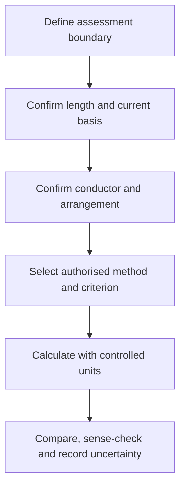
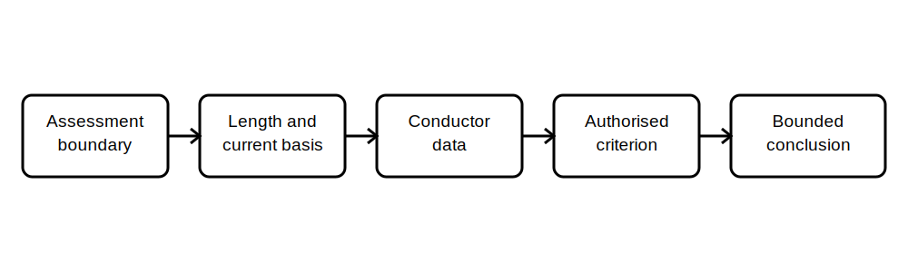

# Voltage-Drop Reasoning Workflow

## 1. Outcome and entry check
By the end, the learner can organise the evidence needed for a voltage-drop assessment, distinguish input assumptions from verified values, and explain how circuit length, current, conductor properties and supply context affect the reasoning.

**Entry check:** Explain why circuit length alone cannot determine whether voltage drop is acceptable.

## 2. Why it matters
Voltage-drop reasoning links circuit performance to installation planning. A plausible arithmetic result can still be unreliable when route length, load current, conductor properties, phase arrangement, operating state or the applicable limit has been assumed incorrectly.

## 3. Core concepts and terminology
- **Voltage drop:** the reduction in voltage between two defined points while current flows.
- **Route length:** the physical or electrical length used by the applicable method, confirmed rather than guessed.
- **Design current:** the current basis selected for the assessment.
- **Conductor impedance:** opposition to current flow, affected by conductor properties and operating conditions.
- **Assessment boundary:** the start and end points included in the voltage-drop check.
- **Allocation:** the part of an overall permissible drop assigned to a section of an installation.
- **Sensitivity check:** testing how a result changes when a material uncertain input changes.

## 4. Rule-finding workflow
1. Define the assessment boundary and supply context.
2. Confirm route length and distinguish one-way length from any method-specific path treatment.
3. Establish the relevant current basis and operating state.
4. Confirm conductor material, size, arrangement and applicable impedance data.
5. Identify the current authorised method and permissible criterion for the specific scope.
6. Calculate with consistent units and traceable inputs.
7. Compare the result only against the verified criterion and allocation.
8. Perform a sensitivity check and record unresolved assumptions.

## 5. Visual model or worked example

**Worked example:** A fictional long circuit supplies equipment with intermittent demand. The learner identifies two possible current bases, records the uncertain route length, and explains how each uncertainty changes the conclusion before any compliance statement is made.

## 6. Practical application
Build a voltage-drop evidence sheet for two fictional circuits. Include assessment boundary, route evidence, current basis, conductor data source, supply arrangement, operating state, unit checks, criterion source, allocation assumptions and sensitivity cases. State which input must be resolved first and why.

Assessment evidence: correct boundary definition, complete input traceability, consistent units, explicit assumptions, authorised-criterion checkpoint and a defensible sensitivity statement.

## 7. Common errors and safety checkpoint
Common errors include using the wrong length convention, mixing units, substituting protective-device rating for design current without justification, ignoring shared upstream drop, applying an unverified limit, and presenting an estimated result as a verified installation outcome.

**Safety checkpoint:** This module supplies no voltage-drop limits, formula constants, conductor data or compliant result. Current authorised criteria and qualified technical review are required before design or compliance decisions.

## 8. Retrieval and next links
Describe the evidence chain for voltage-drop reasoning and identify three assumptions that could materially change the result.

- Previous: [Block 31 — Conductor-Selection Variables](block-31-conductor-selection-variables.md)
- Next: [Block 33 — Protection and Conductor Coordination](block-33-protection-and-conductor-coordination.md)
- Knowledge note: [Voltage-Drop Reasoning Workflow](../../../knowledge-base/9-week/Block 32 - Voltage-Drop Reasoning Workflow.md)
