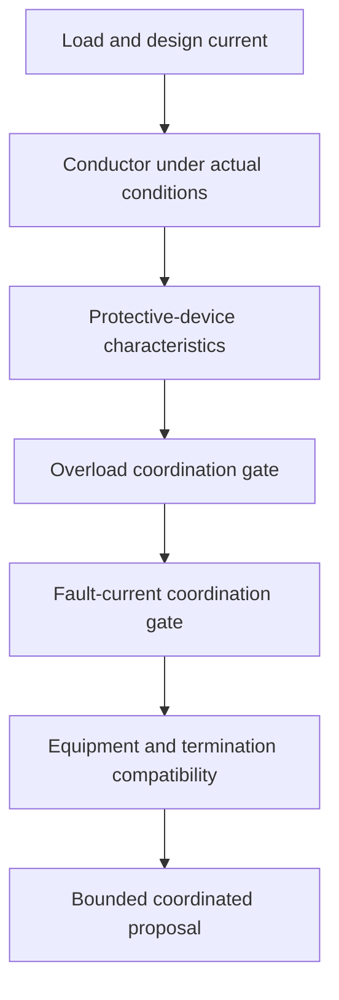
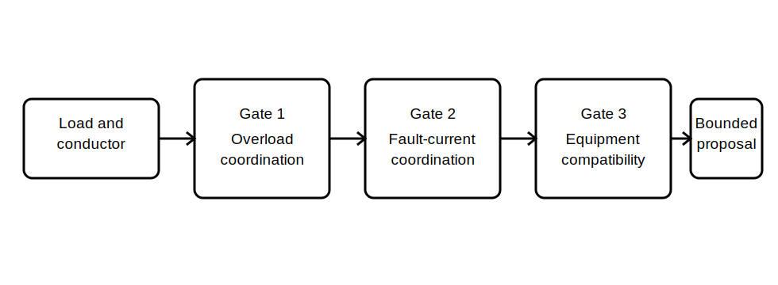

# Protection and Conductor Coordination

## 1. Outcome and entry check
By the end, the learner can describe the evidence relationships among load, conductor, protective device and fault conditions, and can identify when a proposed combination remains unverified.

**Entry check:** Explain why a protective-device rating lower than a conductor's apparent current-carrying capacity does not by itself prove complete coordination.

## 2. Why it matters
A circuit is not justified by checking each component in isolation. The load basis, conductor under actual installation conditions, protective-device characteristics, fault-path evidence, equipment constraints and applicable operating requirements must form a coherent set.

## 3. Core concepts and terminology
- **Coordination:** demonstrated compatibility among the load, conductor, protective device and relevant operating conditions.
- **Overload protection:** protection intended to limit harmful effects of sustained overcurrent arising in an otherwise intact path.
- **Fault-current protection:** protection intended to respond to abnormal low-impedance or fault paths within its verified capability.
- **Protective-device characteristic:** documented behaviour of a device under stated current and time conditions.
- **Prospective fault current:** the fault current that could flow at a defined point under stated conditions.
- **Breaking capacity:** a verified device capability associated with interrupting fault current under specified conditions.
- **Coordination record:** a traceable summary of inputs, checks, sources, assumptions and unresolved items.

## 4. Rule-finding workflow
1. Confirm circuit purpose, design current and load characteristics.
2. Confirm conductor selection inputs and installation conditions.
3. Identify the protective functions required and the proposed device characteristics.
4. Check overload relationships using the current authorised method.
5. Check fault-current capability, fault-path evidence and applicable operating requirements separately.
6. Confirm device, conductor, equipment and termination compatibility.
7. Test the proposal against normal, overload and fault scenarios.
8. Record sources, assumptions, contradictions and qualified-review needs.

## 5. Visual model or worked example

**Worked example:** A fictional circuit has a stated load, proposed conductor and protective device. The learner discovers that installation conditions are known but prospective fault-current evidence and device breaking capability are missing. They classify the overload check as provisional and stop before claiming full coordination.

## 6. Practical application
Prepare a coordination record for two fictional circuits. Include load basis, conductor evidence, installation conditions, protective functions, device characteristics, overload questions, fault-current questions, equipment constraints, source references and unresolved items. Conclude with either a bounded provisional statement or a stop-and-escalate decision.

Assessment evidence: correct separation of overload and fault checks, complete evidence chain, explicit uncertainty, no unsupported performance claims and a justified coordination status.

## 7. Common errors and safety checkpoint
Common errors include treating device rating as the only coordination check, confusing overload response with fault interruption capability, ignoring actual installation conditions, assuming breaking capacity, and claiming compliance while fault-path or equipment evidence is incomplete.

**Safety checkpoint:** This module provides no device curves, ratings, fault-current values, disconnection times or compliant combinations. These require current authorised sources, verified installation data and qualified technical review.

## 8. Retrieval and next links
Describe the coordination chain from load to conductor to protective device, then explain why overload and fault-current checks must remain distinct.

- Previous: [Block 32 — Voltage-Drop Reasoning Workflow](block-32-voltage-drop-reasoning-workflow.md)
- Next: [Block 34 — Integrated Planning Case](block-34-integrated-planning-case.md)
- Knowledge note: [Protection and Conductor Coordination](../../../knowledge-base/9-week/Block 33 - Protection and Conductor Coordination.md)
