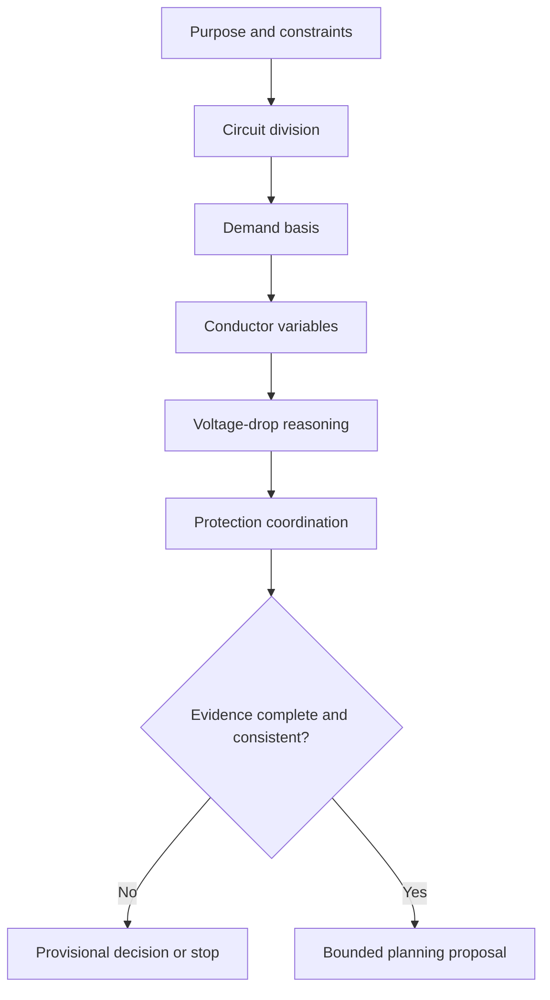
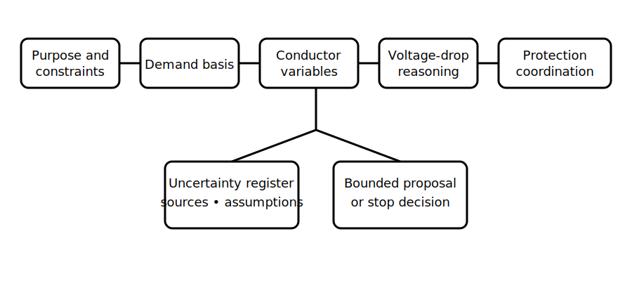

# Integrated Planning Case

## 1. Outcome and entry check
By the end, the learner can assemble a bounded planning proposal that links installation purpose, circuit division, demand basis, conductor-selection variables, voltage-drop reasoning and protection coordination without inventing missing values.

**Entry check:** Name the evidence needed before a proposed conductor and protective device can be treated as coordinated.

## 2. Why it matters
Planning decisions interact. A plausible answer in one area can become unsafe or indefensible when route conditions, continuity needs, demand assumptions, voltage drop, protection or equipment constraints are considered together.

## 3. Core concepts and terminology
- **Planning brief:** the stated purpose, constraints and required outcomes for a fictional installation.
- **Evidence pack:** traceable inputs, sources, assumptions and unresolved items supporting a proposal.
- **Dependency:** an input whose change can alter another decision.
- **Constraint conflict:** two requirements that cannot both be satisfied by the current proposal.
- **Provisional decision:** a bounded choice awaiting identified evidence or review.
- **Decision log:** a record of alternatives, reasons, assumptions and stop conditions.

## 4. Rule-finding workflow
1. Restate the installation purpose and continuity consequences.
2. Inventory loads, operating states and demand assumptions.
3. Propose circuit division and identify common-mode losses.
4. Map conductor-selection variables and route conditions.
5. Check voltage-drop inputs and uncertainty.
6. Check overload, fault-current and equipment coordination separately.
7. Run dependency and contradiction checks across the proposal.
8. Record bounded conclusions, unresolved evidence and qualified-review needs.

## 5. Visual model or worked example

**Worked example:** A fictional workshop brief includes lighting, general outlets and one process load. The learner proposes circuit groupings, then discovers that route conditions and prospective fault-current evidence are missing. The proposal remains provisional, with exact missing evidence named rather than replaced by guessed values.

## 6. Practical application
Prepare a one-page planning evidence pack for a fictional small installation. Include purpose, load inventory, operating states, circuit-division options, demand assumptions, conductor variables, voltage-drop inputs, protective-function questions, dependencies, contradictions and a decision log.

Assessment evidence: coherent progression, traceable assumptions, explicit dependencies, correct separation of checks, justified alternatives and no unsupported compliance claim.

## 7. Common errors and safety checkpoint
Common errors include solving each topic independently, hiding assumptions, treating a preliminary calculation as proof, omitting alternative supplies or operating states, and selecting components from memory.

**Safety checkpoint:** This case supplies no compliant design, conductor size, demand factor, voltage-drop limit, device rating, fault value or installation instruction. All such matters require current authorised sources, verified project data and qualified technical review.

## 8. Retrieval and next links
Explain how a change in route conditions could affect conductor selection, voltage-drop reasoning and protection coordination.

- Previous: [Block 33 — Protection and Conductor Coordination](block-33-protection-and-conductor-coordination.md)
- Next: [Block 35 — Rest, Reflection and Catch-Up](block-35-rest-reflection-and-catch-up.md)
- Knowledge note: [Integrated Planning Case](../../../knowledge-base/9-week/Block 34 - Integrated Planning Case.md)
