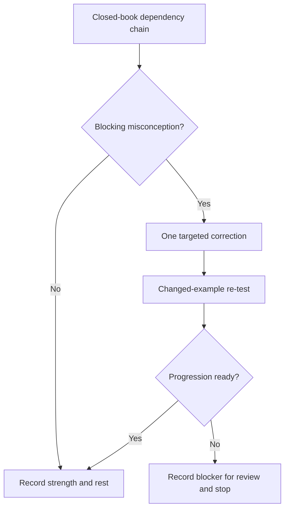
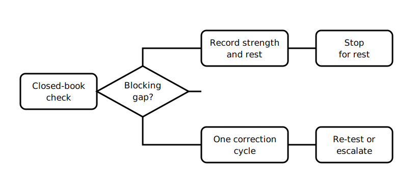

# Rest, Reflection and Catch-Up

## 1. Outcome and entry check
By the end, the learner can identify one blocking planning misconception, complete one targeted correction cycle and stop without converting recovery into another full planning exercise.

**Entry check:** Without notes, describe the dependency chain from purpose through demand, conductor variables, voltage drop and protection coordination.

## 2. Why it matters
Integrated planning creates cognitive load because several decisions interact. Recovery should strengthen the weakest prerequisite while preserving rest, not reward exhaustive reworking.

## 3. Core concepts and terminology
- **Dependency error:** failure to notice that one changed input affects later decisions.
- **Evidence gap:** a missing input that prevents a justified conclusion.
- **Blocking misconception:** an error that undermines progression into verification evidence.
- **Changed-example re-test:** a short transfer check using different fictional facts.
- **Deferred item:** a non-blocking issue recorded for later review.
- **Stop rule:** a fixed boundary on recovery effort.

## 4. Rule-finding workflow
1. Complete the entry check closed-book.
2. Mark each link accurate, partial or unsupported.
3. Select the single highest-impact blocking misconception.
4. Revisit only the relevant module and evidence boundary.
5. Write a corrected dependency explanation.
6. Re-test it with one changed fictional input.
7. Record one strength, one uncertainty and one deferred item.
8. Stop after one cycle or 25 minutes.

## 5. Visual model or worked example

**Worked example:** A learner treats a known load current as sufficient to select a conductor. They repair only that misconception by adding route, environment, protection and voltage-drop dependencies, then re-test using a changed route condition and stop.

## 6. Practical application
Create a six-prompt closed-book check from Blocks 29–34. Repair no more than one blocking misconception. Record the evidence that improved, the uncertainty that remains and the exact point at which the stop rule was applied.

Assessment evidence: accurate self-diagnosis, one focused correction, transfer to a changed example and adherence to the recovery boundary.

## 7. Common errors and safety checkpoint
Common errors include redoing the entire integrated case, choosing an easy factual gap, rereading without retrieval, guessing missing technical values and treating improved study performance as technical approval.

**Safety checkpoint:** This block authorises no design, component selection or field work. Technical planning questions remain subject to current authorised sources and qualified review.

## 8. Retrieval and next links
State one planning dependency that could invalidate a previously reasonable proposal and explain why.

- Previous: [Block 34 — Integrated Planning Case](block-34-integrated-planning-case.md)
- Next: [Block 36 — Verification Evidence Model](block-36-verification-evidence-model.md)
- Knowledge note: [Rest, Reflection and Catch-Up](../../../knowledge-base/9-week/Block 35 - Rest Reflection and Catch-Up.md)
