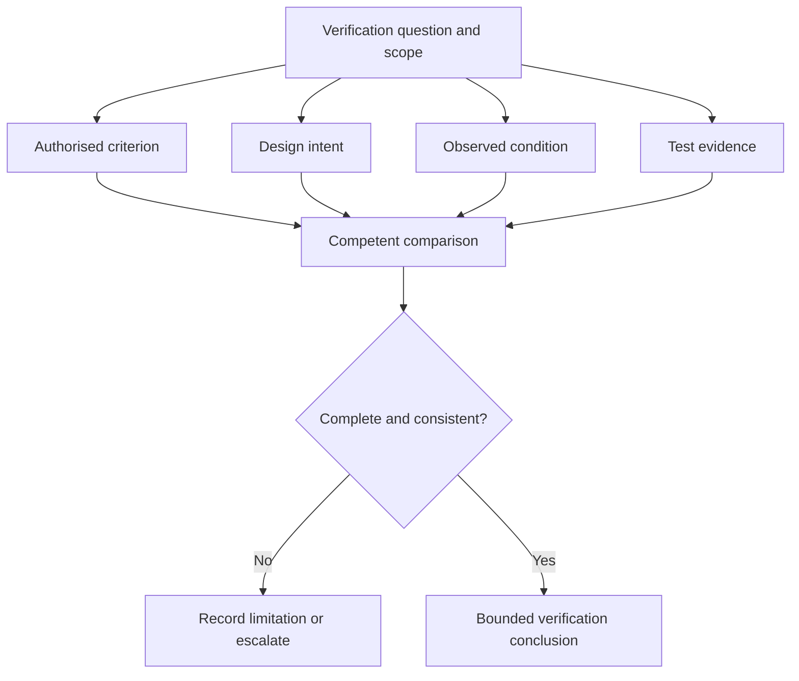
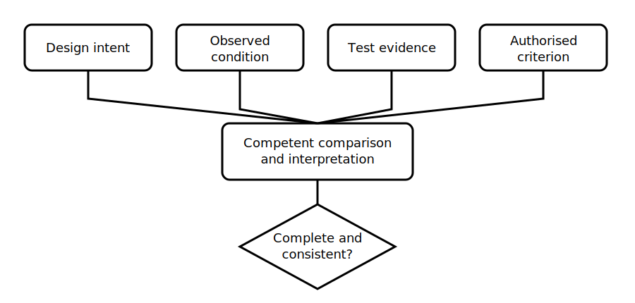

# Verification Evidence Model

## 1. Outcome and entry check
By the end, the learner can distinguish design intent, observed condition, test evidence, interpretation and compliance conclusion, and can identify when the evidence chain is incomplete.

**Entry check:** Explain why a drawing, label or prior certificate cannot by itself prove the present condition of an installation.

## 2. Why it matters
Verification fails when evidence types are blended. A document may state intent, an inspection may reveal condition and a test may produce an observation, but none should be converted into a compliance conclusion without the applicable rule, scope and competent interpretation.

## 3. Core concepts and terminology
- **Design intent:** what documentation indicates was planned or required.
- **Observed condition:** what is directly seen or otherwise established at the time of verification.
- **Test evidence:** a recorded observation produced by an authorised test method.
- **Interpretation:** a reasoned explanation linking evidence to a technical question.
- **Acceptance criterion:** the current authorised basis used to judge evidence.
- **Evidence conflict:** disagreement among documents, observations or test results.
- **Verification record:** a traceable account of scope, evidence, sources, uncertainty and conclusions.

## 4. Rule-finding workflow
1. Define the item, scope and verification question.
2. Identify the current authorised acceptance basis.
3. Separate design documents from present-condition evidence.
4. Record observations without premature judgement.
5. Identify what test evidence is required and who may obtain it.
6. Compare evidence with the authorised criterion.
7. Resolve or escalate conflicts, omissions and scope limitations.
8. State a bounded conclusion and preserve traceability.

## 5. Visual model or worked example

**Worked example:** A fictional board schedule identifies a circuit purpose, while visual inspection finds altered labelling and no current test record. The learner records the conflict, distinguishes intended from observed condition and stops before claiming verification.

## 6. Practical application
Given a fictional evidence pack containing a drawing, label photograph, inspection note and incomplete test record, classify each item by evidence type. Build a verification record showing scope, acceptance-source needs, conflicts, missing evidence and the strongest bounded conclusion available.

Assessment evidence: accurate evidence classification, traceable source needs, explicit scope limits, correct handling of contradictions and no unsupported compliance claim.

## 7. Common errors and safety checkpoint
Common errors include treating documentation as present-condition proof, treating a test number without method or context as decisive, overlooking scope exclusions, collapsing observation into judgement and resolving contradictions by assumption.

**Safety checkpoint:** This module does not prescribe inspection sequences, test methods, instruments, test values, acceptance limits or certification decisions. Those require current authorised sources, suitable equipment, competent persons and qualified technical review.

## 8. Retrieval and next links
Distinguish design intent, observed condition, test evidence, interpretation and conclusion using one fictional example.

- Previous: [Block 35 — Rest, Reflection and Catch-Up](block-35-rest-reflection-and-catch-up.md)
- Next: [Block 37 — Structured Visual Inspection](block-37-structured-visual-inspection.md)
- Knowledge note: [Verification Evidence Model](../../../knowledge-base/9-week/Block 36 - Verification Evidence Model.md)
